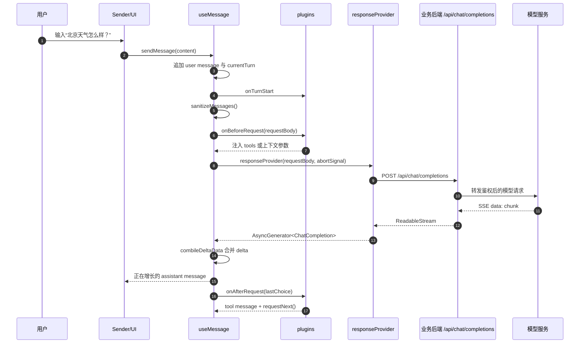
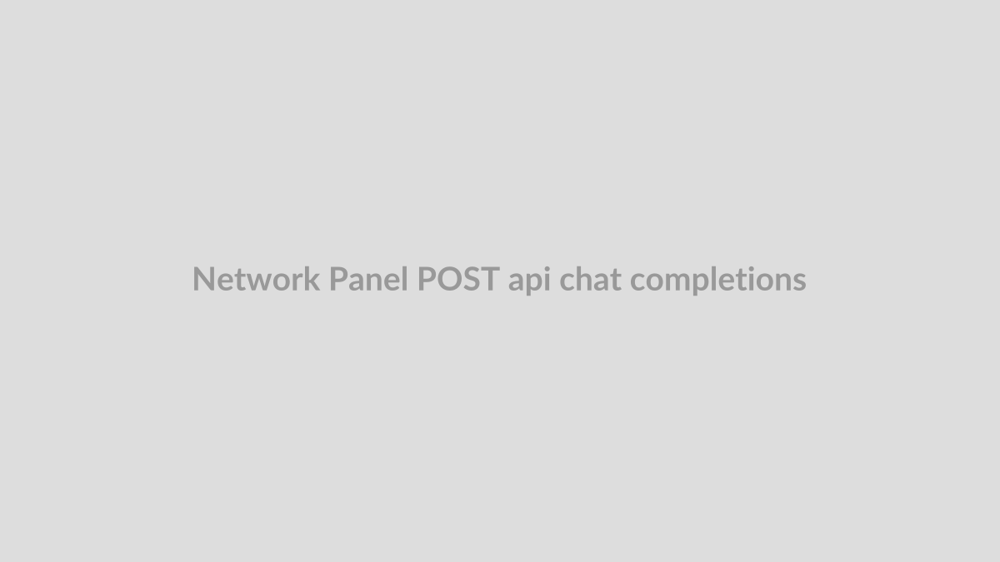

# 打通前后端：从一次消息请求看懂 TinyRobot AI 服务通信链路

用户在输入框里问一句“北京天气怎么样？”，前端到底应该做多少事？如果它只负责把文本丢给后端，流式输出、加载状态、取消请求、工具调用又由谁接住；如果它直接在浏览器里调模型，API Key、鉴权和限流又会落到哪里？

TinyRobot v0.4.1 把职责切成两层：`useMessage` 管前端会话状态、插件和流式合并；业务侧通过 `responseProvider` 决定请求打到哪个后端接口。下面跟着同一次“查天气”会话走一遍：用户发问、请求体成形、后端返回 SSE、前端合并 chunk，最后在 `tool_calls` 出现时触发第二轮请求。

## 消息先进入状态机，再进入网络请求

这条链路的第一个取舍是：用户点击发送后，TinyRobot 先更新本地会话状态，再进入请求流程。UI 因此能立即知道“这一轮已经开始”，不需要等网络请求返回后再补状态。

在 `v0.4.1:packages/kit/src/vue/message/useMessage.ts` 中，`sendMessage` 先拒绝空内容，也会在 `isProcessing` 为真时拒绝新的发送。通过校验后，它把一条 `role: 'user'` 的消息追加到 `messages`，并把同一条消息放进 `currentTurn`，最后调用 `tryExecuteRequest`。`currentTurn` 是前端用来描述“本轮新增消息”的运行时上下文，不是服务端字段。

“北京天气怎么样？”在这里还不是 HTTP payload。它先是一条带 `role`、`content`、`metadata.createdAt`、`metadata.updatedAt` 的前端消息；这一步让后面的 loading、取消、错误处理都围绕同一轮会话发生，避免状态散落在组件事件里。

## 请求体会先被瘦身，再交给插件改写

真正发给后端之前，TinyRobot 不会把 UI 里的所有字段原样塞进请求体。`UseMessageOptions` 中 `requestMessageFieldsExclude` 的默认值是 `['state', 'metadata', 'loading']`，也就是把 UI 展示状态、运行时元数据和加载标记排除掉。`useMessage.ts` 里的 `sanitizeMessages` 会按白名单与黑名单处理消息，`requestBody.messages` 也通过 `Proxy` 保证再次赋值时仍会经过同一套处理。

这个细节很关键：模型需要的是对话语义，不是前端渲染痕迹。比如“查天气”这条用户消息可以进入后端，但某条助手消息上的 `loading: true` 不应该出现在模型上下文里。否则后端会收到混杂着 UI 状态的数据，调试时很难判断问题来自模型、后端还是前端。

插件改写发生在瘦身之后。`onBeforeRequest` 拿到的 `requestBody` 已经是可发出的基础形态，插件可以继续注入 system 消息、temperature、`tools` 等参数。`toolPlugin` 就是在这一阶段调用 `getTools()`，然后把返回的工具列表写入 `requestBody.tools`。插件的改写点位于请求边界前，属于主流程中的受控扩展点。

## `responseProvider` 是前后端边界

v0.4 的一个明显信号是：官方文档把旧的 `client` 改成了 `responseProvider`。这个命名变化直接指向职责边界：真正请求模型的逻辑由调用方提供。`UseMessageOptions.responseProvider` 的类型接收 `MessageRequestBody` 和 `AbortSignal`，可以返回 `Promise<T>`、`AsyncGenerator<T>` 或 `Promise<AsyncGenerator<T>>`。

官方基础示例 `docs/demos/tools/message/Basic.ts` 中，`responseProvider` 调用 `fetch(`${apiUrl}/api/chat/completions`)`，把 `requestBody` 和 `stream: true` 一起 JSON 序列化，最后返回 `sseStreamToGenerator(response, { signal: abortSignal })`。TinyRobot 负责把前端会话整理成请求；`/api/chat/completions` 是业务后端接口，不是 TinyRobot 内置的模型服务。

这也是生产边界最容易写错的地方。历史 TinyRobot 文章已经提醒过，前端项目里的 `VITE_` 环境变量会进入构建产物；涉及模型 API Key 时，正式环境应通过后端服务或网关托管。放到本文这条链路里，TinyRobot 可以把 `AbortSignal`、`messages`、`tools` 等必要上下文交给 `responseProvider`，但鉴权、限流、密钥保护、供应商路由仍应由业务后端处理。

如果读者在 Network 面板看到浏览器直接请求第三方模型服务，并带着生产 API Key，那么问题不在 `useMessage` 的状态机，而在 `responseProvider` 的边界放错了位置。

## SSE chunk 回来后，只合并到同一条助手消息

流式响应的难点不在“收到很多字符串”，而在这些字符串应该持续补到同一条 assistant 消息上。TinyRobot 的实现先把 `responseProvider` 的返回值交给 `normalizeToAsyncGenerator`，无论它是 Promise 还是 AsyncGenerator，后续都按 `for await...of` 消费。

当第一块 chunk 到达，`useMessage` 把 `processingState` 从 `requesting` 切到 `completing`，并取消当前 assistant 消息的 loading。随后它从 `choices` 里选出 `index === 0` 的 choice，把 `chunk.created` 和其它元数据写进当前消息，再在 `choice.delta` 与 `choice.message` 之间选择有效数据，交给 `combileDeltaData` 合并。

`combileDeltaData` 的合并规则很贴近 OpenAI Chat Completions 的流式形态：字符串字段做拼接，对象字段递归合并，带 `index` 的数组按 index 对齐。对于“北京天气怎么样？”这个例子，第一块 delta 可能只有 `role: 'assistant'` 和半句内容，后续 chunk 继续补 `content`；如果返回的是 `tool_calls`，数组里的函数名和 arguments 也会按 index 逐步拼完整。

`sseStreamToGenerator` 则处理更靠近网络的一层：它从 `ReadableStream` 里读二进制块，用 `TextDecoder` 解码，只处理 `data: ` 行，遇到 `[DONE]` 结束；如果 `AbortSignal` 已中止，会抛出名为 `AbortError` 的错误。这样 `useMessage` 不需要知道 ReadableStream 的细节，只消费一个个已经解析好的 ChatCompletion。

```mermaid
stateDiagram-v2
  [*] --> idle
  idle --> processing_requesting: sendMessage / send
  processing_requesting --> processing_completing: 收到第一个 chunk
  processing_completing --> completed: 流结束且无下一轮请求
  processing_completing --> processing_requesting: requestNext()
  processing_requesting --> aborted: abortRequest()
  processing_completing --> aborted: abortRequest()
  processing_requesting --> error: 未处理异常
  processing_completing --> error: 未处理异常
  completed --> idle: 下一次发送前
  aborted --> idle: 下一次发送前
  error --> idle: 下一次发送前
```

## 工具调用把一轮对话拆成两段

“查天气”这类问题能清楚暴露工具调用的边界。模型第一次响应未必直接给答案，可能返回一个 `tool_calls`：调用 `get_weather`，参数是 `{"city":"Beijing"}`。此时最终答案还没有完成，TinyRobot 需要把工具结果补进消息列表，再发起第二轮请求。

`toolPlugin` 正是放在这个位置。请求前，它通过 `getTools()` 把工具 schema 注入 `requestBody.tools`。请求后，它检查 `lastChoice.finish_reason === 'tool_calls'` 且当前 assistant 消息上存在 `tool_calls`。条件满足时，插件把 `processingState` 切到 `calling-tools`，为每个 tool call 追加一条 `role: 'tool'` 的消息，执行业务传入的 `callTool`，把返回字符串或对象逐步写入 tool 消息，最后调用 `requestNext()`。

这里有一个容易忽略的判断：TinyRobot 可以组织 tool 消息和下一轮请求，但它并不知道天气 API 应该怎么调。`callTool` 是业务函数，`getTools` 也是业务函数；TinyRobot 只是确保工具调用结果按模型协议回到会话上下文里。官方 `ToolCall.ts` 示例用本地 mock 演示了这一点：第一轮返回 `get_weather` 的 `tool_calls`，`callTool` 返回“Beijing 天气：晴，25°C。”，第二轮再返回最终文本。

这说明前端会话引擎接住的是模型协议中的工具分支，并没有接管后端能力。真正访问天气服务、决定权限和脱敏字段，仍然应该由业务侧实现。

## 取消、错误和生产边界决定链路能不能收住

流式链路不能只验证 happy path。TinyRobot 在每一轮请求开始时创建新的 `AbortController`，并把 `AbortSignal` 一路传给插件和 `responseProvider`。`abortRequest` 会触发 abort，并等待 `isProcessing` 变为 false；`tryExecuteRequest` 捕获中止后把 `requestState` 置为 `aborted`，其它未处理异常则进入 `error` 分支。

错误处理也留给插件扩展。若插件实现了 `onError`，它可以追加一条错误消息或做统一提示；若没有任何插件处理错误，`useMessage` 会继续抛出异常。这个策略比静默吞错更适合源码解析里的边界判断：UI 库可以提供错误钩子，但不能替业务决定所有错误该如何展示、上报或重试。

因此验证这条链路时，不要只看“回答出来了”。至少要看三层证据：

- Network 面板里 `POST /api/chat/completions` 的请求体是否只包含必要消息、工具和业务参数，是否没有 `loading`、`metadata`、API Key、Cookie 等不该出现的内容。
- SSE 返回是否是 `data: ...` 分块，并以 `[DONE]` 或连接结束收尾；前端是否在第一块 chunk 后进入 `completing`。
- 取消、后端 500、工具调用失败时，`requestState` 是否落到 `aborted` 或 `error`，插件是否给出了业务可接受的提示。

这样验证的价值在于定位边界：如果请求体不干净，先看 `requestMessageFieldsExclude` 和插件；如果后端没有流式返回，先看 `responseProvider`；如果工具调用没有第二轮请求，先看 `toolPlugin` 的 `finish_reason`、`tool_calls` 和 `requestNext()`。

## 这条链路真正说明了什么

从一次“查天气”会话看下来，TinyRobot v0.4.1 的通信设计可以概括成一句话：前端会话引擎负责把用户输入、插件、流式响应和工具调用组织成稳定状态机；业务后端负责模型服务的真实调用、安全和治理。

这个划分有两个实际收益。第一，前端开发者能在 `useMessage` 这一层获得可预测的状态：`idle`、`processing/requesting`、`processing/completing`、`completed`、`aborted`、`error` 都能直接驱动 UI。第二，企业项目可以把模型供应商、鉴权、限流、审计、密钥保护放在后端，不必让组件库越过它不该管的边界。

也正因为边界清楚，接入时不要把 `responseProvider` 写成随手直连生产模型的浏览器函数。更稳妥的方式是让它请求业务自己的 `/api/chat/completions`：前端传递经过瘦身的 `messages` 和工具上下文，后端再决定模型路由、权限、日志和安全策略。TinyRobot 把这条链路接起来，但不替业务后端做最终决定。

## 关于 OpenTiny NEXT

OpenTiny NEXT 是一套企业智能前端开发解决方案，以生成式 UI 和 WebMCP 两大核心技术为基础，对现有传统的 TinyVue 组件库、TinyEngine 低代码引擎等产品进行智能化升级，构建出面向 Agent 应用的前端 NEXT-SDKs、AI Extension、TinyRobot 智能助手、GenUI 等新产品，实现 AI 理解用户意图自主完成任务，加速企业应用的智能化改造。

欢迎加入 OpenTiny 开源社区。添加微信小助手：opentiny-official 一起参与交流前端技术～
OpenTiny 官网：[opentiny.design](https://opentiny.design)
TinyRobot 代码仓库：[github.com/opentiny/tiny-robot](https://github.com/opentiny/tiny-robot)（欢迎 star ⭐）
如果你也想要共建，可以进入代码仓库，找到 good first issue 标签，一起参与开源贡献～如果你有任何问题，欢迎在评论区留言交流！
