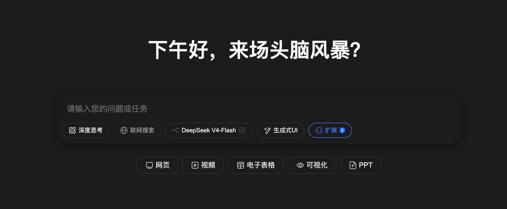
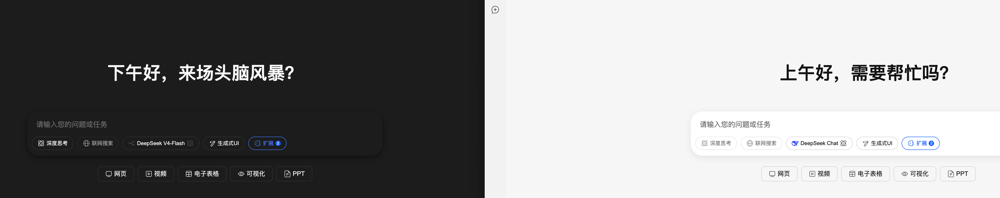
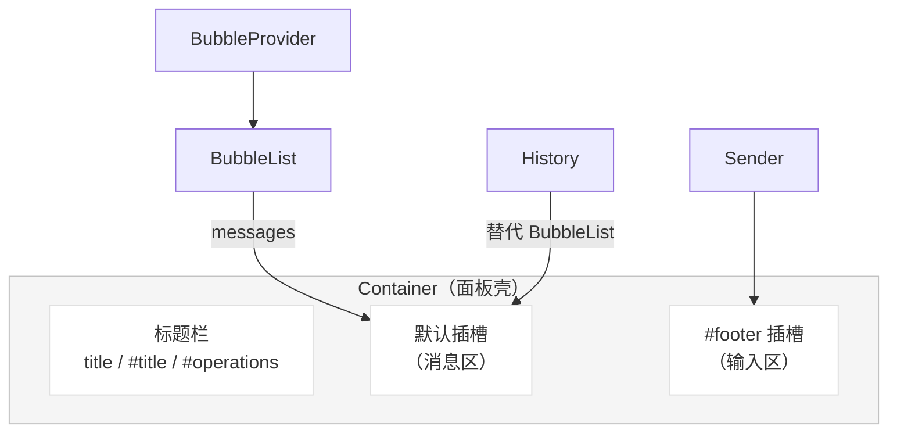

# 还在手写对话面板？TinyRobot Container 一个组件装下整个 AI 聊天

你一定写过对话面板——一个 `v-if` 控制显隐，一个标题栏，一个消息列表，一个输入框，再拼上全屏切换、关闭按钮、主题适配……功能拆开都不复杂，但放到一起，代码量蹭蹭往上涨，维护成本更是随功能膨胀指数级上升。

**有没有一个组件，把这些通通装进去？**

有的。TinyRobot 的 `Container` 组件就是干这件事的。它不渲染对话内容本身——那是 Bubble 和 Sender 的活——它只做三件事：**控制面板显隐、编排布局结构、桥接子组件事件**。一句话理解：

> Container = 可控显隐的对话面板壳。

本文从源码出发，带你拆解 Container 的三层能力，看清楚它为什么这样设计，以及如何在你的项目中用好它。

## 3 分钟从零到一：用 Container 搭出你的第一个完整对话界面

先看最小可运行示例。只需要 Container + BubbleList + Sender 三个组件：

```vue
<script setup lang="ts">
import { ref } from 'vue'
import { Container, BubbleList, Sender } from '@opentiny/tiny-robot'

const show = ref(true)
const messages = ref([
  { role: 'assistant', content: '你好！我是 AI 助手，有什么可以帮你的？' }
])
const input = ref('')

function handleSubmit(text: string) {
  messages.value.push({ role: 'user', content: text })
  input.value = ''
  // 此处接入 AI 服务...
}
</script>

<template>
  <Container v-model:show="show" title="AI 助手">
    <BubbleList :messages="messages" />
    <template #footer>
      <Sender v-model="input" @submit="handleSubmit" />
    </template>
  </Container>
</template>
```

这就是一个完整的对话界面。Container 提供了标题栏、关闭按钮、全屏切换和底部输入区的固定布局，你只需要往默认插槽塞消息列表、往 `#footer` 插槽塞输入框。



对比手写等价面板：你需要自己管理 `v-if`/`v-show`、自己写标题栏 HTML、自己处理全屏切换逻辑、自己固定底部输入区布局、自己适配主题变量——至少多写 40 行模板代码和 20 行逻辑代码。Container 把这些全部内聚了。

## Container 的三层能力：显隐控制 → 布局编排 → 事件桥接

这是本文的核心判断：Container 的所有设计都可以归入三层能力，每层解决一类痛点。

### 第一层：显隐控制——`v-model:show` 与 `@close`

```ts
// 源码核心（简化版）
const show = defineModel<boolean>('show', { required: true })

const handleClose = () => {
  show.value = false
  emit('close')
}
```

`v-model:show` 是双向绑定——父组件控制面板的打开/关闭，Container 内部的关闭按钮也能反向更新父组件状态。这不是简单的 `v-if`，而是**状态所有权归父组件、触发权归双方**的设计。

`@close` 事件在面板关闭时触发，让你可以在关闭时做清理（如中断流式响应、保存草稿等），而不需要 watch `show` 的变化。

### 第二层：布局编排——标题栏、底部输入区、内容区自动伸缩

看模板结构：

```html
<div class="tr-container">
  <!-- 拖拽条区域 -->
  <div class="tr-container__dragging-bar-wrapper">...</div>
  <!-- 标题栏：title 插槽 / operations 插槽 / 全屏切换 / 关闭按钮 -->
  <div class="tr-container__header">
    <slot name="title">
      <h3 class="tr-container__title">{{ props.title }}</h3>
    </slot>
    <div class="tr-container__header-operations">
      <slot name="operations"></slot>
      <icon-button :icon="fullscreenToggleIcon" @click="..." />
      <icon-button :icon="IconClose" @click="handleClose" />
    </div>
  </div>
  <!-- 默认插槽：消息列表 -->
  <slot></slot>
  <!-- 底部输入区 -->
  <div class="tr-container__footer">
    <slot name="footer"></slot>
  </div>
</div>
```

关键布局逻辑在 CSS 里：

```css
.tr-container {
  display: flex;
  flex-direction: column;
  /* 固定定位，占满视口右侧 */
  position: fixed;
  inset: 0;
  left: var(--left); /* 侧边栏模式：left 不为 0；全屏模式：left 为 0 */
}

.tr-container__header + * {
  flex: 1;       /* 内容区自动填满剩余空间 */
  overflow-y: auto; /* 内容溢出自动滚动 */
}

.tr-container__footer {
  flex-shrink: 0; /* 底部输入区固定，不被挤压 */
}
```

这个布局编排的核心意图是：**标题栏固定在顶部、输入区固定在底部、中间消息列表自动伸缩并滚动**。你不需要写一行 CSS 就能得到这个布局。

### 第三层：事件桥接——Container 如何把子组件事件向上传递

Container 本身只 emit 一个 `close` 事件，但它在事件桥接上扮演的角色更重要：**它定义了对话面板的交互边界**。

当你把 Sender 放在 `#footer` 插槽里时，Sender 的 `@submit` 事件直接由父组件处理——Container 不拦截。这是有意为之的设计：Container 只管"壳"的交互（关闭、全屏），不管"内容"的交互（发送消息、点击气泡）。这种**职责隔离**让 Container 不需要知道子组件的具体 API，保持了组件的通用性。

### 完整 Props / Events / Slots 速查表

| 类别 | 名称 | 类型 | 说明 |
| --- | --- | --- | --- |
| Model | `v-model:show` | `boolean` | 面板显隐状态（必填） |
| Model | `v-model:fullscreen` | `boolean` | 全屏模式（可选） |
| Prop | `title` | `string` | 标题栏文字，默认 `'OpenTiny NEXT'` |
| Event | `close` | `() => void` | 面板关闭时触发 |
| Slot | `default` | — | 主内容区（放 BubbleList 等） |
| Slot | `title` | — | 自定义标题栏内容 |
| Slot | `operations` | — | 标题栏右侧操作区（在全屏/关闭按钮之前） |
| Slot | `footer` | — | 底部区域（放 Sender 等） |

## 主题与换肤：Container 的 CSS 变量体系与 OpenTiny Design 对接

Container 的样式完全通过 CSS 变量控制，分为两类：

### 不影响布局的变量（颜色、字重等）

| CSS 变量 | 默认值（亮色） | 说明 |
| --- | --- | --- |
| `--tr-container-bg-color` | `var(--tr-page-bg-default)` → `#f5f5f5` | 面板背景色 |
| `--tr-container-border-color` | `var(--tr-border-color-disabled)` → `#c2c2c2` | 边框颜色 |
| `--tr-container-title-color` | `var(--tr-text-primary)` → `#191919` | 标题文字颜色 |
| `--tr-container-title-font-weight` | `600` | 标题字重 |

### 影响布局的变量（宽度、间距等）

| CSS 变量 | 默认值 | 说明 |
| --- | --- | --- |
| `--tr-container-width` | `480px` | 侧边栏模式宽度 |
| `--tr-container-border-width` | `1px` | 边框宽度 |
| `--tr-container-header-padding` | `0 24px 16px` | 标题栏内边距 |
| `--tr-container-header-operations-gap` | `8px` | 操作按钮间距 |
| `--tr-container-title-font-size` | `14px` | 标题字号 |
| `--tr-container-title-line-height` | `22px` | 标题行高 |

### 全屏模式覆盖变量

| CSS 变量 | 默认值 | 说明 |
| --- | --- | --- |
| `--tr-container-title-font-size-fullscreen` | `16px` | 全屏时标题字号 |
| `--tr-container-title-line-height-fullscreen` | `22px` | 全屏时标题行高 |
| `--tr-container-header-padding-fullscreen` | `0 160px 16px` | 全屏时标题栏内边距（居中效果） |

### 深色主题

切换到深色主题时，Container 的背景色和边框色会跟随全局变量自动变化：

- `--tr-page-bg-default`：`#f5f5f5` → `#191919`
- `--tr-border-color-disabled`：`#c2c2c2` → `#808080`
- `--tr-text-primary`：`#191919` → `#e6e6e6`

你只需要在根节点设置 `data-tr-color-mode="dark"` 或使用 `ThemeProvider` 组件，Container 的样式就会自动切换，无需额外配置。



### 与 OpenTiny Design Token 的映射关系

Container 的 CSS 变量不是凭空定义的，而是映射到 TinyRobot 全局 Design Token：

| Container 变量 | 全局 Token | 语义 |
| --- | --- | --- |
| `--tr-container-bg-color` | `--tr-page-bg-default` | 页面级背景色 |
| `--tr-container-border-color` | `--tr-border-color-disabled` | 禁用态边框色 |
| `--tr-container-title-color` | `--tr-text-primary` | 主文本色 |

这种映射意味着：**你修改全局 Token，所有组件一起变；你只改 Container 变量，只影响 Container 自己**。两层控制粒度，按需选择。

## 组件组合实战：Container + BubbleList + Sender + History 的最佳搭配

### 最小完整对话单元：Container + BubbleList + Sender

这是最常见的组合，覆盖 80% 的对话场景：

```vue
<Container v-model:show="show" title="AI 助手">
  <BubbleList :messages="messages" :role-configs="roleConfigs" />
  <template #footer>
    <Sender v-model="input" @submit="handleSubmit" />
  </template>
</Container>
```

### 带会话列表：Container + History

当需要会话管理（历史会话列表、新建会话、重命名等）时，用 History 组件：

```vue
<Container v-model:show="show" title="AI 助手">
  <History :data="sessions" :selected="currentSessionId" />
</Container>
```

History 的 `data` 属性支持平铺数组或分组结构，`menuItems` 可以配置右键菜单操作。

### 统一渲染策略：Container + BubbleProvider

当对话中需要渲染多种内容类型（文本、代码、图片、工具调用结果等）时，用 BubbleProvider 统一注册渲染器：

```vue
<Container v-model:show="show" title="AI 助手">
  <BubbleProvider
    :box-renderer-matches="boxMatchers"
    :content-renderer-matches="contentMatchers"
  >
    <BubbleList :messages="messages" />
  </BubbleProvider>
  <template #footer>
    <Sender v-model="input" @submit="handleSubmit" />
  </template>
</Container>
```

### 四组件协作关系图



### 插槽嵌套顺序与样式隔离注意事项

1. **默认插槽内容会被 `.tr-container__header + *` 选择器赋予 `flex: 1; overflow-y: auto`**——这意味着你放在默认插槽里的第一个元素会自动成为可滚动的消息区域
2. **`#footer` 插槽的内容有 `flex-shrink: 0`**——不会被内容区挤压，始终保持完整高度
3. Container 使用 `scoped` 样式，子组件的样式不会泄漏到 Container 外部；但如果你在子组件中使用了全局 CSS 变量，这些变量仍然会生效

## 高级玩法：全屏模式、命名主题、多实例共存与自定义扩展

### 全屏模式：`v-model:fullscreen`

```vue
<Container v-model:show="show" v-model:fullscreen="fullscreen" title="AI 助手">
  ...
</Container>
```

源码中的切换逻辑：

```ts
const fullscreen = defineModel<boolean>('fullscreen')
const fullscreenToggleIcon = computed(() =>
  fullscreen.value ? IconExitFullScreen : IconEnterFullScreen
)
```

全屏模式的 CSS 变化：

```css
.tr-container.fullscreen {
  --left: 0;        /* 从右侧偏移变为占满全屏 */
  --width: unset;    /* 取消固定宽度 */
}
```

侧边栏模式下，Container 宽度固定 480px，靠右显示（`left: unset; right: 0`）；全屏模式下，`left` 归零、`width` 解除约束，面板占满整个视口。标题栏的 `padding` 也会从 `0 24px 16px` 变为 `0 160px 16px`，让标题在全屏时视觉居中。


### 命名主题：多主题切换的工程实践

使用 `ThemeProvider` 组件实现命名主题切换：

```vue
<script setup lang="ts">
import { ThemeProvider } from '@opentiny/tiny-robot'
import { ref } from 'vue'

const theme = ref('default')
</script>

<template>
  <ThemeProvider v-model:theme="theme">
    <Container v-model:show="show" title="AI 助手">
      ...
    </Container>
  </ThemeProvider>
</template>
```

`ThemeProvider` 通过 `data-tr-theme` 属性和 CSS 变量覆盖实现主题切换，Container 的所有样式变量都会自动跟随。

### 多实例共存：z-index 管理建议

Container 使用 `z-index: var(--tr-z-index-fixed)`（默认 100）。如果你需要多个 Container 实例（如主对话 + 帮助面板），建议：

1. 通过 CSS 变量覆盖不同实例的 z-index：`--tr-z-index-fixed: 100` / `200`
2. 或者使用 `#operations` 插槽添加层级切换按钮
3. 不建议直接修改全局 `--tr-z-index-fixed`，这会影响所有固定定位元素

### 自定义扩展：slots 与 scoped slots 的扩展点

| 扩展点 | 能力 | 建议 |
| --- | --- | --- |
| `#title` | 完全替换标题栏内容 | ✅ 适合加搜索框、状态指示器 |
| `#operations` | 在全屏/关闭按钮前插入操作按钮 | ✅ 适合加设置、分享等按钮 |
| `#footer` | 完全替换底部区域 | ⚠️ 替换后需自行处理输入区布局 |
| CSS 变量覆盖 | 修改颜色、宽度、间距等 | ✅ 推荐优先用 CSS 变量而非改源码 |
| 直接修改源码 | 任意修改 | ❌ 不建议，升级时冲突风险高 |

**边界**：Container 的 `position: fixed` 布局和 `flex` 结构不建议改——这是它作为"面板壳"的核心设计。如果需要内联布局或非固定定位，建议不使用 Container，直接用 BubbleList + Sender 自行组装。

## 总结：Container 的设计哲学与下一步

回看全文，Container 的设计可以用四个词概括：

1. **导演模式**——自己不演（不渲染内容），只编排（显隐、布局、事件桥接）
2. **能力分层**——显隐控制 → 布局编排 → 事件桥接，每层独立，不耦合
3. **主题一致**——CSS 变量全部映射到全局 Design Token，换肤零成本
4. **生态协同**——与 BubbleList、Sender、History、BubbleProvider 天然组合，各司其职

这种设计的代价是：Container 不适合需要深度定制布局的场景（如内联嵌入、非固定定位）。但这是有意为之的取舍——Container 解决的是 80% 的标准对话面板需求，剩下 20% 的定制场景，TinyRobot 的组件化设计让你可以自由组合 Bubble、Sender 等原子组件。

**适合继续深入的选题**：

- Bubble 深度解析：角色配置、分组策略、自定义渲染器
- Sender 高级用法：Tiptap 扩展、Template、Mention、Suggestion
- TinyRobot 全家桶实战：从 CLI 创建到自定义主题的完整流程

## 关于 OpenTiny NEXT

OpenTiny NEXT 是一套企业智能前端开发解决方案，以生成式 UI 和 WebMCP 两大核心技术为基础，对现有传统的 TinyVue 组件库、TinyEngine 低代码引擎等产品进行智能化升级，构建出面向 Agent 应用的前端 NEXT-SDKs、AI Extension、TinyRobot 智能助手、GenUI 等新产品，实现 AI 理解用户意图自主完成任务，加速企业应用的智能化改造。

欢迎加入 OpenTiny 开源社区。添加微信小助手：opentiny-official 一起参与交流前端技术～
OpenTiny 官网：[opentiny.design](https://opentiny.design)
TinyRobot 代码仓库：[github.com/opentiny/tiny-robot](https://github.com/opentiny/tiny-robot)（欢迎 star ⭐）
如果你也想要共建，可以进入代码仓库，找到 good first issue 标签，一起参与开源贡献～如果你有任何问题，欢迎在评论区留言交流！
