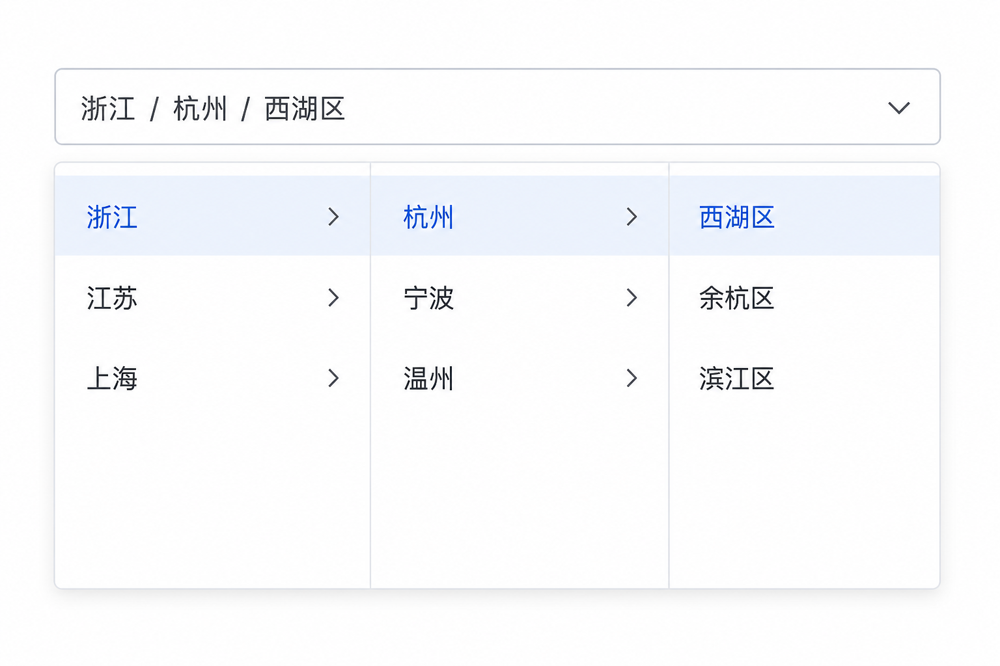

# 层级选择不再手写联动：TinyVue Cascader 级联选择器上手

收货地址、组织架构、商品类目——表单里经常要选一条「层级路径」。常见做法是串联多个 `Select`：一级变了清空二级、二级变了请求三级，状态同步和禁用时机一散，交互就容易出洞。

TinyVue 的 `Cascader`（级联选择器）用一份树形 `options` 把整条路径收进一个控件：展开后按列点选，也可多选、搜索、懒加载，以及在需要时选择任意一级节点。

## 基本用法：一份 options 即可

通过 `options` 指定选项树，用 `v-model` 绑定选中值：

```vue
<template>
  <tiny-cascader v-model="value" :options="options" />
</template>

<script setup>
import { ref } from 'vue'
import { TinyCascader } from '@opentiny/vue'

const value = ref([])
const options = ref([
  {
    value: 'zhejiang',
    label: '浙江',
    children: [
      {
        value: 'hangzhou',
        label: '杭州',
        children: [
          { value: 'xihu', label: '西湖区' },
          { value: 'yuhang', label: '余杭区' }
        ]
      },
      {
        value: 'ningbo',
        label: '宁波',
        children: [{ value: 'haishu', label: '海曙区' }]
      }
    ]
  },
  {
    value: 'jiangsu',
    label: '江苏',
    children: [
      {
        value: 'nanjing',
        label: '南京',
        children: [{ value: 'xuanwu', label: '玄武区' }]
      }
    ]
  }
])
</script>
```

默认会返回完整路径数组（由各级 `value` 组成）。若业务只要叶子节点的值，可通过 `:props="{ emitPath: false }"` 调整返回形态。

展开后按层级点选即可完成一条路径：



## 多选与 Tag 折叠

当一次要勾选多条路径时，开启 `props.multiple`：

```vue
<template>
  <tiny-cascader
    v-model="value"
    :options="options"
    :props="{ multiple: true }"
    collapse-tags
    clearable
  />
</template>
```

多选后输入框会以 Tag 展示已选项；路径较多时加上 `collapse-tags`，把多余 Tag 折叠起来，避免筛选区被撑爆。需要时还可挂 `clearable`，一键清空。

## 可搜索：选项多时先搜再选

把 `filterable` 设为 `true` 即可搜索。默认会匹配节点 `label`（以及父节点 `label`，受 `show-all-levels` 影响）。可用 `#empty` 自定义无匹配内容，用 `debounce` 控制输入去抖：

```vue
<template>
  <tiny-cascader
    v-model="value"
    :options="options"
    filterable
    :debounce="300"
    placeholder="试试搜索：杭州"
  >
    <template #empty>
      <div>暂无匹配选项</div>
    </template>
  </tiny-cascader>
</template>
```

类目树一深，滚动找叶子就费劲；搜索适合「知道关键词、懒得点开多层」的操作路径。

## 懒加载：子级按需拉取

全量地区树、巨大组织树不适合首屏一次性塞进 `options`。此时开启 `props.lazy`，并用 `lazyLoad` 在展开某一级时再取子节点——`lazyLoad(node, resolve)` 必须在数据就绪后调用 `resolve`：

```vue
<template>
  <tiny-cascader v-model="value" :props="lazyProps" />
</template>

<script setup>
import { ref } from 'vue'
import { TinyCascader } from '@opentiny/vue'

const value = ref('')
let id = 0

const lazyProps = {
  lazy: true,
  lazyLoad(node, resolve) {
    const { level } = node
    setTimeout(() => {
      const nodes = Array.from({ length: level + 1 }).map(() => ({
        value: ++id,
        label: `选项 ${id}`,
        leaf: level >= 2
      }))
      resolve(nodes)
    }, 500)
  }
}
</script>
```

可用节点上的 `leaf` 字段明确叶子，避免仅靠「有无 children」误判展开态。

## 选择任意一级：checkStrictly

默认单选通常只能选叶子。若业务允许只选到「省」或「市」（不必落到区），打开 `props.checkStrictly`，取消父子选中关联：

```vue
<template>
  <tiny-cascader
    v-model="value"
    :options="options"
    :props="{ checkStrictly: true }"
  />
</template>
```

适合「粒度可选」的筛选：有的用户精确到区，有的只需要省级汇总。

## 小结

面对层级路径表单，优先用一份树数据 + `Cascader`，而不是串联多个 `Select` 手写联动。接入顺序可以是：静态 `options` 跑通 → 需要多选时开 `multiple` / `collapse-tags` → 选项多时加 `filterable` → 数据量大时改 `lazy` → 允许非叶子时开 `checkStrictly`。

官方文档：[Cascader 级联选择器](https://opentiny.design/tiny-vue/zh-CN/os-theme/components/cascader)

## 关于 OpenTiny

OpenTiny 是面向企业级应用的前端开发解决方案，TinyVue 作为核心 UI 组件库，支持 Vue 2、Vue 3 及 PC / Mobile 多端场景，提供 100+ 高质量组件，开箱即用。

欢迎体验 TinyVue 组件库：[opentiny.design/tiny-vue](https://opentiny.design/tiny-vue/zh-CN/overview)

TinyVue 代码仓库：[github.com/opentiny/tiny-vue](https://github.com/opentiny/tiny-vue)（欢迎 Star ⭐）

添加微信小助手 **opentiny-official**，一起交流前端技术～
