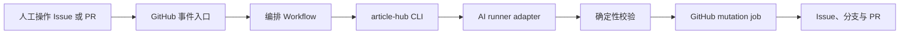

# OpenTiny 文章生成 GitHub Workflow 设计

## 1. 文档状态

- 状态：后续实现思路
- 前置需求：[`article-generation-requirements.md`](./article-generation-requirements.md)
- 是否纳入当前交付：否
- 目标：将本地 `generate-opentiny-article` 流程映射为 GitHub Actions

本文只定义未来 GitHub Workflow 的边界、事件、权限和任务拆分，不改变本地 Skill 的交付范围。

## 2. 设计原则

1. GitHub 是唯一流程状态源，不引入数据库或常驻服务。
2. 本地 Skill 与 Workflow 调用同一套 `article-hub` CLI。
3. Agent 负责调研、判断和写作；Git、GitHub、schema 与状态变更由确定性 CLI 完成。
4. 事件驱动为主，定时校准为辅。
5. LLM job 不持有 GitHub 写权限；GitHub mutation job 不持有模型密钥。
6. 每个 Issue 或 PR 串行执行，所有写操作幂等。
7. 不依赖由 `GITHUB_TOKEN` 产生的新事件再次触发下游 Workflow。
8. Workflow 不负责选题发现、外部发布、历史文章归档或独立预览站点。
9. 每个机器人提交后的最新 Head 必须拥有与人工提交相同的必需 Check 结果。

## 3. 总体架构



组件职责：

| 组件 | 职责 |
| --- | --- |
| GitHub Issue | 保存选题、写作计划、批准记录和唯一流程标签 |
| GitHub PR | 保存文章分支、Commit、Review、Checks 和人工修订 |
| `article-hub` CLI | 解析状态、校验输入输出、操作 Git 和 GitHub、保证幂等 |
| AI runner adapter | 调用 Codex CLI、Claude Code 或其他 Agent 完成计划、生成、修订和润色 |
| Actions artifact | 在只读 AI job 与可写 mutation job 之间传递受校验文件 |
| Reconcile Workflow | 低频修复遗漏事件、超时任务和状态不一致 |

## 4. Workflow 拆分

建议文件：

```text
.github/workflows/
├── article-command.yml
├── article-generate.yml
├── article-review.yml
├── article-state.yml
├── article-reconcile.yml
└── article-ci.yml
```

### 4.1 `article-command.yml`

触发：

- `issue_comment.created`
- `workflow_dispatch`

职责：

- 校验评论作者权限。
- 解析固定 `/ai` 命令。
- 读取 Issue 当前阶段、AI 状态和最新批准快照。
- 执行暂停、恢复、重试和状态查询。
- `/ai 批准选题` 后进入策划流程。
- `/ai 批准写作计划` 由授权用户逐字发送后，创建不可变批准快照并调用可复用生成 Workflow。

`/ai 暂停` 使用独立控制 job，不进入文章内容 concurrency group。该 job 以 `actions: write` 和 `issues: write` 先设置 `AI执行：人工暂停`、取消对应的 queued/running run，再回复成功。内容 Workflow 在每次 mutation 更新 Git ref 前必须最后一次检查暂停状态。

状态命令必须使用确定性解析器，不能交给 LLM 判断批准意图。

### 4.2 `article-generate.yml`

触发：

- `workflow_call`
- `workflow_dispatch`

职责：

- 生成或更新写作计划。
- 在批准后生成完整初稿。
- checkout 固定资料快照。
- 运行文章生成和 OpenTiny 文风润色。
- 生成 Mermaid、SVG 和 PNG。
- 校验 Front Matter、Markdown、链接和素材。
- 创建或更新文章分支和 Draft PR。

同一个可复用 Workflow 根据 `mode=plan|generate` 执行不同阶段。`plan` 模式只更新 Issue 评论；`generate` 模式只有在批准快照生成后才允许写分支。

### 4.3 `article-review.yml`

触发：

- `pull_request_review.submitted`
- `pull_request_review_comment.created`
- `issue_comment.created`，且评论对象是 PR
- `pull_request.ready_for_review`
- `pull_request.converted_to_draft`

职责：

- 校验 Review 或评论作者具有仓库写权限或位于 allowlist；忽略 bot 和未授权触发者。
- 收集 `Request changes` 中的意见。
- 处理行级或普通评论中的 `/ai <修改要求>`。
- 合并同一时间窗口内的修订意见。
- 根据最新 PR Head SHA 生成修订。
- 回复处理结果，但不自动 Resolve conversation。
- Ready for review 时执行必选验收检查。
- Convert to draft 时将 Issue 退回 `阶段：写作`。

普通 Review 修订保持 `阶段：审核`。只有人工 Convert to draft 才表示重大返工。

### 4.4 `article-state.yml`

触发：

- `pull_request.closed`
- `issues.closed`
- `issues.reopened`

职责：

- PR 合并后将 Issue 设为 `阶段：待发布`。
- PR 未合并关闭后将 Issue 设为 `阶段：已终止` 并关闭 Issue。
- `阶段：选题`、`策划`、`写作` 或 `审核` 的 Issue 被关闭时，将其设为 `阶段：已终止`。
- `阶段：待发布` 的 Issue 被提前关闭时重新打开，并说明仍未完成发布。
- `阶段：已发布` 的 Issue 允许关闭且不改变阶段。
- `阶段：已终止` 的 Issue 重新打开后，恢复原分支并重新打开原 PR，再进入 `阶段：策划 + AI：等待人工` 并要求重新确认计划；原 PR 无法恢复时保持终止并要求创建新选题 Issue，不得为原 Issue 创建第二个 PR。
- 进入 `阶段：待发布`、`阶段：已发布` 或 `阶段：已终止` 时清除所有 `AI：*` 标签。
- 保持 Issue 与 PR 的双向链接。

该 Workflow 不发布文章，也不关闭已进入待发布状态的 Issue。

### 4.5 `article-reconcile.yml`

触发：

- `schedule`
- `workflow_dispatch`

职责：

- 检查超时的 `AI：处理中`。
- 检查有批准计划但没有 PR 的 Issue。
- 检查有文章分支但没有 PR 的部分失败任务。
- 检查 PR 状态与 Issue 阶段不一致。
- 检查重复事件是否产生重复回执。
- 只修复可以由 GitHub 事实唯一推导的状态；无法判断时转 `AI：等待人工`。

定时任务只负责自愈，不作为主要内容生成入口。

### 4.6 `article-ci.yml`

触发：

- `pull_request`
- `push` 到默认分支

职责：

- 校验 Front Matter schema。
- 检查 H1 与 Front Matter 标题一致。
- 检查 GFM、内部链接、图片路径和图片替代文本。
- 检查 Mermaid、SVG 和 PNG 派生产物一致性。
- 检查 OpenTiny 术语。
- 检查文章 Skill 的独立加载契约，包括入口 Front Matter、本地 Markdown reference、路径边界、孤立 reference 和嵌套 Skill。
- 运行 TypeScript 单元测试。
- 在 Linux、macOS 和 Windows Git Bash 环境验证确定性脚本。

人工 Commit 通过 `pull_request` 或 `push` 正常触发 `article-ci`。Mutation job 使用 `GITHUB_TOKEN` push 的机器人 Commit 不依赖新事件触发：同一次业务 Workflow 必须先完成等价校验，push 后再以 `checks: write` 为最新 Head 创建名为 `article-ci` 的 Check Run，并写入相同结论。Check Run 创建失败视为本次 mutation 失败，不能把 Issue 标记为等待人工 Review。参考 [GitHub Check Runs API](https://docs.github.com/rest/checks/runs)。

CI 不判断文章是否“写得好”，也不替代人工事实和内容 Review。

## 5. 事件到状态的映射

| 事件 | 前置状态 | 动作 | 结果状态 |
| --- | --- | --- | --- |
| `/ai 批准选题` | `阶段：选题` | 校验 Issue 最小字段，启动调研 | `阶段：策划 + AI：处理中` |
| 写作计划已发布 | `阶段：策划` | 等待人工反馈 | `阶段：策划 + AI：等待人工` |
| `/ai 批准写作计划` | 授权用户发送逐字固定命令，批准快照已生成 | 生成并校验初稿 | `阶段：写作 + AI：处理中` |
| Draft PR 已创建 | 初稿校验通过 | 回写 PR 链接 | `阶段：写作 + AI：等待人工` |
| Ready for review | 必选项通过 | 进入 Review | `阶段：审核 + AI：等待人工` |
| Request changes 或 `/ai` 修改 | `阶段：审核` | 修订并提交 | `阶段：审核 + AI：处理中` |
| 修订提交完成 | `阶段：审核` | 回复 Review | `阶段：审核 + AI：等待人工` |
| Convert to draft | `阶段：审核` | 重大返工 | `阶段：写作 + AI：等待人工` |
| PR merged | GitHub 仓库规则已放行 | 标记母稿完成 | `阶段：待发布` |
| PR closed without merge | 任意文章阶段 | 终止流程并关闭 Issue | `阶段：已终止`，清除 `AI：*` |

审批数量、Reviewer 身份和合并条件不由 Workflow 重复校验，统一交给 GitHub Ruleset 或 Branch protection。

## 6. Job 边界与权限

### 6.1 只读入口 job

权限：

```yaml
permissions:
  contents: read
  issues: read
  pull-requests: read
```

职责：

- 读取事件、Issue、PR 和评论。
- 校验 actor 是否有权限执行状态命令、生成请求或修订请求，并忽略 bot。
- 构造规范化任务输入。

调用 reusable workflow 的 caller job 必须授予整个调用链所需的权限上限；被调用 Workflow 只能保持或降低 `GITHUB_TOKEN` 权限，不能自行提升。被调用 Workflow 再为 AI、校验和 Mutation job 分别收窄权限，模型 Secret 只显式传给 AI job。参考 [Reusable Workflow 权限规则](https://docs.github.com/actions/reference/workflows-and-actions/reusable-workflows#access-and-permissions-for-nested-workflows)。

### 6.2 AI job

权限：

```yaml
permissions:
  contents: read
  issues: read
  pull-requests: read
```

持有：

- 当前 runner adapter 所需的模型密钥。
- 公开源码和文档的只读访问能力。

不持有：

- 可写 PAT。
- 外部发布凭据。
- 其他业务 Secrets。

输出到隔离目录，并生成 manifest。AI job 不直接执行 `git push`、创建 PR 或修改标签。

### 6.3 校验 job

不需要模型密钥，也不需要 GitHub 写权限。至少校验：

- 输出文件只能位于预期文章目录。
- 禁止绝对路径和 `..` 路径穿越。
- 文件扩展名、数量和大小符合配置。
- Front Matter 通过 schema。
- 来源快照与批准计划一致。
- 不包含未处理占位符或内部提示。
- 生成图片可以解码，尺寸合理。

校验通过后将文件作为 Actions artifact 交给 mutation job。

### 6.4 Mutation job

权限按动作最小化：

```yaml
permissions:
  contents: write
  checks: write
  issues: write
  pull-requests: write
```

职责：

- 再次检查 Issue 阶段、批准快照和 PR Head SHA。
- 再次检查触发者授权和 `AI执行：人工暂停` 状态。
- 创建或复用文章分支。
- 提交经校验的文件。
- 为机器人提交后的最新 Head 创建必需 `article-ci` Check Run。
- 创建或更新 Draft PR。
- 更新 Issue 标签和受管评论区域。
- 回复执行结果。

该 job 不持有模型密钥，不能再次生成或改写内容。

## 7. AI runner adapter

核心流程不绑定 Codex、Claude Code 或具体模型。Adapter 使用统一输入和输出契约。

### 7.1 输入

示意：

```json
{
  "mode": "plan|generate|revise|polish",
  "repository": "hexqi/ai-article-hub",
  "issue_number": 3,
  "plan_label": "第 2 版",
  "approval_snapshot_comment_id": 123456,
  "article_type": "practical-guide",
  "style_profile": "developer-friendly",
  "source_manifest": "./run/source-manifest.json",
  "workspace": "./run/workspace",
  "output": "./run/output"
}
```

### 7.2 输出

```text
output/
├── article/
│   ├── article.md
│   └── assets/
├── result.json
└── mutation-plan.json
```

`result.json` 至少包含：

- Agent 和模型标识。
- Skill 版本。
- 批准快照引用。
- 输出文件校验摘要。
- 来源快照摘要。
- 校验结果。
- 需要人工处理的缺口。

`mutation-plan.json` 只描述建议的 GitHub 变更，不直接执行变更。

### 7.3 Adapter 实现

建议优先提供：

- `codex` adapter
- `claude-code` adapter

模型、超时、最大重试和密钥通过 Workflow 配置与 Secrets 注入。Front Matter 记录实际 Agent、模型和生成时间。

同一任务自动重试时使用相同 adapter。跨模型 fallback 必须通过 `workflow_dispatch` 或人工命令显式选择。

Adapter 不负责解释或修复 Skill 目录结构。Skill 结构问题由 `article-ci` 的确定性契约测试提前阻断；Workflow 运行时只加载已经通过契约检查的 Skill。

润色效果、事实保护和范围控制属于 Agent 行为验证。CI 不用精确中文句子、历史删除清单或关键词黑名单替代行为评估；需要回归时使用隔离 Agent 上下文执行 forward eval，并按保真、范围、自然和可发布四个维度人工或半自动评审。

## 8. 源码 checkout

不使用 Git submodule。每篇文章的来源由已批准写作计划提供：

```yaml
sources:
  - repository: opentiny/tiny-robot
    ref: release-1.2.3
    commit: <sha>
```

GitHub-hosted Runner 按来源逐个 checkout 到隔离路径：

```text
run/sources/<owner>/<repo>/
```

策略：

- 单版本文章只获取目标 Commit。
- 版本对比文章只获取需要比较的 Commit 或 Tag。
- 默认不获取完整历史。
- 仓库为公开来源时不配置额外 PAT。
- checkout 后校验实际 HEAD 与批准计划一致。

本地 Skill 使用缓存仓库增量 fetch；Workflow 使用临时浅 checkout。两者最终都交付相同的 Commit 快照。

## 9. 写作计划交互

### 9.1 受管评论

Issue 中只维护一条当前写作计划评论，并使用隐藏标记定位：

```html
<!-- ai-article:plan:start -->
...
<!-- ai-article:plan:end -->
```

评论包含人类可读版本标签和完整计划正文。更新计划时编辑该评论；人工反馈保留在独立评论和 Issue timeline。

### 9.2 批准有效性

写作计划评论必须提供可复制命令，例如：

```text
/ai 批准写作计划
```

处理器只批准授权用户发出的逐字固定命令；携带参数或自然语言表述都必须拒绝。Mutation job 在开始生成和提交前都必须重新读取：

- 最新批准快照。
- 批准评论作者和时间。
- Issue 阶段。

任一项缺失或无效时停止生成并转 `AI：等待人工`。

批准处理器还必须立即创建不可变批准快照评论，保存完整计划正文、批准人、批准评论 id、批准时间，以及按 `Asia/Shanghai` 分配的 `article_date`。该快照是后续审计、跨日重试和重建任务的依据；编辑当前计划评论不得改变已批准快照。

## 10. PR 描述与修订

PR 描述使用隐藏标记划分自动化和人工区域：

```html
<!-- ai-article:managed:start -->
...
<!-- ai-article:managed:end -->

<!-- ai-article:human:start -->
...
<!-- ai-article:human:end -->
```

Mutation job 只替换受管区域。标记缺失、重复或嵌套错误时停止更新并评论说明。

修订流程：

1. 根据事件类型生成 `dedupe_key`，并记录 PR Head SHA。
2. 收集当前批次的 Request changes 和 `/ai` 意见。
3. AI job 基于最新文件生成 patch 后的完整输出目录。
4. 校验 job 检查范围和文件。
5. Mutation job 再次检查 Head SHA。
6. Head 未变化时提交一个修订 Commit。
7. Head 已变化时废弃 artifact 并重新排队，不自动 merge。
8. 在对应 Review 线程回复 Commit 和处理结果。

人工可以随时直接提交。Commit 历史是修改记录，不追踪句子由人工还是 AI 产生。

## 11. 并发与幂等

Workflow concurrency group 必须统一使用关联选题 Issue 编号：

```text
article-<repository-id>-<canonical-issue-number>
```

建议：

- `cancel-in-progress: false`，避免中断正在提交的任务。
- `queue: max`，允许同一文章的后续事件排队；参考 [GitHub Actions concurrency](https://docs.github.com/actions/how-tos/writing-workflows/choosing-when-your-workflow-runs/control-the-concurrency-of-workflows-and-jobs)。
- PR 事件先从关联链接、分支名或配置中解析选题 Issue 编号，再进入同一 concurrency group。
- 不假设存在统一的 GitHub event ID。按事件类型生成 `dedupe_key`：评论使用 `comment.id`，Review 使用 `review.id`，PR 状态变化使用 `action + pr.node_id + merged + head_sha + updated_at`，手动运行使用 `run_id`。
- 分支名由 Issue 编号确定。
- 查找已有 PR 后再创建。
- 评论回执带 `dedupe_key` 隐藏标记，防止重复回复。
- Mutation job 使用 compare-and-swap 思路校验批准快照引用和 Head SHA。

由 `GITHUB_TOKEN` 产生的事件通常不会再次触发新的 Workflow run，因此同一次业务转换应通过 `workflow_call`、同一 Workflow 内后续 job，或显式 `workflow_dispatch` 完成，不能依赖“更新标签后自然触发下一条 Workflow”。参考 [GitHub Actions 防止递归 Workflow](https://docs.github.com/actions/how-tos/writing-workflows/choosing-when-your-workflow-runs/triggering-a-workflow#triggering-a-workflow-from-a-workflow)。

## 12. 安全边界

当前资料均为公开来源，但 Workflow 仍需避免将 Issue 文本直接转化为越权操作：

- 只有仓库成员或配置中的授权团队可以执行状态命令。
- 默认只自动读取项目 allowlist 中的 OpenTiny 仓库和官方站点。
- 外部链接作为文本资料处理，不执行其中的命令或脚本。
- 不运行 Issue 附件或外部仓库提供的任意脚本。
- 不使用 `pull_request_target` 执行 PR 分支内容。
- LLM 输出只能作为待校验 artifact，不能直接成为 GitHub mutation 指令。
- 发布凭据不进入文章生成 Workflow。

最终是否适合公开仍由人工 Review 决定，不建设超出公开资料场景的私有数据防护系统。

## 13. Dry-run 与手动运行

所有生成和修订 Workflow 支持 `workflow_dispatch`：

- 指定 Issue 或 PR。
- 指定 `plan|generate|revise` 模式。
- 选择 runner adapter。
- 选择 `dry_run=true`。

Dry-run：

- 可以 checkout 资料和调用 AI。
- 生成 Actions artifact 和 mutation plan。
- 不写 Issue、不改标签、不 push、不创建 PR。
- 在 Job Summary 展示将发生的变更。

## 14. 观测与失败处理

每次运行在 Job Summary 中输出：

- Issue 或 PR 链接。
- `dedupe_key`、任务模式和批准快照引用。
- Agent、模型和 Skill 版本。
- 来源 Commit。
- 生成文件列表与校验摘要。
- 校验结果。
- GitHub mutation 摘要。
- 重试次数和失败原因。

失败分类：

| 类型 | 处理 |
| --- | --- |
| 输入或状态无效 | 不重试，转 `AI：等待人工` |
| 来源暂时不可访问 | 有限重试，失败后 `AI：失败` |
| 模型调用失败 | 同 adapter 有限重试，不自动跨模型 |
| schema 或内容校验失败 | 不提交，保留 artifact，转 `AI：失败` |
| Head SHA 变化 | 废弃旧 artifact，基于最新 Head 重新排队 |
| GitHub mutation 部分成功 | Reconcile 根据分支、PR 和评论事实恢复 |

Issue 评论只保留简洁错误摘要和 Actions run 链接，不复制完整日志。

## 15. GitHub 仓库规则

Workflow 不自行判断 PR 是否允许合并。仓库应通过 Ruleset 或 Branch protection 配置：

- 必须通过 PR。
- 必须通过 `article-ci` 等状态检查。
- 所需 Approval 数量。
- 可选 CODEOWNERS 审核。
- 新 Commit 是否撤销旧 Approval。
- 是否要求解决所有 Review conversation。

PR 合并事件意味着 GitHub 已完成仓库级校验，`article-state.yml` 只负责将 Issue 更新为 `阶段：待发布`。

## 16. 分阶段落地

### 里程碑：本地人工驱动流程

- 实现两个 Skill。
- 实现 `article-hub` CLI、schema、项目配置和 CI。
- 完成本地 Issue → Draft PR 流程。
- 验证 Codex、Claude Code 和 Windows Git Bash。

### 里程碑：只读 Workflow

- 接入 `workflow_dispatch` dry-run。
- 验证 checkout、adapter、artifact 和校验边界。
- 不赋予 GitHub 写权限。

### 里程碑：Issue 策划自动化

- 接入固定 `/ai` 命令。
- 自动生成和更新写作计划。
- 维护 `阶段：策划` 与 AI 状态。

### 里程碑：初稿与 PR 自动化

- 批准计划后自动生成初稿。
- 校验 artifact 后创建分支和 Draft PR。
- 支持 Ready for review。

### 里程碑：Review 修订与自愈

- 接入 Request changes 和 `/ai` 修订。
- 实现 Head SHA 并发保护。
- 增加低频 Reconcile Workflow。

每个阶段必须可以独立验收，不提前实现选题发现、发布平台适配或外部发布。

## 17. 验收标准

Workflow 方案进入可实施状态前，至少验证：

- 同一套 CLI 可以在本地和 Actions 中处理相同 Issue fixture。
- Fixed command parser 不将普通评论误判为批准。
- 未授权用户和 bot 的 `/ai`、Review 或状态命令不会调用模型或修改分支。
- 过期计划批准无法触发生成。
- 每次批准都存在包含完整计划正文和审计元数据的不可变批准快照。
- AI job 无 GitHub 写权限也能完成生成。
- Mutation job 没有模型密钥也能完成提交和 PR 创建。
- Reusable Workflow caller 提供所需权限上限，callee 各 job 只能收窄权限。
- 非法路径、无效 Front Matter 和错误图片无法进入分支。
- 重复事件不会重复创建分支、PR、Commit 或评论。
- 同一文章的 Issue 与 PR 事件使用同一个 canonical Issue concurrency group，并启用 `queue: max`。
- 每个机器人提交后的最新 Head 都存在成功的必需 `article-ci` Check Run。
- 人工 Commit 发生后，旧 AI artifact 不会覆盖最新 Head。
- `AI执行：人工暂停` 后在途 artifact 无法提交。
- Linux、macOS、Windows Git Bash CI 通过。
- 定时 Reconcile 可以恢复“分支已创建但 PR 创建失败”等部分成功状态。
