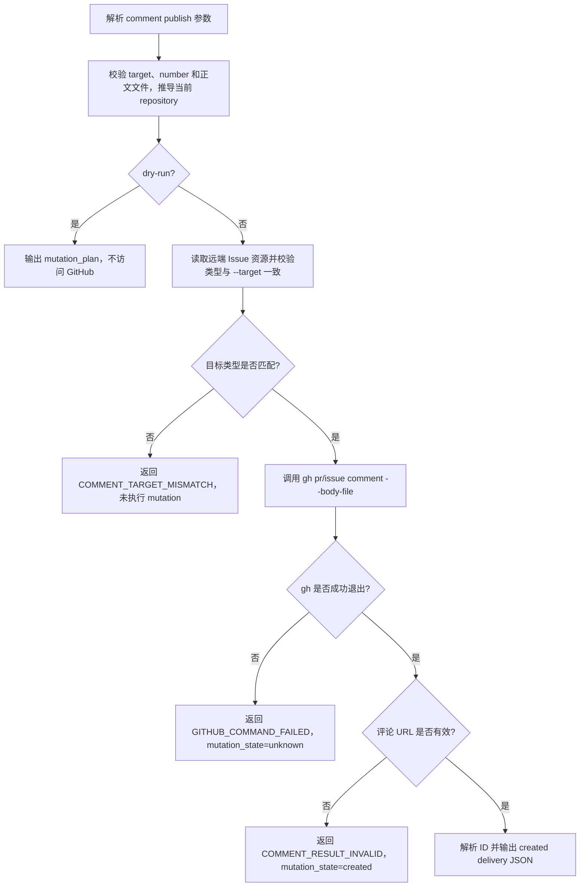

# GitHub 评论安全发布适配器设计

## 1. 文档状态

- 状态：Implemented
- 适用范围：本地 Issue 巡检、PR 巡检、文章生成 Skill 及 `article-hub` CLI
- 目标版本：`article-hub` 0.1.x
- 关联文档：
  - [CLI 边界设计](./cli-boundary-design.md)
  - [CLI 参考文档](./cli-reference.md)
  - [本地 Agent 定时巡检配置说明](./local-agent-scheduled-checks.md)
  - [Issue 巡检 prompt](./prompts/local-issue-watch.md)
  - [PR 巡检 prompt](./prompts/local-pr-watch.md)

本文定义 `article-hub comment publish` 的公开 contract、GitHub 调用方式、创建结果与失败语义。实现细节以源码与 [CLI 参考](./cli-reference.md) 为准。

## 2. 背景与问题

多行 GitHub 正文若由 Agent 直接拼进 `gh ... comment --body`，容易在 shell 边界上截断或丢失内容。历史上曾出现 PR 评论只保留标题、其余正文缺失的情况。

因此仓库提供受控 adapter：正文只能来自文件，内部固定 `--body-file`，并把 `gh` 返回的评论 URL 映射为稳定 JSON。成功条件是发布命令退出码 0 且返回 URL 合法。

## 3. 目标

- 为 PR 和 Issue 会话评论提供统一、受控的 CLI 入口。
- 评论正文只能来自真实 UTF-8 文件，不接受内联正文或 stdin。
- CLI 调用 `gh` 时只传递文件路径，不把评论正文放入子进程参数。
- 发布成功后解析本次返回的评论 URL 和 ID，不依赖评论列表顺序。
- 评论创建命令成功且返回 URL 合法时直接返回创建结果。
- stdout 只输出版本化 JSON；失败使用稳定错误码和结构化 details。
- `--dry-run` 为可选诊断：完成本地 guard 并输出可审计的 `mutation_plan`，不执行 GitHub mutation。
- `update-status` 的附加 Issue 评论复用相同的文件发布能力。
- prompt、Skill 和使用文档以 `comment publish` / `update-status --comment-file` 为会话评论唯一受支持入口。

## 4. 非目标

- 判断评论的自然语言意图、生成评论正文或检查文章写作质量。
- 创建 PR Review、行级 Review 评论、回复 Review thread、Resolve conversation、编辑或删除评论。
- 代替 `gh issue view`、`gh pr view`、`gh api` 等只读事实获取命令。
- 代替 `update-status` 的状态机、暂停保护和标签互斥规则。
- 自动生成业务 `request_key`、`failure_key` 或 `dedupe_key`。
- 在 CLI 内实现通用重试队列、定时任务或 GitHub Workflow。
- 在安全边界上禁止 Agent 启动裸 `gh`。
- 支持 GitHub Enterprise Server。
- 远端正文比对，或基于正文摘要的幂等 / 重试判断。

## 5. CLI 边界判断

`comment publish` 是受控 GitHub mutation adapter，固定以下跨流程不变量：

- 正文必须来自文件，且 `--body-file -` 无效。
- 本地文件在 mutation 前完成存在性、类型、UTF-8 和非空校验。
- GitHub 子进程参数不得包含评论正文。
- 发布结果必须映射为稳定 JSON contract。
- 成功结果必须包含精确 comment ID 与 URL。
- 写操作状态为未知，或已创建但返回结果无效时，不允许调用方盲目重试。

## 6. 公开命令 contract

### 6.1 命令格式

```sh
article-hub comment publish \
  --target <pr|issue> \
  --number <positive-integer> \
  --body-file <path>
```

可选诊断：

```sh
article-hub --dry-run comment publish \
  --target pr \
  --number 123 \
  --body-file /tmp/pr-123-receipt.md
```

### 6.2 参数

| 参数 | 必填 | contract |
| --- | --- | --- |
| `--target` | 是 | 只接受 `pr` 或 `issue`，不做大小写和别名兼容。 |
| `--number` | 是 | 正安全整数；PR 和 Issue 都使用该字段。 |
| `--body-file` | 是 | 必须指向可读普通文件；不接受空值、目录、设备文件或 `-`。 |

命令不提供 `--repository`、`--body`、`--comment`、`--stdin`、`--edit-last`、`--create-if-none` 等参数。调用方传入这些选项时返回 `UNKNOWN_OPTION`。

### 6.3 当前仓库约束

`comment publish` 只操作调用进程 `cwd` 所属的当前 Git 仓库，不接受由调用方选择目标仓库。CLI 在任何 GitHub 读取或 mutation 前执行以下本地 guard；dry-run 也执行相同 guard：

1. 使用 `git rev-parse --show-toplevel` 确认 `cwd` 位于 Git worktree 内。
2. 使用 `git remote get-url --all origin` 读取本地 `origin`；规范化去重后必须恰好得到一个非空 URL。
3. 只接受明确指向 `github.com` 的常见 HTTPS 或 SSH URL。
4. 从 URL 推导 `owner/repo`；两段都必须匹配 `[A-Za-z0-9_.-]+`，且不能是 `.` 或 `..`。

推导结果写入 `target.repository` 和 `mutation_plan.operations[].repository`，并作为发布和 URL 校验的唯一 repository。CLI 不使用 `gh repo view` 推导仓库，避免 dry-run 访问远端，也不允许 `GH_REPO` 改写目标。

所有内部 GitHub 调用仍必须显式绑定推导出的仓库和 `github.com`：发布命令使用 `--repo github.com/<owner>/<repo>`，类型预检 API 使用 `--hostname github.com`。不在 Git worktree、缺少或存在歧义的 `origin`、remote host 不受支持、URL 无法解析或 owner/repository 不安全时，返回 `CURRENT_REPOSITORY_INVALID`，且不得访问 GitHub。

### 6.4 正文文件校验

CLI 在任何 GitHub mutation 前按以下顺序校验：

1. 路径参数不是空字符串或 `-`。
2. 路径存在、可读且对应普通文件。
3. 文件可按严格 UTF-8 解码；无效字节不能被替换字符静默吞掉。
4. 正文至少包含一个非空白字符。
5. 计算 `line_count` 供人工检查（统一 CRLF/CR 为 LF，并忽略最多一个文件末尾换行）。

正文原文不写入 stdout、stderr 或 `mutation_plan`。

### 6.5 成功输出

真实发布成功时输出：

```json
{
  "ok": true,
  "schema_version": "article-hub.comment.publish",
  "dry_run": false,
  "target": {
    "kind": "pr",
    "number": 123,
    "repository": "hexqi/ai-article-hub"
  },
  "body": {
    "file": "/tmp/pr-123-receipt.md",
    "line_count": 8
  },
  "delivery": {
    "status": "created",
    "comment_id": 123456789,
    "comment_url": "https://github.com/hexqi/ai-article-hub/pull/123#issuecomment-123456789"
  },
  "mutation_plan": {
    "operations": [
      {
        "kind": "gh-pr-comment",
        "repository": "hexqi/ai-article-hub",
        "number": 123,
        "body_file": "/tmp/pr-123-receipt.md"
      }
    ]
  }
}
```

Issue 评论使用 `target.kind: "issue"` 和 operation kind `gh-issue-comment`。

### 6.6 Dry-run 输出

Dry-run 执行全部本地参数、当前仓库和正文文件校验，但不读取远端目标、不创建评论。`delivery` 为 `null`，`mutation_plan.operations` 与真实路径相同。日常发布直接运行真实命令；`--dry-run` 用于需要核对 mutation plan 的场景。

## 7. 执行流程



### 7.1 目标类型预检

独立 `comment publish` 在真实 mutation 前，使用 REST Issue 资源确认目标类型与 `--target` 一致：

```sh
gh api --hostname github.com repos/<owner>/<repo>/issues/<number>
```

判定规则：

- `target=pr`：响应必须包含 object 类型的 `pull_request`。
- `target=issue`：响应不得包含 `pull_request`。

类型不匹配时返回 `COMMENT_TARGET_MISMATCH`，`mutation_state` 为 `not_started`，`retry_safe` 为 `true`。

预检读取失败时返回 `GITHUB_COMMAND_FAILED`，details 标记 `stage: "target-preflight"`、`mutation_state: "not_started"` 和 `retry_safe: true`。Dry-run 不做远端预检。

`update-status` 始终面向 Issue：先通过 `gh issue view` 读取最新标签，再按需执行标签 mutation 与评论发布。

### 7.2 发布调用

```sh
gh pr comment <number> --repo github.com/<owner>/<repo> --body-file <body-file>
gh issue comment <number> --repo github.com/<owner>/<repo> --body-file <body-file>
```

其中 `<owner>/<repo>` 只使用当前仓库 `origin` 的本地推导结果。调用必须经过现有 `runCommand`/`execFile` 边界，不使用 shell 字符串，不允许把文件内容替换为 `--body` 参数。

### 7.3 评论 URL 校验

返回 URL 必须满足：

- scheme 为 `https`，host 为 `github.com`。
- owner、repository 与当前仓库推导结果一致，比较时忽略大小写。
- 页面编号与 `--number` 一致。
- fragment 精确包含正整数形式的 `issuecomment-<id>`。
- `target=pr` 时 URL 路径是 `/pull/<number>`；`target=issue` 时 URL 路径是 `/issues/<number>`。

`gh` 返回退出码 0 但没有合规 URL 时，评论已经创建，但 CLI 无法提供稳定 comment URL/ID。此时返回 `COMMENT_RESULT_INVALID`、`mutation_state: "created"` 和 `retry_safe: false`。

## 8. 错误 contract 与重试语义

### 8.1 错误码

| 错误码 | 退出码 | mutation 状态 | 说明 |
| --- | --- | --- | --- |
| `MISSING_ARGUMENT` | 2 | 未执行 | 缺少参数，或 `--number`/`--target` 值无效。 |
| `UNKNOWN_OPTION` | 2 | 未执行 | 传入 `--repository`、`--body` 等未支持选项。 |
| `CURRENT_REPOSITORY_INVALID` | 2 | 未执行 | `cwd` 不在 Git worktree、`origin` 缺失或有歧义、remote 不是 `github.com`，或无法安全解析 `owner/repo`。 |
| `COMMENT_FILE_NOT_FOUND` | 2 | 未执行 | 正文文件不存在或不可读。 |
| `INVALID_COMMENT_FILE` | 2 | 未执行 | `-`、非普通文件、无效 UTF-8 或正文仅含空白。 |
| `COMMENT_TARGET_MISMATCH` | 2 | 未执行 | 远端对象类型与 `--target` 不一致。 |
| `GITHUB_COMMAND_FAILED` | 1 | 未执行或未知 | 类型预检失败时未执行 mutation；发布命令失败时写入状态未知。 |
| `COMMENT_RESULT_INVALID` | 1 | 已创建 | 发布命令成功，但返回内容无法映射为目标 comment URL/ID。 |

`mutation_state` 只接受：

- `not_started`：可以证明评论 mutation 尚未开始。
- `unknown`：评论发布命令已经启动，但无法证明远端是否创建评论。
- `created`：发布命令成功，评论已创建。

| 失败阶段 | 错误码 | `mutation_state` | `retry_safe` |
| --- | --- | --- | --- |
| 本地参数、当前仓库或正文文件 guard | 对应参数/仓库/文件错误 | `not_started` | `true` |
| 目标类型预检读取失败 | `GITHUB_COMMAND_FAILED` | `not_started` | `true` |
| 目标类型不匹配 | `COMMENT_TARGET_MISMATCH` | `not_started` | `true` |
| 发布命令非零退出且无可信 URL | `GITHUB_COMMAND_FAILED` | `unknown` | `false` |
| 发布命令成功但 URL 无效 | `COMMENT_RESULT_INVALID` | `created` | `false` |

GitHub 相关错误的 details 至少包含：

```json
{
  "stage": "publish",
  "mutation_state": "unknown",
  "retry_safe": false,
  "target": {
    "kind": "pr",
    "number": 123,
    "repository": "hexqi/ai-article-hub"
  },
  "comment_id": null,
  "comment_url": null
}
```

已经取得 comment ID 或 URL 时保留实际值。不得在 details 中回显正文。

### 8.2 调用方处理规则

- `retry_safe: true` 只表示评论 mutation 尚未开始；修正参数或恢复只读预检后可以重新执行。
- `retry_safe: false` 时，不重新执行 publish 命令。
- 调用方先通过现有 `request_key`、`failure_key` 或 `dedupe_key` 查询远端是否已有对应评论。
- 已存在匹配事件标记的评论时，沿用该结果，不创建重复评论。
- 未找到匹配评论时，保留运行标记和本地正文文件，报告 comment URL、目标与人工检查入口。
- `comment publish` 自身不编辑或删除已创建评论。

## 9. 幂等与并发

adapter 不自动生成业务幂等键，也不把“相同正文”一律视为同一事件。幂等继续由调用方已存在的事件标记保证：

- Issue 普通请求使用 `request_key`。
- Issue/PR 失败回执使用 `failure_key`。
- PR 巡检处理回执使用 `dedupe_key`。
- 写作计划由计划版本、触发评论和固定批准快照管理。

CLI 发布前不扫描“最近一条评论”。发布后只解析本次返回的 comment URL/ID。

## 10. `update-status` 集成

### 10.1 目标状态

`update-status --comment-file` 复用共享 GitHub 评论发布模块：

```sh
gh issue comment <number> --repo github.com/<owner>/<repo> --body-file <comment-file>
```

`update-status` 与独立 `comment publish` 一样，不接受 `--repository`，从调用进程 `cwd` 的 `origin` 推导当前仓库。

共享实现：

- 当前仓库推导和 `github.com` host guard。
- 正文文件校验（UTF-8、普通文件、非空）与可选 `line_count`。
- `gh ... comment --body-file` 调用。
- URL 解析和创建结果映射。
- `mutation_state` 与 `retry_safe` details。

成功 envelope 的 `comment_delivery`：

```json
{
  "comment_delivery": {
    "status": "created",
    "comment_id": 123456789,
    "comment_url": "https://github.com/hexqi/ai-article-hub/issues/51#issuecomment-123456789"
  }
}
```

没有传入 `--comment-file`、状态 mutation 被阻断或没有标签变化时，`comment_delivery` 必须为 `null`。

### 10.2 部分成功

评论文件的全部本地校验必须在标签 mutation 前完成。

标签更新后评论失败时返回 `PARTIAL_MUTATION`：

```json
{
  "mutation_state": "unknown",
  "completed_operations": [
    { "kind": "gh-issue-edit-labels" }
  ],
  "unknown_operations": [
    {
      "kind": "gh-issue-comment",
      "body_file": "/tmp/status-comment.md"
    }
  ],
  "retry_safe": false
}
```

- 发布命令已启动但未返回可信 URL：评论进入 `unknown_operations`，`mutation_state` 为 `unknown`。
- 发布命令成功但 URL 无效：`mutation_state` 为 `created`；标签与评论均进入 `completed_operations`（评论带 `result_error`），`unknown_operations` 为空。

### 10.3 参数边界

- 附加评论使用 `--comment-file`。
- `comment publish` 与 `update-status` 的目标仓库均由当前 worktree 的 `origin` 推导。
- `create-pr --repository` 是独立 contract，不在本设计范围内修改。

## 11. 代码组织

| 路径 | 职责 |
| --- | --- |
| `src/commands/comment.ts` | 组织 `comment publish` command，生成 envelope 和 mutation plan。 |
| `src/infrastructure/github-repository.ts` | 从当前 Git worktree 的 `origin` 推导并校验 `github.com` repository。 |
| `src/infrastructure/github-comment.ts` | 校验文件、类型预检、调用 `gh` 并映射创建结果。 |
| `src/cli.ts` | 解析 `comment publish` 与 `update-status` 参数。 |
| `src/commands/update-status.ts` | 复用安全发布模块，维护状态 mutation 与部分成功语义。 |
| `tests/integration/comment-cli.test.ts` | 验证公开 CLI contract 和 GitHub 外部边界。 |
| `tests/support/fake-gh.ts` | 支持 PR/Issue 评论创建、URL 输出和失败注入。 |

## 12. 调用方约定

### 12.1 Prompt 与巡检

Issue/PR/发布巡检与本地调度文档统一约定：

1. Agent 用文件写入工具生成临时 Markdown 文件。
2. 命令 `cwd` 必须是 `scheduler_root`、runtime worktree 或候选 worktree；目标仓库由 `origin` 推导。
3. 运行 `<article_hub> comment publish ...`。
4. 只在 `delivery.status == "created"` 时声明评论发布成功。
5. 需要核对 mutation plan 时可用 `--dry-run`。
6. 会话评论的唯一受支持入口是 `comment publish` 或 `update-status --comment-file`。

### 12.2 Skill

`generate-opentiny-article` 使用 `comment publish --target issue` 发布写作计划；状态回执经 `update-status --comment-file`。四份项目级 Skill（`.agents` 与 `.claude`）保持相同 contract。

## 13. 安全分析

### 13.1 已解决风险

- 正文中的引号、反引号、`$(...)`、`!`、换行和 Markdown 不进入 shell 字符串。
- 正文不出现在 `gh` 子进程 argv。
- 不支持 stdin，避免 pipe、here-doc 和命令替换重新成为正文来源。
- 调用方不能通过 public 参数、`GH_REPO` 或 `GH_HOST` 把受控 mutation 指向当前 `origin` 之外的仓库或 host。
- 发布成功以 `gh` 返回的精确 comment URL/ID 为准。
- stdout 不输出正文。

### 13.2 仍存在的限制

- Agent 仍可在执行环境允许时主动调用裸 `gh`。
- 当前仓库 guard 依赖本地 Git 配置。
- `gh` 请求非零退出时，远端是否已接受 mutation 可能未知；因此默认禁止自动重试。
- 调用方提供的正文文件在校验和 `gh` 读取之间可能被其他本地进程修改。
- GitHub 仍可能因权限、rate limit、spam 检测、网络或服务异常拒绝请求。

## 14. 测试设计

### 14.1 必测成功路径

- PR 评论 dry-run 从当前 worktree 的 `origin` 推导 repository，输出 `article-hub.comment.publish`、`body.line_count` 和 `gh-pr-comment` operation，fake `gh` 无调用。
- Issue 评论 dry-run 输出 `gh-issue-comment` operation。
- 主仓、runtime worktree、候选 worktree 和仓库子目录都推导出同一个 `owner/repo`。
- PR/Issue 真实发布只向 fake `gh` 传递 `--body-file <path>`，参数中不存在 `--body` 和正文。
- `GH_REPO` 或 `GH_HOST` 指向其他目标时，预检和发布仍显式使用当前 `origin` 推导的 repository 与 `github.com`。
- 类型预检能区分 Issue 与 PR；类型匹配才执行评论 mutation。
- 正文包含双引号、反引号、`$(command)`、`!`、HTML comment 和多行 Markdown 时，只通过文件路径传递，stdout/stderr 不泄露正文。
- 返回精确 comment ID、URL 和 `created` 状态；`body` 含 `line_count`。
- CRLF 与文件末尾单个换行按统一规则统计 `body.line_count`。

### 14.2 必测失败路径

- 缺少参数、非法 target、非正整数 number；显式传入 `--repository` 时返回 `UNKNOWN_OPTION`。
- `cwd` 不在 Git worktree、`origin` 缺失、存在多个不同的 `origin` URL、remote 不是 `github.com` 等返回 `CURRENT_REPOSITORY_INVALID`。
- `target=issue` 指向 PR 或 `target=pr` 指向 Issue 时，在评论 mutation 前返回 `COMMENT_TARGET_MISMATCH`。
- 文件不存在、目录、`-`、无效 UTF-8、空文件、仅空白正文。
- 传入 `--body` 时在 fake `gh` 调用前返回 `UNKNOWN_OPTION`。
- 类型预检读取非零退出时返回 `GITHUB_COMMAND_FAILED`、`stage: "target-preflight"`、`mutation_state: "not_started"` 和 `retry_safe: true`。
- 评论发布命令非零退出且没有可信 URL 时返回 `GITHUB_COMMAND_FAILED`、`mutation_state: "unknown"` 和 `retry_safe: false`。
- `gh` 返回成功但没有 URL、URL target 不匹配或 comment ID 非法时返回 `COMMENT_RESULT_INVALID`、`mutation_state: "created"` 和 `retry_safe: false`。

### 14.3 `update-status` 回归

- 目标 repository 从当前 worktree 推导。
- `--comment-file` 经共享模块以 `--body-file` 发布。
- 评论文件本地无效时不修改标签。
- 成功发布状态评论时返回 `comment_delivery.status: "created"`、comment ID 和 URL；调用序列为 view → edit → comment。
- 标签成功、评论发布状态未知时返回 `mutation_state: "unknown"`，评论进入 `unknown_operations`。
- 标签和评论已创建但评论 URL 无效时返回 `mutation_state: "created"`，评论进入 `completed_operations` 并包含 `result_error`。

### 14.4 Skill 和文档 contract

- 生成 Skill 通过 `comment publish --target issue` 发布写作计划；状态回执使用 `update-status --comment-file`。
- 润色 Skill 状态回执使用 `--comment-file`。
- 测试保护“评论 mutation 唯一入口”的长期 contract，不绑定 prompt 的完整自然语言段落。

## 15. 验收标准

- `comment publish` 同时支持 PR 和 Issue，生成稳定 JSON envelope。
- `comment publish` 和 `update-status` 只操作当前 worktree 的单一 `github.com` origin。
- 评论正文只接受文件输入；`--body-file -` 被拒绝。
- 独立 `comment publish` 在 mutation 前校验远端对象类型与 `--target` 一致。
- 所有真实评论调用都使用 `--body-file`，外部进程参数中不存在正文。
- 评论发布命令成功且 URL 合法时返回 `delivery.status: "created"`；`body` 含文件路径与 `line_count`。
- dry-run 为可选诊断，不执行 GitHub mutation。
- `update-status --comment-file` 复用共享实现，成功 envelope 返回 `comment_delivery`，部分成功结果不诱导盲目重试。
- Issue/PR prompt、四份项目级 Skill 和使用文档以受控 adapter 为会话评论入口。
- `pnpm test` 与 `pnpm run build` 通过。

## 16. 已确认决定

- 附加评论使用 `--comment-file`。
- `comment publish` 和 `update-status` 的目标仓库由当前 worktree 的 `origin` 推导。
- `create-pr --repository` 保持既有 contract。
- 不实施 Codex、Claude 或调度器层的命令硬禁止。
- 成功依据为 `gh` 退出码 0 且返回 URL 合法。
- `body.line_count` 供人工检查。
- 独立 `comment publish` 做 Issue/PR 类型预检。
- `update-status` 通过 `gh issue view` 读取 Issue，再执行标签与评论 mutation。
- `--dry-run` 为可选诊断。
