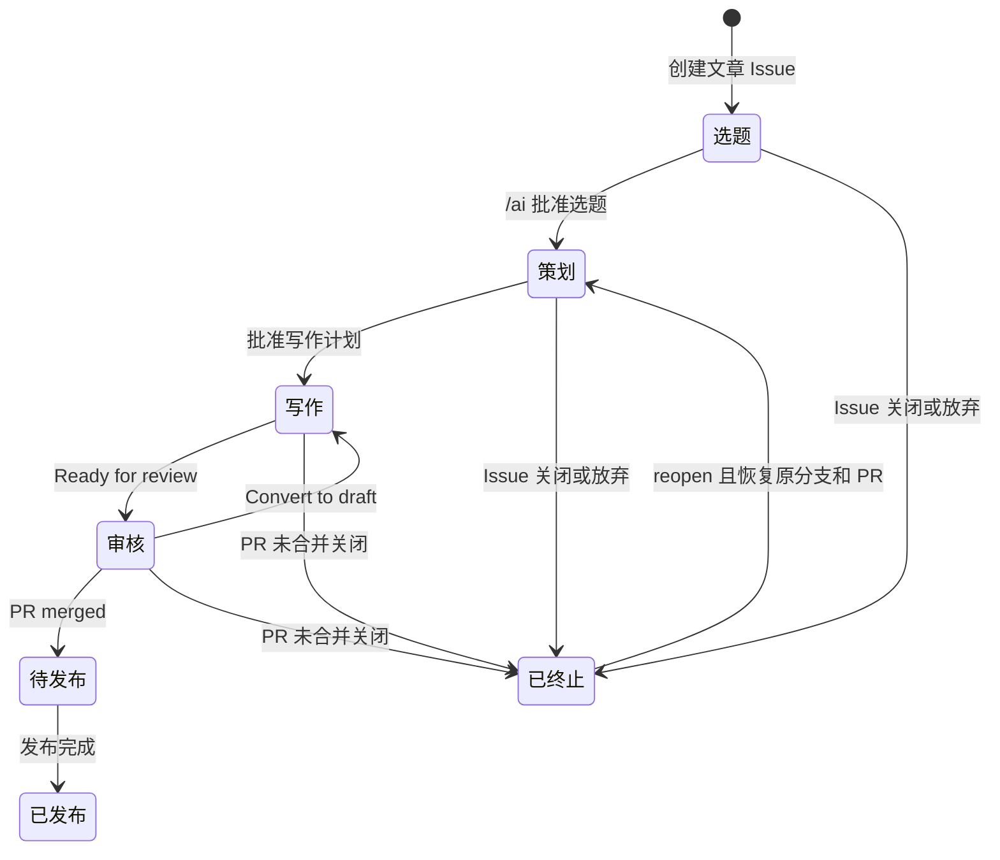
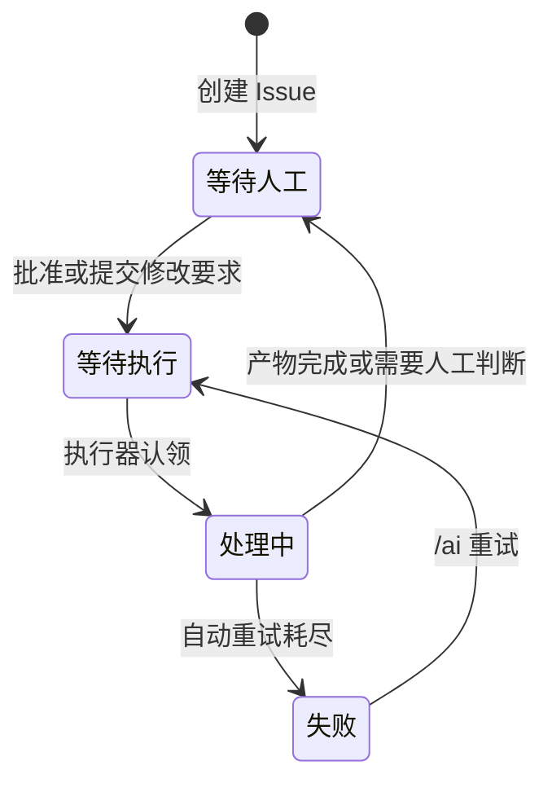

# 状态 mutation 单一规则源设计

## 1. 背景

当前状态规则分别实现在 `src/domain/state-machine.ts` 与
`src/commands/update-status.ts`：

- 两处各自声明阶段标签、AI 状态标签和 AI inactive 阶段集合。
- `state decide` 遇到暂停时阻断所有 mutation，进入 AI inactive 阶段时只清理
  `AI：*`，不负责目标阶段互斥。
- `update-status` 负责目标阶段和 AI 状态互斥，但进入 AI inactive 阶段时只清理已知
  AI 状态；当前标签为 `AI：已暂停` 且目标仍为该标签时，还可以绕过暂停 guard 修改阶段。
- 文档列出了 `/ai 恢复`，但 `AI：已暂停` 作为互斥 AI 状态覆盖了暂停前状态，系统无法
  确定恢复目标。

这导致状态标签互斥、暂停保护和恢复规则存在多个真理来源，违反仓库要求：确定性业务规则
必须固定在 `article-hub`，不得由 command 或 Skill 重复实现。

## 2. 目标

本次改造必须实现：

1. 用一个 domain Module 固定状态标签、状态不变量、暂停保护和 mutation 规划。
2. 将业务阶段、AI 工作状态和人工暂停信号建模为三个正交维度。
3. 提供无需额外保存“暂停前状态”的可靠暂停与恢复路径。
4. 让 `state decide` 与 `update-status` 对相同输入产生一致决策。
5. 保持现有 CLI JSON envelope、稳定错误码、dry-run 和可审计 mutation plan。
6. 为旧 `AI：已暂停` 标签提供确定性迁移路径，不猜测丢失的状态。

## 3. 非目标

本次不实现：

- GitHub Workflow、常驻服务、定时 Reconcile 或自动事件监听。
- GitHub Actions queued/running run 的取消；这是未来 Workflow 的控制面职责。
- 发布平台适配和 `阶段：待发布 → 阶段：已发布` 的发布实现。
- 通用状态存储、数据库或事件溯源。
- 为唯一的 GitHub Adapter 创建抽象仓储 Interface。

当前本地交付只负责确定性命令解析、状态决策、受控标签 mutation 和 Skill 停止条件。

## 4. 方案选择

### 4.1 采用：独立人工暂停信号

暂停时保留业务阶段和可恢复的 AI 工作状态，额外增加
`AI执行：人工暂停`。恢复只需移除该标签，GitHub 当前标签本身就是完整状态来源。

### 4.2 不采用：额外保存暂停前状态

将暂停前状态写入评论、独立 metadata 或缓存会产生双写和恢复一致性问题。评论还需要新增
解析 contract，本地缓存又不符合 GitHub 是唯一长期状态来源的约束。

### 4.3 不采用：仅重命名互斥暂停状态

如果暂停标签仍占用正常 AI 工作状态槽位，即使改名也会丢失恢复目标，不能解决状态模型
不闭合的问题。

## 5. 状态模型

### 5.1 三个正交维度

| 维度 | 标签 | 互斥规则 |
| --- | --- | --- |
| 业务阶段 | `阶段：选题/策划/写作/审核/待发布/已发布/已终止` | 恰好一个 |
| AI 工作状态 | `AI：等待执行/处理中/等待人工/失败` | 活跃阶段恰好一个 |
| 人工暂停信号 | `AI执行：人工暂停` | 至多一个，可与 AI 工作状态共存 |

`AI：已暂停` 不再是正常 AI 工作状态，只在迁移期作为 legacy 标签识别。

### 5.2 活跃阶段

以下阶段属于活跃阶段：

- `阶段：选题`
- `阶段：策划`
- `阶段：写作`
- `阶段：审核`

有效状态必须恰好包含一个阶段标签和一个 AI 工作状态标签，可以额外包含
`AI执行：人工暂停`。

### 5.3 AI inactive 阶段

以下阶段没有待执行 AI 工作：

- `阶段：待发布`
- `阶段：已发布`
- `阶段：已终止`

进入这些阶段时必须清除：

- 所有以 `AI：` 开头的标签，包括未知历史状态。
- `AI执行：人工暂停`。
- legacy `AI：已暂停`。

`阶段：待发布` 仍可迁移到 `阶段：已发布`，因此代码和文档使用
`aiInactivePhases`，不再把三者统称为 terminal phases。真正的业务终态是
`阶段：已发布` 和 `阶段：已终止`。

### 5.4 非法当前状态

以下情况返回 `INVALID_CURRENT_STATE`，不生成 mutation：

- 没有阶段标签。
- 同时存在多个阶段标签。
- 活跃阶段同时存在多个正常 AI 工作状态。
- 活跃阶段没有正常 AI 工作状态，但不存在可显式迁移的 legacy 暂停状态。
- AI inactive 阶段仍带有活动 AI 状态，而当前 intent 又不是
  `reconcile` 或合法 lifecycle transition。

未知的 `阶段：*` 或 `AI：*` 标签不应被静默当作合法状态。Reconcile 可以清理
AI inactive 阶段中的未知 `AI：*`；其他场景必须报告当前状态无效。

## 6. 完整状态流

### 6.1 业务阶段流



### 6.2 事件到状态的映射

| 事件 | 前置状态 | 结果状态 |
| --- | --- | --- |
| 创建文章 Issue | 无 | `阶段：选题 + AI：等待人工` |
| `/ai 批准选题` | `阶段：选题 + AI：等待人工` | `阶段：策划 + AI：等待执行` |
| 执行器认领调研 | `阶段：策划 + AI：等待执行` | `阶段：策划 + AI：处理中` |
| 写作计划发布 | `阶段：策划 + AI：处理中` | `阶段：策划 + AI：等待人工` |
| 批准写作计划 | `阶段：策划 + AI：等待人工` | `阶段：写作 + AI：等待执行` |
| 执行器认领生成 | `阶段：写作 + AI：等待执行` | `阶段：写作 + AI：处理中` |
| Draft PR 创建完成 | `阶段：写作 + AI：处理中` | `阶段：写作 + AI：等待人工` |
| Ready for review | `阶段：写作 + AI：等待人工` | `阶段：审核 + AI：等待人工` |
| Request changes 或授权 `/ai` 修改 | `阶段：审核 + AI：等待人工` | `阶段：审核 + AI：等待执行` |
| 执行器认领修订 | `阶段：审核 + AI：等待执行` | `阶段：审核 + AI：处理中` |
| 修订完成 | `阶段：审核 + AI：处理中` | `阶段：审核 + AI：等待人工` |
| Convert to draft | `阶段：审核` | `阶段：写作 + AI：等待人工` |
| PR merged | `阶段：审核` | `阶段：待发布`，清理 AI 与暂停标签 |
| 发布完成 | `阶段：待发布` | `阶段：已发布` |
| PR 未合并关闭或人工放弃 | 任一活跃阶段 | `阶段：已终止`，清理 AI 与暂停标签 |
| 已终止 Issue reopen | `阶段：已终止` | `阶段：策划 + AI：等待人工` |

`AI：等待执行 → AI：处理中` 是显式认领过程。只有执行器已经开始处理时才能设置
`AI：处理中`，避免暂停、恢复或重试后产生没有真实任务的“处理中”状态。

### 6.3 AI 工作状态流



业务阶段迁移可以同时改变 AI 工作状态，但必须由同一个 domain 决策生成一个幂等
mutation plan。

### 6.4 允许的阶段迁移

Domain Module 只允许状态流中明确存在的阶段边，不接受任意目标阶段：

| intent | 允许的阶段迁移 |
| --- | --- |
| `content-transition` | 保持当前阶段、`选题 → 策划`、`策划 → 写作` |
| `lifecycle-transition` | `写作 → 审核`、`审核 → 写作`、`审核 → 待发布`、任一活跃阶段 `→ 已终止`、`待发布 → 已发布`、`已终止 → 策划` |
| `pause`、`resume`、`retry` | 不改变阶段 |
| `reconcile` | 不推进业务阶段，只修复可由当前事实唯一推导的不变量 |

目标活跃阶段必须同时给出合法 AI 工作状态；目标 AI inactive 阶段忽略调用方提供的 AI
状态并清理所有 AI 与暂停标签。未列出的阶段边返回 `INVALID_TRANSITION`。

## 7. 暂停、恢复与重试

### 7.1 `/ai 暂停`

暂停属于控制面 intent，只允许作用于活跃阶段，且操作幂等。

| 暂停前 AI 状态 | 暂停后 |
| --- | --- |
| `AI：等待执行` | 保留状态，增加 `AI执行：人工暂停` |
| `AI：处理中` | 改为 `AI：等待执行`，增加 `AI执行：人工暂停` |
| `AI：等待人工` | 保留状态，增加 `AI执行：人工暂停` |
| `AI：失败` | 保留状态，增加 `AI执行：人工暂停` |

`AI：处理中` 必须退回 `AI：等待执行`，因为暂停意味着当前执行已失效。未来 Workflow
还需取消 queued/running run；本次本地实现只固定标签状态与 mutation guard。

重复暂停返回成功和空 mutation plan。

### 7.2 暂停期间的权限

暂停期间禁止：

- 启动调研、生成或修订任务。
- 将 `AI：等待执行` 改为 `AI：处理中`。
- 提交或推送 AI 产物。
- 创建或更新 Draft PR。
- 普通内容面状态推进。

暂停期间允许：

- `/ai 状态` 和只读诊断。
- `/ai 恢复`。
- PR merged、Issue closed 等 lifecycle transition。
- 进入 AI inactive 阶段并清理状态。
- 只修复可唯一推导不变量、且不推进活跃状态的确定性 Reconcile。

暂停 guard 必须根据 mutation intent 判断，不能继续使用“存在暂停标签就阻断任何
mutation”的规则。

### 7.3 `/ai 恢复`

正常恢复只移除 `AI执行：人工暂停`，不修改业务阶段和正常 AI 工作状态：

| 保留的 AI 状态 | 恢复后的行为 |
| --- | --- |
| `AI：等待执行` | 可以重新进入执行队列 |
| `AI：等待人工` | 继续等待人工，不自动执行 |
| `AI：失败` | 保持失败，必须显式 `/ai 重试` |
| `AI：处理中` | 视为非法当前状态，不允许恢复 |
| 无正常 AI 状态 | 视为状态不完整，不允许恢复 |

重复恢复返回成功和空 mutation plan。

### 7.4 `/ai 重试`

`/ai 重试` 只允许：

```text
AI：失败 → AI：等待执行
```

若存在 `AI执行：人工暂停`，返回 `AI_PAUSED`。用户必须先 `/ai 恢复`，再
`/ai 重试`，避免“重试”隐式撤销人工暂停。

## 8. Deep 状态 mutation Module

深化 `src/domain/state-machine.ts`，使其成为状态规则的唯一真理来源。Module 的
Interface 接收当前标签、mutation intent、可选目标状态和可选 Head SHA guard，输出
确定性 mutation decision。

mutation intent 使用可判别联合类型表达：

```text
content-transition
lifecycle-transition
pause
resume
retry
reconcile
```

Implementation 统一负责：

- 标签目录、类型守卫与状态归一化。
- 当前状态不变量校验。
- 阶段和 AI 工作状态互斥。
- 暂停、恢复和重试规则。
- 基于 intent 的暂停 guard。
- Head SHA guard。
- AI inactive 阶段清理。
- legacy 暂停迁移。
- 幂等 `labelsToRemove` 与 `labelsToAdd` 规划。

该 Module 应保持纯函数实现，不读取文件、不调用 GitHub、不生成 CLI envelope。其
Interface 同时作为 domain unit test 与 command Adapter 的测试 Seam，集中状态规则的
Locality，并为多个命令提供 Leverage。

当前只有一个 GitHub Adapter，因此不新增抽象仓储 Interface；一个 Adapter 对应的抽象
Seam 目前没有实际变化来源。

## 9. Command 与 Adapter 职责

### 9.1 `state decide`

`state decide` 继续作为无副作用 Primitive：

- 读取状态 fixture。
- 将 wire 输入转换为 domain 输入。
- 调用状态 mutation Module。
- 输出稳定 JSON envelope。

状态 fixture 增加 mutation intent 和相应目标字段。迁移期未提供 intent 的旧 fixture
按 `reconcile` 处理。Reconcile 在活跃阶段遇到人工暂停时仍返回 `AI_PAUSED`；在 AI
inactive 阶段则允许清理残留 AI 与暂停标签，从而保持现有暂停 guard 和终态清理行为。

### 9.2 `update-status`

`update-status` 继续作为 GitHub mutation Adapter，不再声明或判断业务状态规则：

- 读取并规范化 Issue fixture。
- 将 CLI 参数转换为 domain intent。
- 把 domain mutation decision 映射为 GitHub label/comment operations。
- dry-run 只输出计划，不执行外部 mutation。
- 非 dry-run 执行 GitHub mutation。

CLI 增加可选 `--intent`：

```text
content-transition
lifecycle-transition
pause
resume
retry
```

兼容规则：

- 未提供 `--intent` 时默认为 `content-transition`。
- `content-transition` 沿用现有 `--phase` 和可选 `--ai-state`。
- `lifecycle-transition` 要求 `--phase`，目标为活跃阶段时还要求 `--ai-state`。
- `pause`、`resume` 和 `retry` 不要求 `--phase`。
- legacy 恢复可以显式提供 `--ai-state`，作为人工选择的恢复目标。

`--comment` 只有 mutation 被允许时才进入 operation plan。被暂停或状态非法时不得单独
发表评论，避免出现“已更新”但标签未更新的误导性回执。

非 dry-run 的最终实现必须基于 mutation 前最新的 Issue 标签重新决策。当前
`--issue-file` 可以用于审计和 dry-run，但不能作为写操作时唯一的暂停事实来源。若本次
实现无法安全获取最新 GitHub 标签，则非 dry-run 必须停止，而不是使用过期 fixture
继续 mutation。

### 9.3 固定命令解析

`src/domain/command-parser.ts` 确定性识别需求文档列出的命令：

```text
/ai 状态
/ai 批准选题
/ai 批准写作计划 <plan_version> <hash-prefix>
/ai 暂停
/ai 恢复
/ai 重试
```

`inspect-issue` 仍只负责解析、权限和 bot 过滤，输出 `actionable`；它不直接执行状态
mutation。当前本地流程由 Agent 根据 actionable 命令调用对应 CLI intent，未来
Workflow 才负责自动唤醒。

## 10. Legacy `AI：已暂停` 迁移

迁移期同时识别旧 `AI：已暂停` 和新 `AI执行：人工暂停`，但不把旧标签纳入正常 AI
工作状态集合。

规则如下：

1. 旧标签与一个合法正常 AI 工作状态共存：替换为新暂停标签，保留正常 AI 状态。
2. 只有旧标签、没有正常 AI 工作状态：返回
   `LEGACY_PAUSE_STATE_AMBIGUOUS`，禁止自动恢复。
3. 人工可通过 resume intent 显式提供目标 `--ai-state`；Module 移除旧标签并恢复为
   该状态。
4. 若 legacy 状态中的目标为 `AI：处理中`，拒绝迁移；人工必须选择
   `AI：等待执行`、`AI：等待人工` 或 `AI：失败`。
5. 进入 AI inactive 阶段时，无条件清除新旧暂停标签。
6. 存量 Issue 迁移完成后，删除 GitHub 上的旧标签，再移除兼容实现。

任何路径都不得根据阶段猜测暂停前 AI 状态。

## 11. 错误与幂等 contract

保留已有：

- `AI_PAUSED`
- `HEAD_SHA_MISMATCH`
- `INVALID_STATE`

新增稳定原因：

| code | 含义 |
| --- | --- |
| `INVALID_CURRENT_STATE` | 当前标签违反状态不变量 |
| `INVALID_TRANSITION` | 当前状态不允许目标迁移 |
| `LEGACY_PAUSE_STATE_AMBIGUOUS` | legacy 暂停状态缺少可恢复 AI 状态 |

无效 CLI 标签值继续使用 `INVALID_STATE` 和退出码 `2`。状态决策被业务 guard 阻断时
保持成功 JSON envelope，使用 `mutation_allowed: false` 与稳定 `blocked_reason`；
输入文件或参数本身无效时沿用现有 CLI error envelope。

Domain 决策顺序固定为：

1. 校验并归一化当前状态；无法解释时返回 `INVALID_CURRENT_STATE`。
2. 对活跃阶段的 content transition、retry 和 reconcile 应用人工暂停 guard，优先返回
   `AI_PAUSED`。
3. 对需要保护内容产物的 intent 应用 Head SHA guard，返回 `HEAD_SHA_MISMATCH`。
4. 校验 intent 对应的阶段边和目标状态，返回 `INVALID_TRANSITION` 或 mutation plan。

以下情况是成功 no-op，`mutation_plan.operations` 为空：

- 重复暂停。
- 重复恢复。
- 当前标签已经满足目标状态。
- Reconcile 后无需修复。

## 12. 测试策略

### 12.1 Domain unit tests

状态 mutation Module 的 Interface 是主要测试面，使用 table-driven tests 覆盖：

- 三个维度的合法组合与互斥不变量。
- 四种 AI 工作状态的暂停。
- `处理中` 暂停后退回 `等待执行`。
- 恢复不改变阶段和正常 AI 工作状态。
- 暂停期间 content transition 被阻断。
- 暂停期间合法 lifecycle transition 可以完成。
- `/ai 重试` 必须先恢复。
- 人工暂停与 Head SHA 同时存在时，内容 mutation 稳定返回 `AI_PAUSED`。
- 未暂停时 Head SHA 不一致阻断内容 mutation。
- AI inactive 阶段清除所有 `AI：*`、新暂停标签和 legacy 暂停标签。
- 未知 `AI：旧状态` 在 AI inactive 阶段可被清理。
- legacy 暂停的可迁移与歧义路径。
- 重复操作的 no-op 结果。

### 12.2 CLI integration tests

保护调用方可观察行为：

- `state decide` 与 `update-status` 对同一输入产生一致标签计划。
- 默认 intent 保持现有 `update-status` 调用兼容。
- 暂停时不能借目标暂停标签修改阶段。
- pause、resume、retry 与 lifecycle intent 的参数约束。
- stdout/stderr、exit code、schema version 和稳定 blocked reason。
- dry-run 不执行 GitHub mutation。
- 非 dry-run 使用最新 GitHub 标签重新检查暂停状态。
- comment 不会在标签 mutation 被阻断时单独执行。

### 12.3 Parser、Skill 与 fixture tests

- 固定命令只接受精确格式、授权用户和非 bot 来源。
- Issue 模板初始状态改为 `阶段：选题 + AI：等待人工`。
- 生成与润色 Skill 使用新暂停标签作为停止条件。
- paused eval fixture 同时保留正常 AI 工作状态和新暂停标签。
- 文档、CLI reference、fixture 与代码标签目录一致。

测试不绑定私有函数、内部调用次数、人类可读 message 完整措辞或 fixture 完整快照。

## 13. 实施顺序

1. 用失败的 domain tests 固定三维状态模型、intent 和 legacy 行为。
2. 深化 domain 状态 mutation Module，删除 command 中重复的状态目录和决策。
3. 接入 `state decide` 与 `update-status`，补 CLI integration tests。
4. 扩展固定命令 parser。
5. 更新 Issue 模板、Skill、eval fixture 和状态文档。
6. 运行 build、全部测试以及 Skill contract tests。

每一步只处理当前状态模型，不顺带重构其他 CLI command。

## 14. 验收标准

满足以下条件视为完成：

- phase、AI 工作状态、AI inactive 阶段和暂停标签只在 domain Module 定义一次。
- `state decide` 与 `update-status` 不再包含独立业务决策。
- 新状态可以无损暂停和恢复，不需要额外持久化“暂停前状态”。
- legacy 状态无法唯一恢复时明确阻断，人工可显式选择目标状态。
- 暂停阻断内容 mutation，但不阻断恢复和合法 lifecycle transition。
- 所有 AI inactive 阶段都清除正常、未知和新旧暂停标签。
- 现有 CLI contract 保持兼容，新增 intent 有稳定文档和测试。
- build、全部测试和相关 Skill contract tests 通过。
