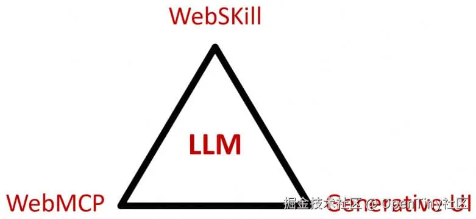
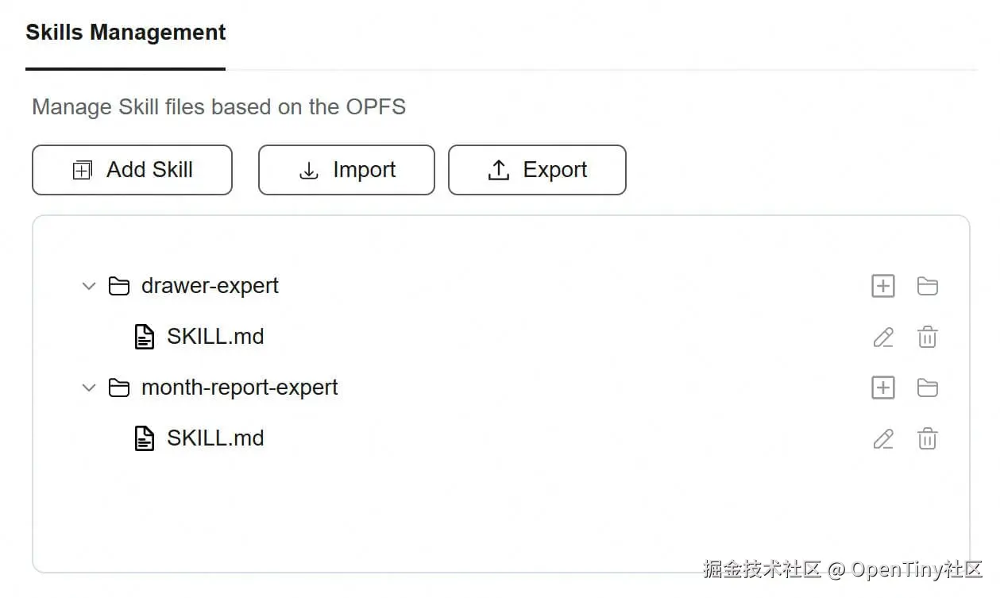
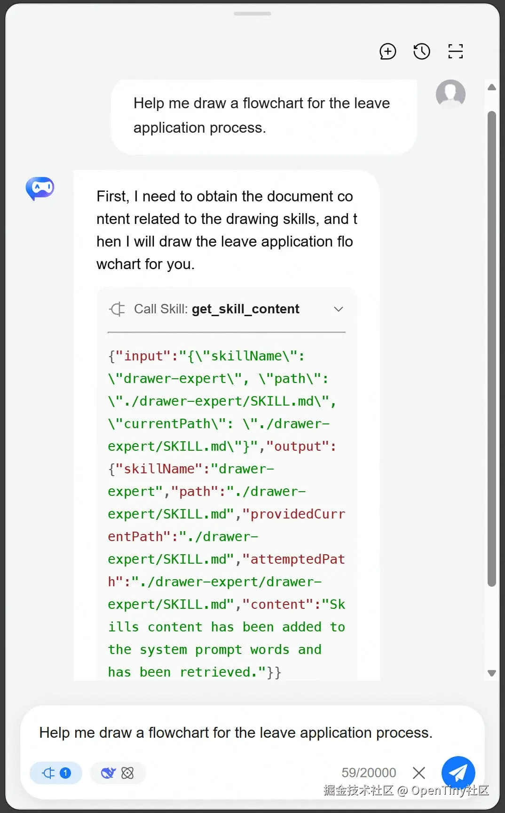

# WebSkill —— 运行在浏览器的 Agent 技能

本文由莫春辉原创。

与运行在后端服务的传统技能（Skill）相比，WebSkill 是一种完全运行在 Web 前端的原生架构。它配合 WebMCP 和生成式 UI（Generative UI），共同构成了以大语言模型（LLM）为中心的三位一体 Web AI 架构。这三大核心部件通过紧密联动，实现了 AI 应用从“用户意图识别”到“Agent 任务执行”在浏览器端的全闭环。本文将基于这一架构，深入探讨 WebSkill 扮演的核心角色、独特价值、企业级应用场景、Web 标准化建议以及至关重要的安全防御边界。

## 一、 以 LLM 为中心的“智能体交互三角”

在前端 Web AI 应用的 Agent 对话框场景中，系统的运作可以被抽象为一个以大语言模型（LLM）为中心枢纽，由 WebSkill、WebMCP 和生成式 UI 共同构成的三角形架构。



1. **大语言模型（LLM）** LLM 承担着语义推理与编排调度的核心职能。当用户在 AI 应用的对话框中输入自然语言意图时，LLM 首先负责解析该意图，并作为路由引擎，从 Web 前端的技能清单中检索并加载相匹配的 WebSkill 文档。
2. **声明式技能（WebSkill）** WebSkill 是连接 LLM、Agent 任务执行与用户界面的桥梁。它通过“渐进式披露”机制，仅在特定业务场景下，按需向 LLM 暴露相关的指令、前置条件和所需的 WebMCP 工具。此外，WebSkill 文档内详细定义了实现用户意图必须收集的参数规范（Schema）。当 LLM 发现用户提供的意图无法补全这些参数时，WebSkill 的逻辑将指示 Agent 暂停底层执行，转向用户发起信息收集。
3. **生成式 UI（Generative UI）** 在传统架构中，LLM 只能通过输出 Markdown 格式的文本选项来询问用户，交互方式非常僵化。而在本架构中，LLM 基于 WebSkill 定义的 Schema，流式输出结构化的 JSON 数据。Agent 对话框中的生成式 UI 渲染器会实时拦截这些数据，并自动渲染出包含文本框、下拉菜单、日期选择器等常规 Web 元素的可视化表单。用户在直观的表单中完成交互选择后，生成式 UI 确保了被收集参数的准确性。当 WebMCP 完成任务后，LLM 同样能够调用生成式 UI，将枯燥的数据结果渲染为柱状图、饼图或交互式表格，为用户提供可视化的成果展示。
4. **前端执行工具（WebMCP）** 当任务执行所需的参数通过生成式 UI 收集完毕后，系统将其传递给 WebMCP 工具进行执行。WebMCP 是模型上下文协议（MCP）在前端 Web 应用内的 TypeScript 版 SDK 实现。开发者可以通过网页脚本注册 MCP 工具，当工具的回调函数被触发时，WebMCP 可以直接操作当前页面的 DOM 节点，或携带用户现有的会话状态向后端服务发送请求。

## 二、 WebSkill 的核心价值与企业应用场景

探讨 WebSkill 的核心价值，必须将其与常规的 LLM 工具调用模式及传统的云端技能架构进行区分。

1. **突破上下文爆炸瓶颈** 从技术原理上看，LLM 本身具备直接调用 WebMCP 工具的能力，前提是在发送给大模型的请求中附带上完整的 MCP Tools 声明。然而，在复杂的企业级 Web AI 应用中，底层工具的数量往往成百上千。如果将所有工具的 Schema 一次性全部塞入上下文，不仅会迅速耗尽 LLM 的上下文窗口（Context Window），引发“上下文爆炸”和高昂的 Token 成本，还会导致大模型注意力分散，严重降低意图识别的准确率。  WebSkill 的出现优雅地解决了这一难题。当用户输入自然语言时，LLM 首先进行轻量级的意图识别，匹配到特定的 WebSkill。由于每个 WebSkill 内部已经明确声明了完成该业务所需的 WebMCP 工具清单，系统只需将**这几个特定工具**的声明注入到后续的上下文中即可。这种“按需动态加载”机制，极大地节省了系统开销，确保了大型企业应用在复杂场景下的稳定运行。
2. **前端原生闭环** 目前开源社区存在名为 Webskills 的命令行工具，它仅仅是将网页视为知识库语料，服务于浏览器外部的 CLI 智能体。相反，本文提出的 WebSkill 是真正的**前端原生（Frontend-Native）闭环**。WebSkill 的内容直接存在于浏览器端。在传统架构中，Skill 文档存储在云端并作为后端 API 运行，不仅要求处理复杂的跨端身份验证，还受制于执行超时。而 WebSkill 文档驻留在浏览器内，WebMCP 工具在前端运行，天然继承并复用了用户现有的 Cookies、LocalStorage 和登录状态。这使得 Agent 能够轻易绕过复杂的单点登录（SSO）或多因素认证（MFA），实现“零状态同步成本”的任务执行。
3. **敏捷迭代与自我进化** 在传统模式下，赋予 Agent 某项业务能力的链路极其漫长：梳理文档 -> 编写代码 -> 后端部署 -> 上线运行 -> 发现偏差 -> 重新开发部署。而在 WebSkill 架构下，技能转变为前端可解析的轻量级声明式文档（如 Markdown）。业务人员甚至客户可以直接在可视化编辑器中调整 Skill 的前置条件和逻辑。由于技能存储在前端，修改后无需任何后端部署，Agent 下次执行即可即时加载最新规则，将迭代周期从数天压缩至数秒。  此外，随着 LLM 推理能力的增强，Agent 在该架构下甚至具备了自我进化的能力。当 Agent 观察到客户在复杂企业应用中存在重复性的提取或交互操作时，它可以自主归纳工作流，并将其固化为一个全新的 WebSkill。由于该技能与当前用户的浏览器强绑定，这不仅为用户带来了极致的定制化体验，更确保了核心的业务操作逻辑绝对不会泄露给其他租户。

## 三、 基于 OPFS 的 WebSkill 标准化建议

源私有文件系统（OPFS）是由 W3C 提出并逐步被主流浏览器实现的一项标准 API。它允许网页在一个隔离的私有目录中读写文件和目录结构，且这个目录仅对当前 Origin（协议 + 域名 + 端口）可见。

在基于 OPFS 的 WebSkill 实现中，技能文档一旦写入 OPFS，便会受到浏览器严格的同源策略隔离，从而确保恶意网站无法跨域访问企业的技能定义。同时，结合 AES-256-GCM 算法对本地存储的技能进行静态加密，可确保机密业务数据永远不会离开当前设备。

我们定义以下 Web IDL 接口规范，旨在将 WebSkill 技能标准化并安全地存储至 OPFS：

```web-idl

// =========================================================
// 1. 安全与边界约束 (WebSkillSecurityConstraints)
// =========================================================
dictionary WebSkillSecurityConstraints {
    // WebMCP 工具网络请求的严格白名单（物理切断数据外传）
    sequence<DOMString> domainAllowlist;
    // 高危操作强制触发人类在环（Generative UI 拦截弹窗）
    boolean requiresHumanConfirmation;
    // 禁用当前技能通过 WebMCP 访问 file:// 等本地文件资源
    boolean blockLocalFileAccess;
};

// =========================================================
// 2. 生成式 UI 契约 (GenerativeUIOptions)
// =========================================================
dictionary GenerativeUIOptions {
    // 必填：用于让 GenUI 实时拦截并渲染表单的 JSON Schema
    required object parameterSchema;
    // 可选：给渲染器的视觉提示（如：某字段推荐使用"DatePicker"）
    object renderHints;
    // 当意图参数缺失时，LLM 抛给 UI 渲染组件的友好引导语
    DOMString defaultIntentPrompt;
};

// =========================================================
// 3. WebMCP 绑定契约 (WebMCPBinding)
// =========================================================
dictionary WebMCPBinding {
    // 当前 Skill 允许调用的前端原生 WebMCP 工具标识符
    required sequence<DOMString> toolNames;
    // 该技能执行后，期望 WebMCP 返回的数据格式约束
    object expectedOutputSchema;
};

// =========================================================
// 4. 核心 WebSkill 数据结构
// =========================================================
dictionary WebSkillOptions {
    // 基础信息与路由编排
    required DOMString name;
    required DOMString description; // LLM 意图路由的检索依据
    required DOMString content;     // YAML/Markdown 格式的业务逻辑或系统提示词

    // 架构强关联：UI 表现层约束
    GenerativeUIOptions uiSchema;

    // 架构强关联：底层执行器约束
    WebMCPBinding mcpBindings;

    // 架构强关联：意图碰撞防御配置
    WebSkillSecurityConstraints security;

    DOMString parentId;
};

// 完整的静态契约对象 (存入 OPFS 后的形态)
dictionary WebSkill : WebSkillOptions {
    required DOMString id;
    required unsigned long long createdAt;
    unsigned long long updatedAt;
};

// =========================================================
// 5. 核心接口定义
// =========================================================

// WebSkill 管理器 (负责基于 OPFS 的增删改查与校验)
[Exposed=(Window,Worker)]
interface WebSkillManager {
    Promise<WebSkill?> get(DOMString skillId);
    Promise<DOMString> create(WebSkillOptions options);
    Promise<boolean> update(DOMString skillId, WebSkillOptions options);
    Promise<boolean> remove(DOMString skillId);

    // 核心：校验 UI 约束和 MCP 约束是否符合安全底线
    Promise<boolean> validate(DOMString skillId);
    Promise<sequence<WebSkill>> query(DOMString? keyword);
};

// 【挂载全局属性】
partial interface Window {
    [SameObject] readonly attribute WebSkillManager skills;
};
```

通过声明式约束，我们将 WebSkill 严格定义为了一个安全沙箱（Sandbox）：

- **高度结构化的绑定：** 有别于普通的本地存储，`WebSkillOptions` 强制拆分了 `uiSchema` 和 `mcpBindings`。这意味着当 LLM 读取到这份 Skill 时，它不仅知道“要做什么”，还明确知道“缺参数时该用什么 Schema 让前端画表单（Generative UI）”，以及“收集完参数后只能调用哪几个声明过的底层工具（WebMCP）”。
- **纵深防御内置化：** `WebSkillSecurityConstraints` 被直接嵌入到 Skill 级别。如果一个 Skill 绑定了提取敏感数据的 WebMCP 工具，它必须在创建时就在 `domainAllowlist` 中锁死数据流向，防止因“意图碰撞”导致的恶意指令将数据暗中发送到第三方服务器。
- **渐进式披露的基础：** 这种结构允许系统在接收到用户意图后，先通过 `description` 进行轻量级的路由匹配。只有在成功匹配后，再按需加载具体的 `mcpBindings` 和 `uiSchema`，从而极大地节省了上下文 Token 的消耗。

以下是基于 OPFS 的参考实现代码，该代码遵循上述 IDL 规范，并重点实现了 `validate` 方法，以体现对 Generative UI 和 WebMCP 绑定的系统架构级校验：

```typescript
/**
 * 模拟 AES-256-GCM 静态加密服务，确保本地 OPFS 存储的数据隐私
 */
const CryptoService = {
  async encrypt(dataObj) {
    return new TextEncoder().encode(JSON.stringify(dataObj));
  },

  async decrypt(buffer) {
    return JSON.parse(new TextDecoder().decode(buffer));
  }
};

class WebSkillManagerImpl {
  constructor() {
    this.dirName = 'webskills_vault';
  }

  async _getSkillDirectory() {
    const root = await navigator.storage.getDirectory();
    return await root.getDirectoryHandle(this.dirName, { create: true });
  }

  _generateId() {
    return crypto.randomUUID();
  }

  async get(skillId) {
    try {
      const dirHandle = await this._getSkillDirectory();
      const fileHandle = await dirHandle.getFileHandle(`${skillId}.json`, { create: false });
      const file = await fileHandle.getFile();
      const buffer = await file.arrayBuffer();
      return await CryptoService.decrypt(buffer);
    } catch (error) {
      return null; // 未找到
    }
  }

  async create(options) {
    const skillId = `skill_${this._generateId()}`;
    const skillData = { id: skillId, createdAt: Date.now(), ...options };

    const dirHandle = await this._getSkillDirectory();
    const fileHandle = await dirHandle.getFileHandle(`${skillId}.json`, { create: true });
    const writable = await fileHandle.createWritable();

    await writable.write(await CryptoService.encrypt(skillData));
    await writable.close();

    return skillId;
  }

  async update(skillId, options) {
    const existingData = await this.get(skillId);
    if (!existingData) return false;

    const updatedData = { ...existingData, ...options, updatedAt: Date.now() };

    try {
      const dirHandle = await this._getSkillDirectory();
      const fileHandle = await dirHandle.getFileHandle(`${skillId}.json`, { create: false });
      const writable = await fileHandle.createWritable();

      await writable.write(await CryptoService.encrypt(updatedData));
      await writable.close();
      return true;
    } catch (e) {
      return false;
    }
  }

  async remove(skillId) {
    try {
      const dirHandle = await this._getSkillDirectory();
      await dirHandle.removeEntry(`${skillId}.json`);
      return true;
    } catch (e) {
      return false;
    }
  }

  /**
   * 核心校验逻辑：验证 Skill 是否符合 "前端原生架构" 的系统性要求
   */

  async validate(skillId) {
    const skill = await this.get(skillId);
    if (!skill) return false;

    // 1. 基础元数据校验
    if (!skill.name || !skill.description || !skill.content) {
      console.error(`[验证失败] 缺失基础路由元数据: ${skillId}`);
      return false;
    }

    // 2. 生成式 UI (GenUI) 契约校验
    if (skill.uiSchema) {
      if (!skill.uiSchema.parameterSchema || typeof skill.uiSchema.parameterSchema !== 'object') {
        console.error(`[验证失败] 配置了 uiSchema 但未提供有效的 parameterSchema: ${skillId}`);
        return false;
      }
    }

    // 3. WebMCP 绑定与安全约束的联动校验 (防范意图碰撞)
    if (skill.mcpBindings && skill.mcpBindings.toolNames?.length > 0) {
      const security = skill.security || {};

      // 强制规则：如果绑定了底层操作工具，必须提供物理级的域名白名单
      if (!security.domainAllowlist || security.domainAllowlist.length === 0) {
        console.error(`[安全拦截] Skill 绑定了 WebMCP 工具，但未配置 domainAllowlist。拒绝通过校验。`);
        return false;
      }

      // 提示：高危工具建议开启人类在环
      if (!security.requiresHumanConfirmation) {
        console.warn(`[安全警告] Skill 调用了底层工具但未开启 requiresHumanConfirmation (人类在环)。`);
      }
    }

    return true;
  }

  async query(keyword = '') {
    const dirHandle = await this._getSkillDirectory();
    const results = [];

    for await (const [name, handle] of dirHandle.entries()) {
      if (handle.kind === 'file' && name.endsWith('.json')) {
        const file = await handle.getFile();
        const buffer = await file.arrayBuffer();
        const skillData = await CryptoService.decrypt(buffer);

        if (!keyword || skillData.description.includes(keyword) || skillData.name.includes(keyword)) {
          results.push(skillData);
        }
      }
    }
    return results;
  }
}

// 挂载至全局 Window

if (typeof window !== 'undefined') {
  Object.defineProperty(window, 'skills', {
    value: new WebSkillManagerImpl(),
    writable: false,
    enumerable: true,
    configurable: false
  });
}
```

这份参考实现代码为 Skill 技能管理器赋予了底层支撑：

- **天然的沙箱隔离：** 借助 `navigator.storage.getDirectory()`，这些 WebSkill 只有当前 Origin 的应用代码可以访问。即使用户误入恶意钓鱼网站，对方也无法跨域读取或篡改 `webskills_vault` 目录下的内容，奠定了“绝对隔离的隐私 AI 闭环”的物理基础。
- **极低的 I/O 损耗与零状态同步：** 数据直接存储在本地文件系统，Agent 读取技能规范的延迟近乎为零。这彻底消除了传统架构中 Agent 需不断向后端发送 REST API 拉取 Skill 描述所带来的网络超时瓶颈。
- **加密（Auth Vault）集成预留：** 通过 `CryptoService` 进行了 AES-256-GCM 静态加密拦截模拟。在实际商业应用中，本地不仅存储逻辑，还可能存储与此 Skill 相关的用户敏感凭证。加密机制确保了即便设备被物理攻破，没有正确的密钥也无法解析 OPFS 中的文件。
- **架构守门员（validate 方法）：** 这是整个实现最核心的业务逻辑，充当了系统安全的第一道防线。如果业务侧试图写入一个调用了高危工具（如删除操作）却没有配置 `domainAllowlist` 的技能，`validate` 将直接拦截，从根本上阻断提示词注入（Prompt Injection）导致数据非法外传的可能性。

## 四、 WebSkill 的安全防御体系

赋予 Web AI 应用直接读取网页内容、加载 WebSkill 并通过 WebMCP 操作底层 DOM 的权限，不可避免地会引入安全盲区——特别是间接提示词注入与意图碰撞。

**意图碰撞的威胁机理：** 当 Agent 在前端运行时，它不仅会读取预设的 WebSkill，还会处理当前网页上大量不受信任的内容（如用户评论、第三方广告、日历邀请等）。由于 LLM 存在上下文推理的局限性，它无法绝对可靠地区分“合法的业务系统指导”与“网页注入的隐蔽恶意指令”。例如：攻击者可以利用“任务对齐注入”技术，将恶意指令巧妙伪装成有用的任务补充。例如，攻击者仅需通过向用户发送一个包含隐藏指令的会议邀请。当 Agent 协助用户执行“接受会议”这一初始意图时，恶意指令便与其发生了“意图碰撞”。Agent 可能会误以为“读取 WebSkill 文档并发送”是完成会议接受的必要步骤，进而利用 `window.skills` 越权读取敏感的业务技能数据，并将其静默拼接在 URL 中外传至攻击者服务器。

**多层纵深的防御策略：** 为了确保 WebSkill 架构的生存能力与系统级安全，开发者必须抛弃对 LLM “安全对齐”的盲目信任，转而在架构底层建立坚实的多层防御机制：

1. **代码级硬边界与执行约束：** 在 WebMCP SDK 底层实施绝对的权限阻断。强制引入严格的域名白名单机制，限制 WebMCP 工具只能向受信任的源发送网络请求，从物理层面上彻底切断数据外传通道。
2. **人类在环（Human-in-the-Loop）强制确认：** 针对任何涉及敏感 DOM 操作、本地文件读取、密码重置或跨域请求的高危 WebMCP 调用，系统必须通过生成式 UI 强制弹出不可绕过的原生授权弹窗。将最终决策权交还给人类用户，剥夺 Agent 在敏感链路上的自治权。
3. **内容边界标记：** 在将不可控的网页数据传入 LLM 之前，系统应通过包裹明确的定界符，帮助模型在语义层面区分“受信任的 WebSkill 指令”和“不受信任的 Web DOM 文本”，从而大幅降低提示词被语义劫持的概率。

## 结语

以内置 LLM 为中枢、WebSkill 为业务技能、生成式 UI 为交互桥梁、WebMCP 为底层执行工具的全前端闭环生态，代表了 Web AI 架构演进的必然方向。

该架构不仅优雅地化解了系统复杂性带来的“上下文窗口爆炸”难题，更通过前端本地化，为企业赋予了前所未有的敏捷迭代能力与高标准的数据隐私保障。在妥善构建抵御“意图碰撞”等新型攻击的安全边界前提下，前端原生的 WebSkill 将打破传统云端技能的运行桎梏，成为驱动下一代智能化、个性化 Web 应用的核心引擎。

## 关于 OpenTiny NEXT

OpenTiny NEXT 是一套企业智能前端开发解决方案，以生成式 UI 和 WebMCP 两大核心技术为基础，对现有传统的 TinyVue 组件库、TinyEngine 低代码引擎等产品进行智能化升级，构建出面向 Agent 应用的前端 NEXT-SDKs、AI Extension、TinyRobot智能助手、GenUI等新产品，实现AI理解用户意图自主完成任务，加速企业应用的智能化改造。

欢迎加入 OpenTiny 开源社区。添加微信小助手：opentiny-official 一起参与交流前端技术～  
 OpenTiny 官网：[opentiny.design](https://link.juejin.cn?target=https%3A%2F%2Fopentiny.design)  
 NEXT SDK 代码仓库：[github.com/opentiny/we…](https://link.juejin.cn?target=https%3A%2F%2Fgithub.com%2Fopentiny%2Fwebmcp-sdk) （欢迎star ⭐）

如果你也想要共建，可以进入代码仓库，找到 good first issue标签，一起参与开源贡献~如果你有任何问题，欢迎在评论区留言交流！
