# GenUI SDK 生成式UI：六大开发特性详解，适配多种业务场景

本文由云软件体验技术团队岑灌铭原创。

随着大语言模型快速迭代，LLM 已具备强大的自然语言理解与结构化内容生成能力。而如何高效渲染 AI 生成内容、快速打造美观交互的动态界面，已然成为 AI 应用规模化落地的核心痛点。

**生成式 UI（Generative UI）** 顺势成为破解该难题的核心技术方向。**OpenTiny GenUI SDK** 是 OpenTiny 团队基于生成式 UI 理念倾力打造的开源开发方案（以下简称GenUI SDK)，具备完备的前后端一体化集成能力。

无论是从零快速搭建 AI 对话类应用，还是为现有业务系统无缝嵌入动态生成式界面能力，GenUI SDK 均可实现开箱即用、轻量化接入与高灵活扩展，大幅降低 AI 可视化应用的开发门槛。

了解更多GenUI SDK详情：

- 官网：[www.opentiny.design/genui-sdk](https://link.juejin.cn?target=https%3A%2F%2Fwww.opentiny.design%2Fgenui-sdk)
- 源码：[github.com/opentiny/ge…](https://link.juejin.cn?target=https%3A%2F%2Fgithub.com%2Fopentiny%2Fgenui-sdk)

本文将深度拆解 GenUI SDK 六大核心开发特性，帮助你全面了解这一革命式的 AI 应用开发工具。

## 一、现有 AI 生态兼容：支持对接主流 LLM 与工具生态

### 遵循 OpenAI 格式

GenUI SDK 遵循 **OpenAI Chat Completions API** 接口规范，可无缝对接 OpenAI、DeepSeek等主流大模型服务。若你的项目已具备成熟的 Agent 架构与工程业务逻辑，且原有体系兼容 OpenAI 协议，接入 GenUI SDK 时可保留现有逻辑，无需重构改造。

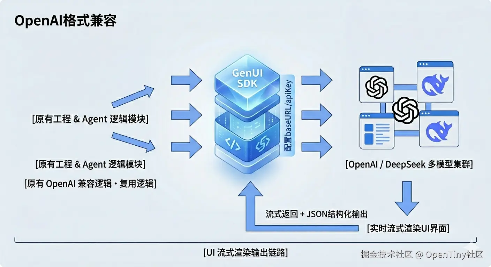

服务端包 `@opentiny/genui-sdk-server` 提供开箱即用的 Chat Completions 能力，支持流式返回、结构化 JSON Schema 输出，让模型生成的内容能够实时、流式地渲染 UI界面。

### 支持 MCP 服务接入

**MCP（Model Context Protocol）** 是连接 AI 与外部工具、数据源的重要协议。GenUI SDK 支持 MCP 服务接入，可轻松连接丰富的工具生态。

你可以将业务系统中已有的 MCPServer 接入到生成式 UI 中， 接入 MCP 后，当模型在调用工具时缺少必要参数，GenUI SDK 能够**自动生成交互式 UI** 来收集所需信息，实现**工具调用 + 参数收集**的一体化体验。企业内部系统工具、第三方 API，自定义工具甚至是前端页面，都可以通过简单改造，成为 MCPServer 与 GenUI 深度集成。

以下是12306mcp服务中查票工具的要求参数：

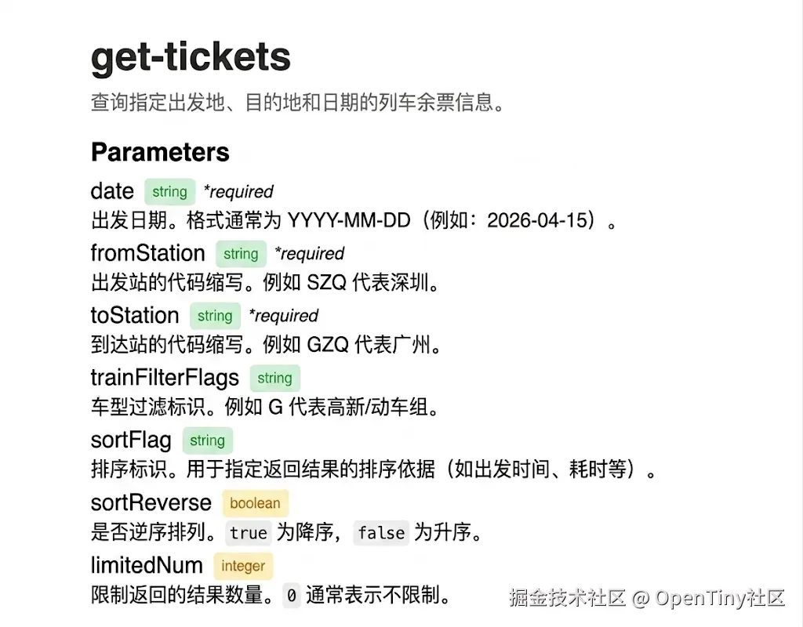

在没有接入生成式UI能力之前，当查询车票缺少参数，大模型会返回文本，要求补充参数。

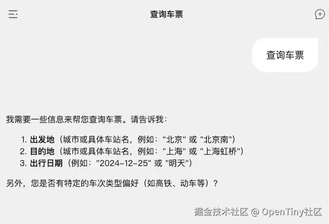

以下是集成了 MCP Server 的 运行效果(视频经加速处理)；同样是查票场景，接入了生成式UI后，大模型直接生成了表单继续信息收集。填写完成后，点击查询按钮即可触发查询。

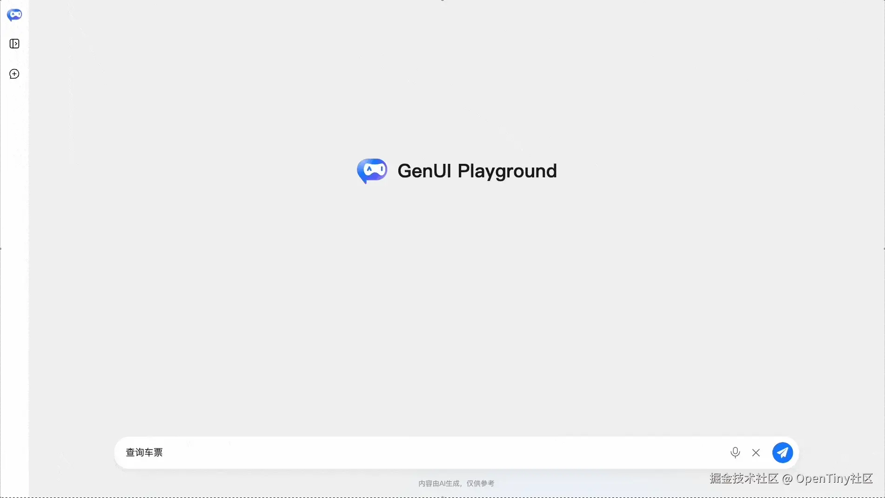

## 二、定制主题：适配不同产品的视觉风格

### 内置主题切换

GenUI SDK 内置多种主题模式，满足不同场景的视觉需求：

- `light`：浅色主题，适合日间使用
- `dark`：深色主题，护眼且适合夜间场景
- `lite`：清新主题，提供更柔和的视觉体验
- `auto`：跟随系统偏好自动切换`light`和`dark`模式

通过 `GenuiConfigProvider` 的 `theme` 属性即可一键切换，无需额外配置。 演练场中可以体验及时切换效果：

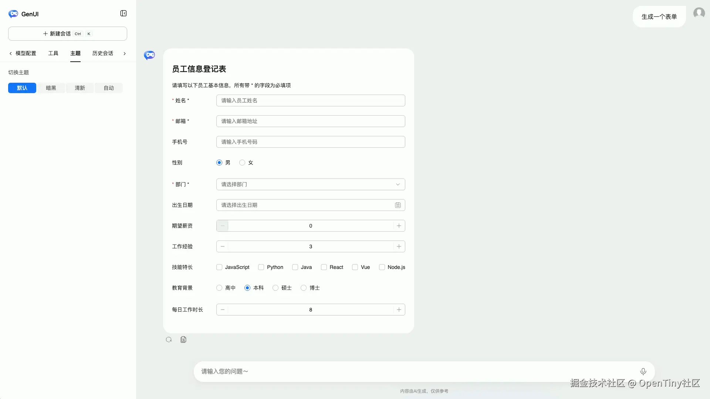

### 完全自定义主题样式

除了内置主题，GenUI SDK 支持基于 **CSS 变量** 的深度定制。你可以通过覆盖 TinyRobot 及物料组件库提供的 Token 变量，实现品牌级主题定制：

- 自定义主色、圆角、间距等设计 Token
- 调整按钮、输入框等组件的视觉风格
- 通过 `id` 属性创建作用域，实现多主题并存

无论是企业级产品的品牌规范，还是面向特定用户群体的视觉偏好，GenUI SDK 都能灵活适配。  
 以下是自定义的一个紫色主题：

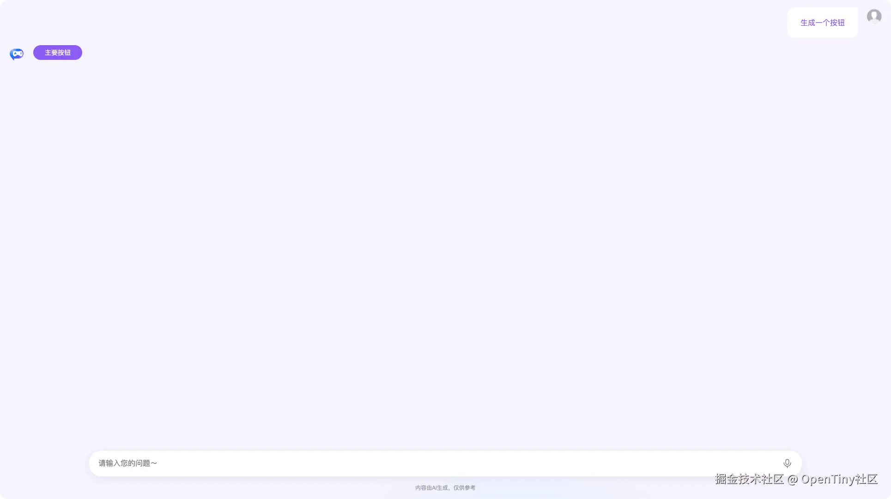

## 三、自定义组件：扩展生成式 UI 的组件库

### 扩展业务组件

使用`GenuiChat`组件，通过 `customComponents` 配置，你可以将**自有业务组件**纳入生成式 UI 体系：

- 传入组件的 **Schema 定义**（属性、类型、描述），让模型理解如何正确使用
- 传入组件的 **引用（ref）** ，实现实际组件渲染

例如，在特性一中生成的商品卡片，大模型每次输出难免存在细微差异，视觉风格也可能与业务系统不完全统一。为实现更一致的体验，你可以预先注册自定义商品卡片组件，结合 MCP 工具，让 AI 在响应用户商品查询时，自动生成包含价格、商品图、购买按钮等完整信息的规范卡片界面。通过自定义组件，可让生成的 UI 高度贴合业务设计规范与品牌风格。

以下是电商系统中，接入了自定义组件前后的效果对比。

接入前：

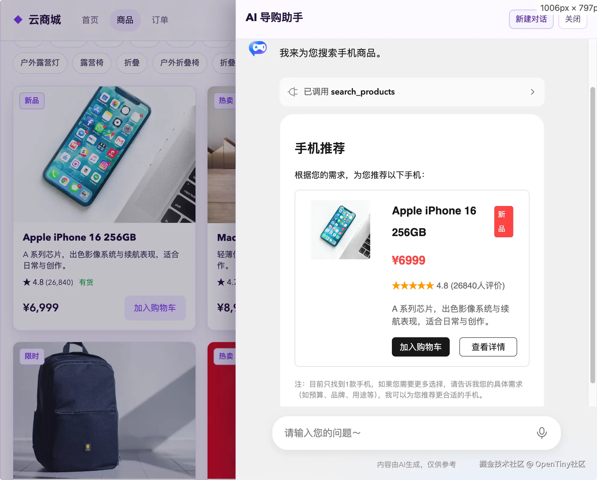

接入后：

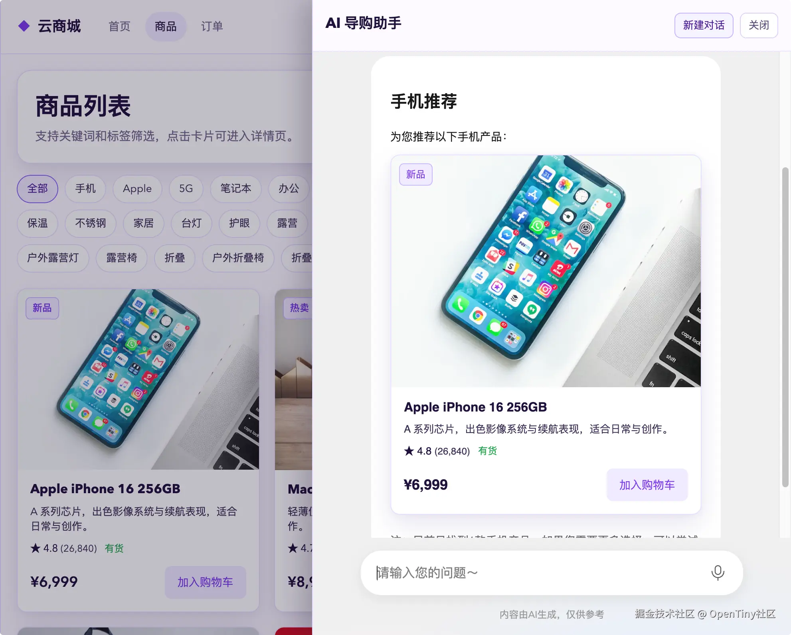

同理，对于 User 这类结构复杂、内部逻辑繁重但外部参数较少的特殊 UI 组件，也可将其封装为自定义组件提供给 AI 使用，进一步提升系统整体体验与专业性。

## 四、自定义交互：满足业务侧的个性化需求

### 灵活配置交互行为

GenUI SDK 支持通过 `customActions` 配置自定义交互行为。每个 Action 包含：

- **name**：动作名称，供 AI 在 Schema 中通过 `this.callAction(name, params)` 调用
- **description**：动作描述，帮助模型理解何时使用
- **parameters**：参数定义（JSON Schema）
- **execute**：前端执行函数

### 典型应用场景

- **跳转新页面**：用户点击「查看详情」时打开新窗口
- **下载附件**：生成导出按钮，触发文件下载
- **拉取数据**：根据用户选择调用后端接口刷新内容
- **提交表单**：将表单数据提交至指定 API
- **多轮对话**：内置 `continueChat` Action，支持用户与生成 UI 的持续交互

通过自定义交互能力，AI 生成的界面不再是单纯的 “只读展示”，而是可以直接执行真实业务操作，完美满足复杂场景下的人机协同需求。

例如在电商系统中，可配置加入购物车等自定义交互行为，结合 MCP 联动能力，让 AI 界面与业务系统深度打通，实现真正智能化的业务交互。

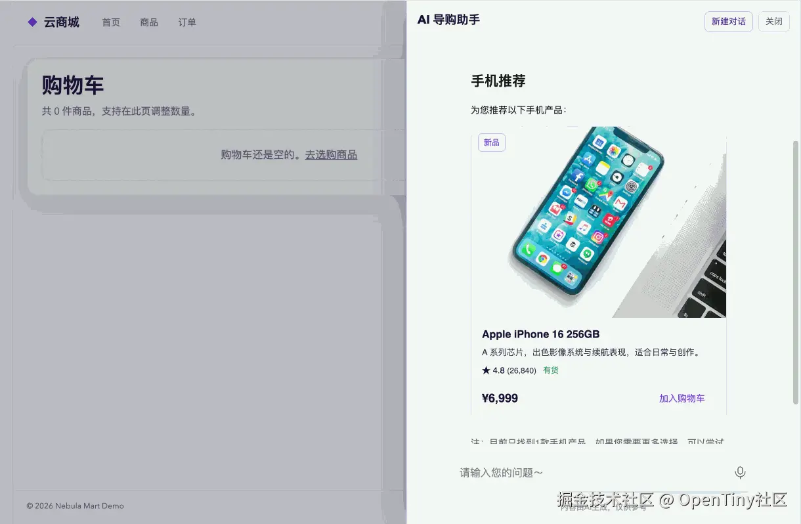

## 五、多技术栈支持：融入现有项目的技术栈

### 内置 Vue 与 Angular 渲染器

GenUI SDK 内置 **Vue** 与 **Angular** 双框架渲染器：

- `@opentiny/genui-sdk-vue`：基于 Vue 3 的前端组件与渲染器，集成 `GenuiChat`、`GenuiRenderer`、`GenuiConfigProvider` 等组件，开箱即用
- `@opentiny/genui-sdk-angular`：基于 Angular 的渲染器，支持在 Angular 应用中集成生成式 UI 能力

两个渲染器使用**相同的 Schema 协议**，确保跨框架的兼容性。同一份 Schema 可在不同技术栈间无缝迁移，后续我们将会计划支持更多的技术栈，敬请期待~

以下分别是使用 TinyUI (angular组件库)和TinyVue生成的登录表单:

TinyUI:

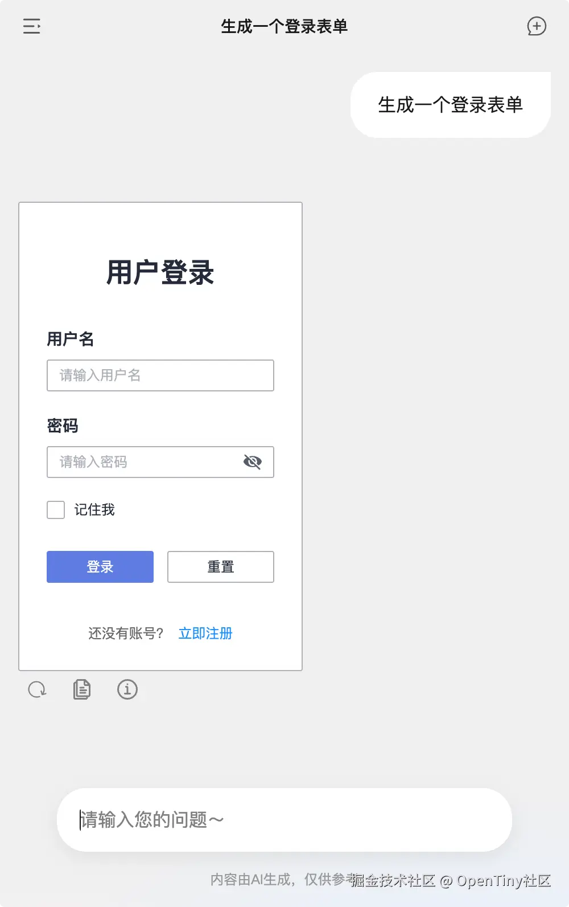

TinyVue:

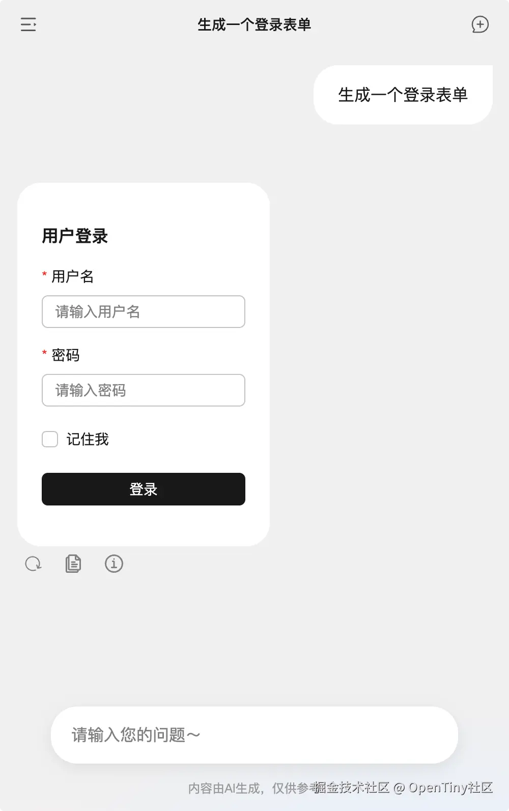

## 六、示例与片段：提升生成界面的质量

### 自定义片段（customSnippets）

`customSnippets` 提供常用的**组件组合模式**，如标准表单结构、列表+卡片布局等。这些片段作为模板注入到模型的上下文中，帮助模型快速复用成熟的 UI 模式，减少低质量输出。

示例与片段的结合，能够助力构建更加优秀的 UI 界面，满足多样化的视觉偏好与业务需求。

### 自定义示例（customExamples）

通过 `customExamples` 配置，你可以向模型提供**业务最佳实践**示例。每个示例包含：

- **name**：示例名称
- **description**：示例说明
- **schema**：完整的组件使用 Schema

模型会参考这些示例，生成更符合业务规范的界面。例如，为数据可视化场景配置示例，可显著提升生成质量。

你可以自定义数据看板的风格，为看板搭配好布局与配色，那么大模型在按需生成看板时，会参考你的布局与配色，为你生成个性化的数据看板：

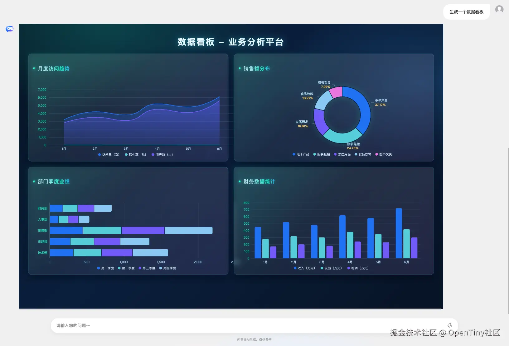

**组件包一览**

| 包名 | 描述 |
| --- | --- |
| @opentiny/genui-sdk-server | 集成生成式 UI 能力的后台服务，配置简单，启动快速。支持自定义组件、自定义操作等能力 |
| @opentiny/genui-sdk-vue | 基于 Vue 的前端组件与渲染器，可用于快速构建生成式 UI Web 应用，同时拥有强大的定制能力 |
| @opentiny/genui-sdk-angular | 基于 Angular 的渲染器，支持在 Angular 应用中集成生成式 UI 能力 |

## 立即体验

- **演练场（安全整改中，可访问备用连接）** ：[playground.opentiny.design/genui-sdk](https://link.juejin.cn?target=https%3A%2F%2Fplayground.opentiny.design%2Fgenui-sdk)
- **演练场备用链接：** [opentiny.github.io/genui-sdk/p…](https://link.juejin.cn?target=https%3A%2F%2Fopentiny.github.io%2Fgenui-sdk%2Fplayground%2F)
- **快速开始**：[docs.opentiny.design/genui-sdk/g…](https://link.juejin.cn?target=https%3A%2F%2Fdocs.opentiny.design%2Fgenui-sdk%2Fguide%2Fquick-start.html)
- **服务端使用**：[docs.opentiny.design/genui-sdk/g…](https://link.juejin.cn?target=https%3A%2F%2Fdocs.opentiny.design%2Fgenui-sdk%2Fguide%2Fserver-usage.html)

## 结语

GenUI SDK 在设计上兼顾了**开箱即用**与**深度定制**，既能让开发者快速搭建可落地的 AI 应用，又能在组件、交互、主题、技术栈等维度灵活扩展。欢迎对生成式 UI 感兴趣的技术爱好者体验使用 GenUI SDK。  
 **GenUI SDK 现已开源，采用 MIT 协议。** 欢迎 Star、Fork，参与贡献，与 OpenTiny 一起推动生成式 UI 技术的发展。

## 关于 OpenTiny NEXT

OpenTiny NEXT 是一套企业智能前端开发解决方案，以生成式 UI 和 WebMCP 两大核心技术为基础，对现有传统的 TinyVue 组件库、TinyEngine 低代码引擎等产品进行智能化升级，构建出面向 Agent 应用的前端 NEXT-SDKs、AI Extension、TinyRobot智能助手、GenUI等新产品，实现AI理解用户意图自主完成任务，加速企业应用的智能化改造。

欢迎加入 OpenTiny 开源社区。添加微信小助手：opentiny-official 一起参与交流前端技术～  
 OpenTiny 官网：[opentiny.design](https://link.juejin.cn?target=https%3A%2F%2Fopentiny.design)  
 GenUI SDK 代码仓库：[github.com/opentiny/ge…](https://link.juejin.cn?target=https%3A%2F%2Fgithub.com%2Fopentiny%2Fgenui-sdk) （欢迎star ⭐）

如果你也想要共建，可以进入代码仓库，找到 good first issue标签，一起参与开源贡献~如果你有任何问题，欢迎在评论区留言交流！
