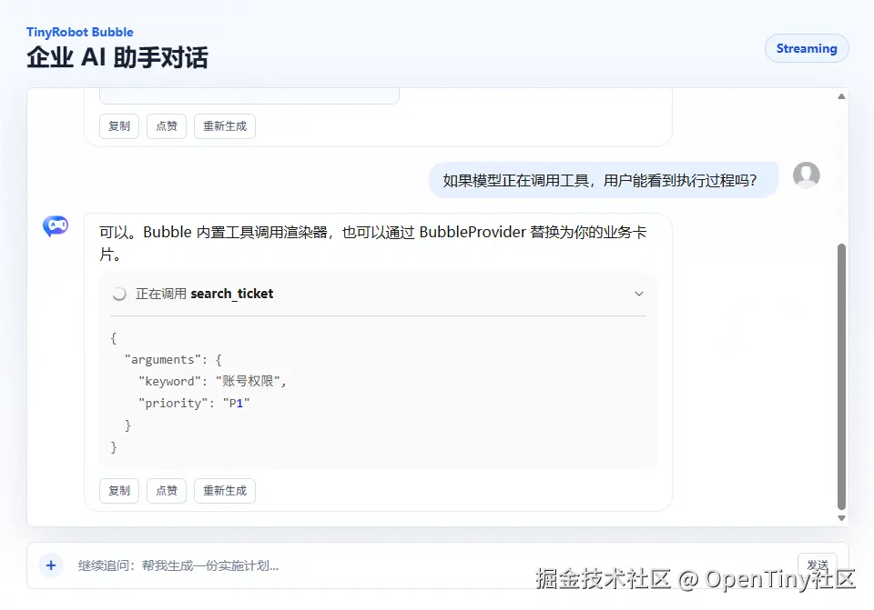
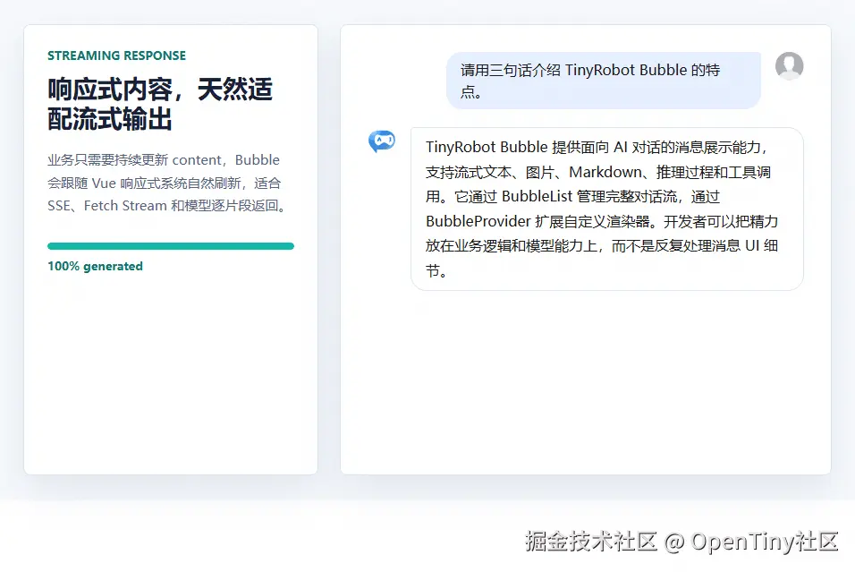
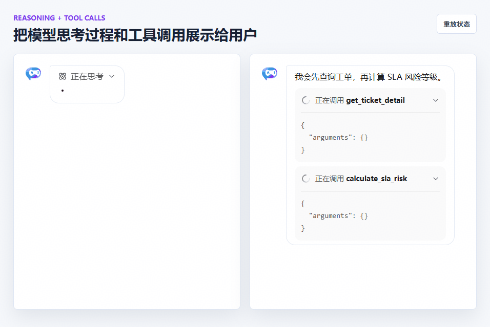

# 还在手写 AI 聊天页？这款 Vue3 气泡组件，直接搞定流式对话！

本文由胡靖原创。

在 AI 应用里，消息气泡看似只是 UI 的一小块，真正落地时却会快速变复杂：流式输出、Markdown、图片、多模态内容、推理过程、工具调用、消息分组、状态折叠、角色样式、自动滚动……这些能力如果都从零实现，往往会让业务代码被展示逻辑淹没。

TinyRobot 的 `Bubble` 组件正是为这个场景设计的。它不是一个简单的“文本气泡”，而是一套面向 AI 对话界面的消息展示系统，内置 `Bubble`、`BubbleList`、`BubbleProvider` 三个核心能力，让开发者可以从单条消息展示平滑扩展到完整对话流。



## 一行代码，展示一条 AI 消息

最基础的用法非常直接：

```xml
<template>
  <tr-bubble role="assistant" content="你好，我是 TinyRobot，可以帮助你快速构建 AI 对话界面。" placement="start" />
</template>

<script setup lang="ts">
import { TrBubble } from "@opentiny/tiny-robot";
</script>
```

`Bubble` 支持 `placement` 控制左右位置，支持 `avatar` 注入头像组件，也支持通过 CSS 变量调整背景、字号、圆角、宽度等视觉细节。对业务开发来说，这意味着你可以先快速搭出可用界面，再按产品设计逐步定制样式。

## 为流式输出准备的响应式内容

AI 回复通常不是一次性返回，而是逐 token、逐片段输出。`Bubble` 的 `content` 是响应式的，只要持续更新内容，组件就能自然呈现流式效果：

```xml
<template>
  <tr-bubble :content="streamContent" :avatar="aiAvatar" />
</template>

<script setup lang="ts">
import { TrBubble } from "@opentiny/tiny-robot";
import { IconAi } from "@opentiny/tiny-robot-svgs";
import { h, ref } from "vue";

const aiAvatar = h(IconAi, { style: { fontSize: "32px" } });
const streamContent = ref("");

async function startStream() {
  const text = "这是一段正在生成中的 AI 回复。";
  streamContent.value = "";

  for (const char of text) {
    streamContent.value += char;
    await new Promise((resolve) => setTimeout(resolve, 80));
  }
}
</script>
```

这类设计非常适合接入 SSE、Fetch Stream 或 TinyRobot Kit 的消息管理能力。展示层只关心消息对象如何变化，不需要把流式渲染逻辑塞进组件内部。



## 不止文本：图片、Markdown、推理和工具调用

Bubble 的内容模型兼容常见的大模型消息结构。`content` 可以是字符串，也可以是数组内容项，例如图片：

```ini
<tr-bubble
  :content="[
    { type: 'text', text: '这是一张生成结果：' },
    { type: 'image_url', image_url: { url: imageUrl } },
  ]"
  content-render-mode="split"
/>
```

当内容项中出现 `type: 'image_url'` 时，Bubble 会自动命中内置图片渲染器。通过 `contentRenderMode`，可以选择把图文渲染在同一个气泡框内，或拆成多个独立 box。

对更复杂的 AI 模型输出，Bubble 也提供了内置渲染器：

- `Text`：默认文本渲染
- `Image`：图片内容渲染
- `Markdown`：Markdown 内容渲染
- `Loading`：加载状态渲染
- `Reasoning`：推理过程渲染
- `Tools` / `Tool`：工具调用渲染
- `ToolRole`：tool 角色消息渲染

例如模型返回推理内容时，可以直接使用 `reasoning_content`：

```ruby
<tr-bubble :content="answer" :reasoning_content="reasoningContent" :state="{ thinking: false, open: true }" />
```

工具调用也可以用 OpenAI 风格的 `tool_calls` 结构表达：

```css
const message = {
  role: "assistant",
  content: "我来查询天气。",
  tool_calls: [
    {
      id: "call_0",
      type: "function",
      function: {
        name: "get_weather",
        arguments: '{"city":"深圳"}',
      },
    },
  ],
  state: {
    toolCall: {
      call_0: { status: "running", open: true },
    },
  },
};
```

这让 Bubble 很适合构建 Agent、Copilot、企业知识库助手等需要展示“模型正在做什么”的产品。



## BubbleList：从单条气泡到完整对话流

实际业务不会只展示一条消息。`BubbleList` 接收 `messages` 数组，并通过 `roleConfigs` 统一配置不同角色的头像、位置、形状和隐藏策略：

```css
<template>
  <tr-bubble-list :messages="messages" :role-configs="roleConfigs" auto-scroll />
</template>

<script setup lang="ts">
import type { BubbleListProps, BubbleRoleConfig } from "@opentiny/tiny-robot";
import { TrBubbleList } from "@opentiny/tiny-robot";

const messages: BubbleListProps["messages"] = [
  { role: "user", content: "帮我总结这份文档" },
  { role: "assistant", content: "可以，请上传文档。" },
];

const roleConfigs: Record<string, BubbleRoleConfig> = {
  user: { placement: "end" },
  assistant: { placement: "start" },
};
</script>
```

`BubbleList` 默认使用 `divider` 分组策略，以 `user` 作为分割点：用户消息单独成组，后续非用户消息合并为同一次回答。它也支持 `consecutive` 连续角色分组，或传入自定义分组函数。

这种默认策略很适合 AI 聊天结构：一次完整回答通常以 `assistant` 开始、以 `assistant` 结束，中间可能穿插一条或多条 `tool` 结果。

```sql
User
└─ 帮我查一下这个工单的 SLA 风险

Assistant 回答块
├─ assistant：我先查询工单详情，并发起 tool call
├─ tool：返回工单详情
├─ tool：返回 SLA 规则
└─ assistant：根据工具结果给出风险判断

User
└─ 那应该怎么处理？

Assistant 回答块
├─ assistant：我继续检查处理人和审批状态
├─ tool：返回处理人信息
└─ assistant：给出处理建议和注意事项
```

`autoScroll` 也针对聊天场景做了处理：当用户发送新消息时，列表会平滑滚动到底部；当 AI 内容持续更新时，只有在用户接近底部时才自动跟随，避免打断用户查看历史内容。

## 渲染器架构：扩展复杂内容，而不是重写组件

Bubble 最值得开发者关注的是它的渲染器机制。组件将渲染拆成两层：

- Box 渲染器：控制气泡外层容器
- Content 渲染器：控制具体内容，如文本、图片、Markdown、工具调用

通过 `BubbleProvider`，可以在组件树内统一配置匹配规则：

```ruby
<tr-bubble-provider :content-renderer-matches="contentRendererMatches">
  <tr-bubble-list :messages="messages" />
</tr-bubble-provider>
```

```typescript
import { BubbleRendererMatchPriority, type BubbleContentRendererMatch } from "@opentiny/tiny-robot";
import { markRaw } from "vue";
import SchemaCardRenderer from "./SchemaCardRenderer.vue";

const contentRendererMatches: BubbleContentRendererMatch[] = [
  {
    find: (_, content) => content.type === "schema_card",
    renderer: markRaw(SchemaCardRenderer),
    priority: BubbleRendererMatchPriority.CONTENT,
  },
];
```

这套机制让业务可以把订单卡片、审批卡片、知识库引用、图表结果等结构化内容接入 Bubble，而不用 fork 组件或在消息列表里写大量条件判断。

## 适合企业 AI 应用的状态边界

Bubble 的消息类型中包含 `state` 字段，专门用于存放 UI 状态，例如推理过程是否展开、工具调用详情是否展开、点赞状态等。组件通过 `state-change` 事件把状态变更抛给外层。

这种设计的好处是：消息内容仍然保持接近模型返回结构，UI 状态不会污染真正要发给模型或持久化的业务字段。

## 总结

TinyRobot Bubble 的价值不只是“好看的气泡”，而是把 AI 对话界面里高频、复杂、容易重复造轮子的展示能力沉淀成了一套可组合系统：

- 单条消息用 `Bubble`
- 完整对话流用 `BubbleList`
- 全局渲染扩展用 `BubbleProvider`
- 文本、图片、Markdown、推理、工具调用都有内置支持
- 角色、分组、自动滚动、插槽、CSS 变量和 TypeScript 类型一并覆盖

如果你正在用 Vue 3 构建 AI Chat、Agent 控制台、企业知识库助手或 Copilot 类产品，TinyRobot Bubble 可以帮你把注意力从“消息怎么画”转移到“AI 能为用户完成什么”。

## 关于 OpenTiny NEXT

OpenTiny NEXT 是一套企业智能前端开发解决方案，以生成式 UI 和 WebMCP 两大核心技术为基础，对现有传统的 TinyVue 组件库、TinyEngine 低代码引擎等产品进行智能化升级，构建出面向 Agent 应用的前端 NEXT-SDKs、AI Extension、TinyRobot智能助手、GenUI等新产品，实现AI理解用户意图自主完成任务，加速企业应用的智能化改造。

欢迎加入 OpenTiny 开源社区。添加微信小助手：opentiny-official 一起参与交流前端技术～  
 OpenTiny 官网：[opentiny.design](https://link.juejin.cn?target=https%3A%2F%2Fopentiny.design)  
 TinyRobot 代码仓库：[github.com/opentiny/ti…](https://link.juejin.cn?target=https%3A%2F%2Fgithub.com%2Fopentiny%2Ftiny-robot) （欢迎star ⭐）

如果你也想要共建，可以进入代码仓库，找到 good first issue标签，一起参与开源贡献~如果你有任何问题，欢迎在评论区留言交流！
