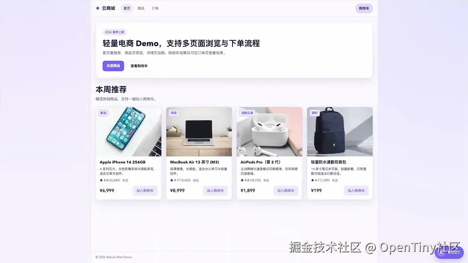
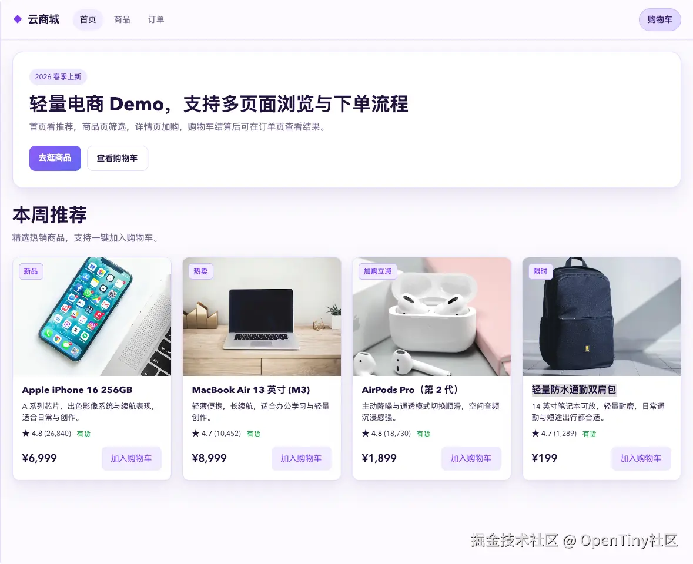
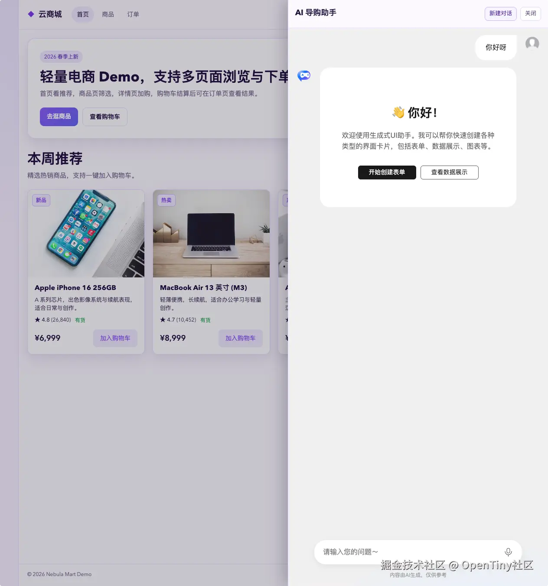
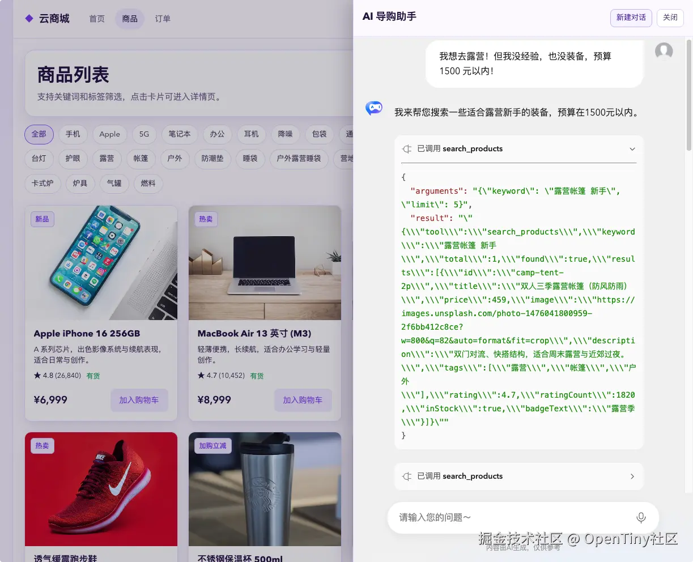
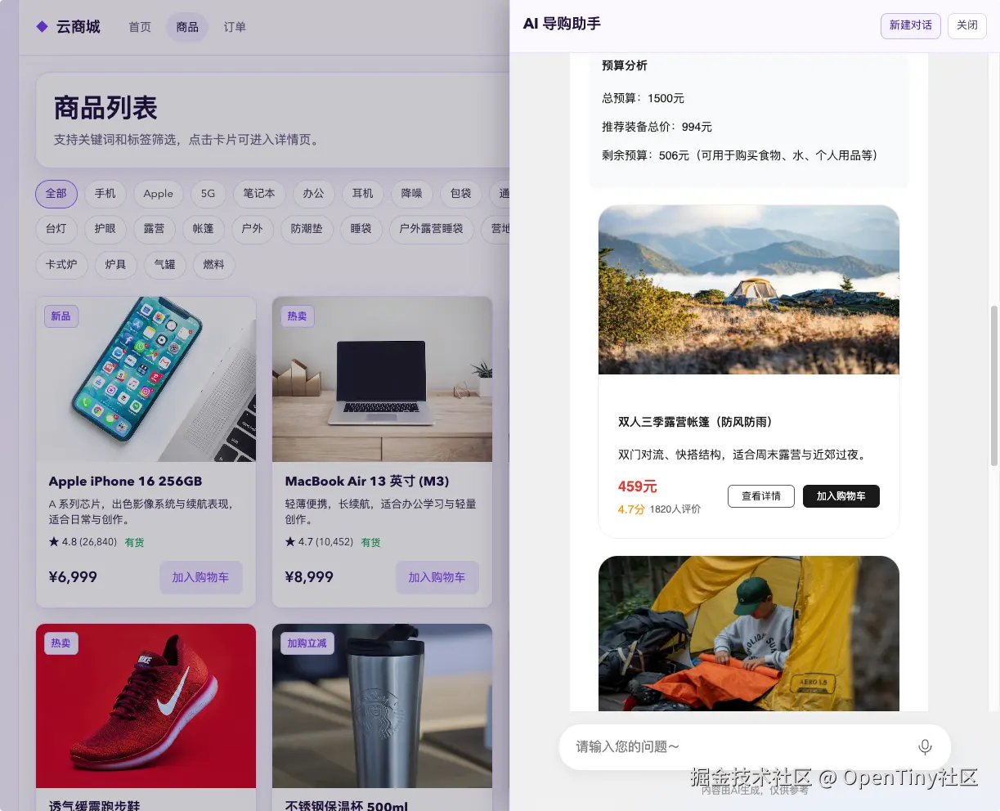
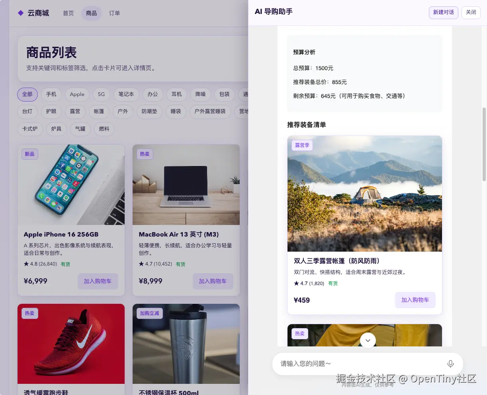
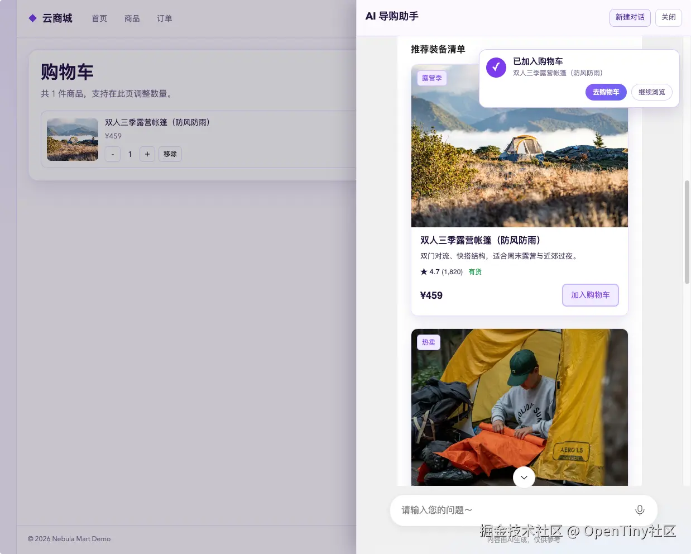

# 生成式 UI 藏大招！看似露营案例，实则电商集成 GenUI SDK 干货

本文由岑灌铭原创。从露营趣味案例入手，详解电商系统集成 GenUI SDK 完整实操~

## 背景

时针拨过周一晚上十点，XX大学男生寝室 502 里充斥着键盘敲击声和偶尔的鼾声。大二学生小明，一个典型的“行动派热血青年”，正瘫在床上刷着朋友圈。

突然，他的手指停住了。屏幕上是隔壁班班花发的一组九宫格：精致的摩洛哥风帐篷、摇曳的煤油灯、噼啪作响的篝火，背景是浩瀚星空。配文：“周末，逃离城市，枕着星星入眠。”

小明感觉心脏被重重击中了。一种名为“我也要去”的冲动像野火一样在胸中燃烧。 “这才是大学生活！我也要去露营！就这周末！”


作为小白，没有经验的他只好求助AI。根据推荐清单，小明在某某电商网站中，完成多轮“搜索-挑选-加购”后。结算时才发现超预算了。囊中羞涩的小明发出了悲怨之声，老王在了解了情况后。给他推荐了一个神奇的网站。小明输入完露营需求后，导购助手自动为他推荐了露营的高性价比装备。 小明可以轻松地完成一键加购和结算。

下面就来看一下这个神奇的电商网站：



## 智能导购背后的“黑科技”

这个神奇网站的智能导购助手，正是基于 **OpenTiny GenUI SDK** 开发而成的。它是 OpenTiny 团队基于生成式 UI（Generative UI）理念倾力打造的开源开发方案，具备完备的前后端一体化集成能力。

在之前的文章中，我们曾介绍过 GenUI SDK 的核心能力与开发特性，错过的同学可以点击回顾：

- **核心能力介绍：** [以界面重构文字，GenUI SDK 重磅上线！](https://juejin.cn/spost/7615156885722382372)
- **开发特性介绍：**  [GenUI SDK 生成式UI：六大开发特性详解，适配多种业务场景](https://juejin.cn/post/7633366204779282451)

在大家对 GenUI 的基本概念有所了解后，下面我们将深入剖析这个“导购助手”的具体实现逻辑。通过下方的详细集成指导，你可以按照手册步骤，一步步在自己的项目中复刻这种智能交互体验。

**💡 小贴士：**  如果你觉得这个案例对你的项目有启发，或者想一窥“智能导购”背后的源码实现，欢迎访问我们的 GitHub 仓库：[github.com/opentiny/ge…](https://link.juejin.cn?target=https%3A%2F%2Fgithub.com%2Fopentiny%2Fgenui-sdk)。

**点上 Star ⭐ 不迷路**，不仅是对开源精神的支持，也方便你日后随时定位组件用法与技术文档！

## 集成指导

在开始集成之前，需要先下载相关源码。下面附上集成前的原始工程与集成完成后的完整示例，方便对照参考：

**Demo 工程地址：** [github.com/opentiny/ge…](https://link.juejin.cn?target=https%3A%2F%2Fgithub.com%2Fopentiny%2Fgenui-sdk-demos)

**集成对比分支：**

- 集成前（原始电商工程）：`raw-e-commerce`
- 集成后（完成智能导购集成）：`main`

如果你更喜欢边看边做，我们也准备了**生成式 UI 专题直播的完整回放**，其中包含手把手的代码实战环节，跟着视频回放中的代码实战环节一步步操作，轻松复刻完整效果：

直播回放：[www.bilibili.com/video/BV1DM…](https://link.juejin.cn?target=https%3A%2F%2Fwww.bilibili.com%2Fvideo%2FBV1DMoxBwEf2)

### 1. 集成目标

在电商前端系统中集成「AI 导购助手」功能，实现以下核心能力，为用户提供智能、便捷的购物引导体验：

- 通过 `GenuiChat` 组件展示对话界面及生成式 UI 内容，实现自然交互
- 借助 MCP 工具调用电商系统原生能力，实现商品实时搜索
- 渲染与电商系统风格统一的自定义商品卡片组件，保证视觉一致性
- 支持 AI 触发核心业务交互：商品加购、商品详情跳转、购物车跳转

### 2. 前置准备

#### 2.1 环境要求

确保本地开发环境满足以下版本要求，避免依赖兼容问题：

- Node.js 版本 ≥ 18
- pnpm 版本 ≥ 10

#### 2.2 安装项目依赖

在项目仓库根目录执行以下命令，安装项目基础依赖：

```
pnpm install
```

依赖安装完毕后，就可以启动并体验一下原始电商系统了~

运行以下命令可以运行电商系统项目

```r
pnpm -F e-commerce dev
```

运行成功后，点击控制台的链接跳转到浏览器就可以看到商城的首页了：



#### 2.3 启动 GenUI 后端服务

按照以下步骤启动 GenUI 后端服务，为前端提供大模型对话能力：

1. 进入项目 `server`目录，复制环境变量示例文件并进行配置： `cd server`然后`cp .env.example .env`
2. 编辑 `server/.env` 文件，至少配置以下核心参数（确保服务正常运行）：
  1. `API_KEY`：你的模型服务密钥（必填）
  2. `BASE_URL`：模型服务地址（需兼容 OpenAI 接口格式，必填）
  3. `PORT`：服务运行端口（默认值为 `3100`，可按需修改）
3. 在`server`目录下运行命令： `pnpm dev`

服务启动成功后，控制台会输出提示信息：`genui-sdk-server is running on http://localhost:3100` 说明：大模型对话接口地址为 `http://localhost:3100/chat/completions`，后续前端将通过该接口与后端交互。 至此，GenUI 后端服务准备完成，接下来进行前端项目改造，实现智能导购助手的集成。

### 3. 前端安装 GenUI 相关依赖

在 `packages/e-commerce` 目录下，需安装以下 GenUI 相关依赖，用于实现对话组件、MCP 工具调用等功能：

- `@opentiny/genui-sdk-vue`：GenUI 核心组件库（提供 GenuiChat 等组件）
- `@modelcontextprotocol/sdk`：MCP 协议 SDK，用于工具开发与调用
- `zod`：参数校验工具，确保接口及工具调用参数规范
- `openai`：OpenAI 兼容接口 SDK，用于与大模型交互

在仓库根目录执行以下命令，精准安装依赖至 `e-commerce` 包：

```sql
pnpm -F e-commerce add @opentiny/genui-sdk-vue @modelcontextprotocol/sdk openai zod
```

### 4. 集成 GenuiChat：生成式 UI 初体验

先实现最小可运行版本的 AI 导购助手，核心目标：成功打开对话界面，发送消息后能正常接收大模型返回结果，验证基础交互链路通畅。

#### 4.1 新建 AI 对话助手组件

在 `src/components` 目录下创建 `AIAssistantDrawer.vue`组件，实现 AI 导购助手的侧边抽屉布局、对话窗口及基础操作功能，代码如下：

代码核心功能：创建 AI 导购助手侧边抽屉组件，包含布局、对话窗口及打开/关闭、新建对话等基础操作

```ts
<script setup lang="ts">
import { computed, ref, type ComponentPublicInstance } from 'vue'
import { GenuiChat, GenuiConfigProvider } from '@opentiny/genui-sdk-vue'

const props = defineProps<{
  modelValue: boolean
}>()

const emit = defineEmits<{
  (e: 'update:modelValue', value: boolean): void
}>()

type GenuiChatExposed = ComponentPublicInstance & {
  handleNewConversation: () => void
}

const chatRef = ref<GenuiChatExposed | null>(null)
const theme = ref<'dark' | 'lite' | 'light'>('light')
const model = ref('deepseek-v3.2')
const temperature = ref(0)

const chatConfig = {
  addToolCallContext: false,
  showThinkingResult: true,
}

const chatUrl = 'http://localhost:3100/chat/completions'

function closeDrawer() {
  emit('update:modelValue', false)
}

function startNewConversation() {
  chatRef.value?.handleNewConversation()
}

</script>

<template>
  <Teleport to="body">
    <Transition name="drawer-fade">
      <div v-if="modelValue" class="assistant-layer" @click.self="closeDrawer">
        <aside class="assistant-drawer" aria-label="AI 导购助手">
          <header class="assistant-drawer__header">
            <div>
              <h2>AI 导购助手</h2>
            </div>
            <div class="assistant-drawer__actions" role="toolbar" aria-label="助手操作">
              <button type="button" class="assistant-drawer__action" @click="startNewConversation">
                新建对话
              </button>
              <button type="button" class="assistant-drawer__close" @click="closeDrawer">关闭</button>
            </div>
          </header>

          <section class="assistant-drawer__content">
            <div class="assistant-chat">
              <GenuiConfigProvider :theme="theme">
                <GenuiChat
                  ref="chatRef"
                  :url="chatUrl"
                  :model="model"
                  :temperature="temperature"
                  :chat-config="chatConfig"
                />
              </GenuiConfigProvider>
            </div>
          </section>
        </aside>
      </div>
    </Transition>
  </Teleport>
</template>

<style scoped>
.drawer-fade-enter-active,
.drawer-fade-leave-active {
  transition: opacity 0.2s ease;
}

.drawer-fade-enter-from,
.drawer-fade-leave-to {
  opacity: 0;
}

.assistant-layer {
  position: fixed;
  inset: 0;
  z-index: 75;
  background: rgba(17, 8, 38, 0.26);
  display: flex;
  justify-content: flex-end;
}

.assistant-drawer {
  width: min(600px, 95vw);
  height: 100%;
  background: #fcf9ff;
  border-left: 1px solid #e5d9ff;
  box-shadow: -12px 0 34px rgba(20, 8, 41, 0.24);
  display: flex;
  flex-direction: column;
}

.assistant-drawer__header {
  padding: 16px;
  border-bottom: 1px solid #eadfff;
  display: flex;
  justify-content: space-between;
  gap: 12px;
}

.assistant-drawer__header h2 {
  margin: 0;
  color: #20133c;
  font-size: 18px;
}

.assistant-drawer__header p {
  margin: 4px 0 0;
  color: #73668d;
  font-size: 12px;
}

.assistant-drawer__actions {
  display: flex;
  flex-shrink: 0;
  align-items: flex-start;
  gap: 8px;
}

.assistant-drawer__action,
.assistant-drawer__close {
  border: 1px solid #ddcff9;
  background: #fff;
  color: #5e4e79;
  border-radius: 8px;
  height: 32px;
  padding: 0 10px;
  cursor: pointer;
  font-size: 13px;
  white-space: nowrap;
}

.assistant-drawer__action {
  border-color: #c4b5fd;
  color: #4c1d95;
  background: #f5f3ff;
}

.assistant-drawer__action:hover {
  background: #ede9fe;
}

.assistant-drawer__content {
  min-height: 0;
  flex: 1;
}

.assistant-chat {
  height: 100%;
}

.assistant-chat :deep(.tiny-config-provider) {
  height: 100%;
}

@media (max-width: 760px) {
  .assistant-drawer {
    width: 100vw;
  }
}
</style>
```

组件创建完成后，需在 `App.vue` 中引入并使用，同时添加悬浮球控件，用于控制 AI 导购助手的显示与隐藏。

**引入并使用 AIAssistantDrawer 组件**

核心功能：在 App.vue 中引入 AI 导购助手组件，并定义控制组件显示/隐藏的响应式变量

```ts
import AIAssistantDrawer from './components/AIAssistantDrawer.vue'
import { ref } from 'vue'

const assistantOpen = ref(false)
```

**在模板中添加悬浮球控件（任意位置）**

核心功能：添加悬浮球按钮，点击可打开 AI 导购助手，同时显示待结算商品数量

```ini
<button
  class="assistant-fab"
  type="button"
  aria-label="打开 AI 导购助手"
  @click="assistantOpen = true"
>
  <span class="assistant-fab__dot">AI</span>
  <span class="assistant-fab__text">
    导购助手
    <small v-if="totalCount > 0">{{ totalCount }} 件待结算</small>
  </span>
</button>

<AIAssistantDrawer
  v-if="assistantOpen"
  v-model="assistantOpen"
/>
```

**配置悬浮球样式**

核心功能：设置悬浮球的样式、位置、交互效果，确保与电商系统视觉风格统一

```css
.assistant-fab {
  position: fixed;
  right: 18px;
  bottom: 20px;
  z-index: 72;
  border: 0;
  border-radius: 999px;
  background: linear-gradient(135deg, #8b5cf6 0%, #6366f1 100%);
  color: #fff;
  min-height: 52px;
  padding: 8px 14px 8px 10px;
  display: inline-flex;
  align-items: center;
  gap: 10px;
  box-shadow: 0 10px 24px rgba(77, 46, 141, 0.28);
  cursor: pointer;
}

.assistant-fab__dot {
  width: 34px;
  height: 34px;
  border-radius: 50%;
  display: grid;
  place-items: center;
  font-size: 12px;
  font-weight: 700;
  background: rgba(255, 255, 255, 0.18);
}

.assistant-fab__text {
  display: grid;
  text-align: left;
  gap: 1px;
  font-size: 13px;
  font-weight: 700;
  line-height: 1.2;
}

.assistant-fab__text small {
  font-size: 11px;
  font-weight: 500;
  opacity: 0.88;
}
```

#### 4.2 初体验验证

启动前端项目后，点击页面右下角的 AI 导购助手悬浮球，验证以下基础功能是否正常：

- AI 助手侧边抽屉能正常打开、关闭
- 聊天框能正常显示，支持输入消息
- 输入消息后，能正常接收大模型返回的内容，体验生成式 UI 基础能力

测试建议：输入简单问候语（如“你好呀！”），查看大模型返回结果是否正常。



目前生成式 UI 已成功集成到电商系统中，但此时的生成式 UI 与电商系统核心业务完全独立，无法实现商品搜索、加购等电商相关功能。接下来，我们将接入电商系统原生能力，将生成式 UI 与电商业务深度融合，打造真正的智能导购助手。

首先，在 `src` 目录下新建 `genui` 文件夹，用于存放生成式 UI 相关的工具、组件、交互配置等文件，统一管理相关代码。

### 5. 集成 MCP：商品查询能力赋能

智能导购助手的核心能力是根据用户需求推荐商品，因此需将电商系统中原有的商品搜索能力，通过 MCP（Model Context Protocol）工具封装，接入到 AI 助手当中，实现商品实时查询与推荐。

#### 5.1 MCP 工具开发

在 `src/genui/mcp` 目录下新建 `product-mcp.ts` 文件，开发商品搜索 MCP 工具。

核心功能：开发商品搜索 MCP 工具，封装电商商品查询接口，定义参数校验、返回格式，供 AI 助手调用

```ts
import { McpServer } from '@modelcontextprotocol/sdk/server/mcp.js'
import { z } from 'zod'
import { searchProducts } from '../../api'
import type { Product } from '../../types'

export const SEARCH_PRODUCTS_TOOL = 'search_products'

export const SearchProductsArgsSchema = z.object({
  keyword: z.string().min(1, 'keyword 不能为空'),
  limit: z.number().int().min(1).max(10).optional(),
})

export const ProductSchema = z.object({
  id: z.string(),
  title: z.string(),
  price: z.number(),
  image: z.string(),
  description: z.string(),
  tags: z.array(z.string()),
  rating: z.number(),
  ratingCount: z.number(),
  inStock: z.boolean(),
  badgeText: z.string(),
})

export const SearchProductsResultSchema = z.object({
  tool: z.literal(SEARCH_PRODUCTS_TOOL),
  keyword: z.string(),
  total: z.number().int().min(0),
  found: z.boolean(),
  results: z.array(ProductSchema),
})

export type SearchProductsArgs = z.infer<typeof SearchProductsArgsSchema>
export type SearchProductsResult = z.infer<typeof SearchProductsResultSchema>

async function searchProductsByBusiness(keyword: string, limit = 4): Promise<Product[]> {
  const results = await searchProducts(keyword)
  return results.slice(0, limit)
}

export function createProductMcpServer() {
  const server = new McpServer(
    { name: 'e-commerce-product-mcp-server', version: '1.0.0' },
    {},
  )

  server.registerTool(
    SEARCH_PRODUCTS_TOOL,
    {
      title: '搜索商品',
      description: '根据关键词在商品库中搜索商品',
      inputSchema: SearchProductsArgsSchema,
    },
    async (rawArgs) => {
      const parsedArgs = SearchProductsArgsSchema.safeParse(rawArgs)
      if (!parsedArgs.success) {
        throw new Error('参数校验失败')
      }

      const { keyword, limit = 4 } = parsedArgs.data
      const results = await searchProductsByBusiness(keyword, limit)

      const payload = SearchProductsResultSchema.parse({
        tool: SEARCH_PRODUCTS_TOOL,
        keyword,
        total: results.length,
        found: results.length > 0,
        results,
      })

      return {
        content: [{ type: 'text', text: JSON.stringify(payload) }],
      }
    },
  )

  return server
}
```

#### 5.2 MCP Client 开发

开发完 MCP 工具（服务端）后，需开发 MCP 客户端，用于调用该工具。由于 MCP 服务端与客户端运行在同一服务中，因此采用 `InMemoryTransport` 方式实现两者的通信，无需额外配置网络接口。

在 `src/genui/mcp` 目录下新建 `mcp-client.ts` 文件，编写 MCP 客户端代码。

核心功能：开发 MCP 客户端，通过内存通信方式连接 MCP 服务端，提供工具列表获取、工具调用等能力

```ts
import OpenAI from 'openai'
import { Client } from '@modelcontextprotocol/sdk/client'
import { InMemoryTransport } from '@modelcontextprotocol/sdk/inMemory.js'
import { createProductMcpServer } from './product-mcp'

let clientPromise: Promise<Client> | null = null

async function createClient() {
  const [clientTransport, serverTransport] = InMemoryTransport.createLinkedPair()
  const server = createProductMcpServer()
  await server.connect(serverTransport)

  const client = new Client({ name: 'e-commerce-product-mcp-client', version: '1.0.0' }, {})
  await client.connect(clientTransport)
  return client
}

export function getMcpClient() {
  if (!clientPromise) clientPromise = createClient()
  return clientPromise
}

export async function getOpenAITools() {
  const client = await getMcpClient()
  const raw = await (client as unknown as { listTools: () => Promise<{ tools?: Array<Record<string, unknown> }> }).listTools()
  const tools = Array.isArray(raw?.tools) ? raw.tools : []
  return tools
    .filter((tool) => typeof tool?.name === 'string')
    .map(
      (tool) =>
        ({
          type: 'function',
          function: {
            name: tool.name as string,
            description: typeof tool.description === 'string' ? tool.description : '',
            parameters:
              tool.inputSchema && typeof tool.inputSchema === 'object'
              ? (tool.inputSchema as Record<string, unknown>)
              : { type: 'object', properties: {} },
          },
        }) as OpenAI.Chat.Completions.ChatCompletionTool,
    )
}

export async function callMcpToolAsText(name: string, args: Record<string, unknown> = {}) {
  const client = await getMcpClient()
  const result = await client.callTool({ name, arguments: args })
  const content = Array.isArray((result as { content?: unknown }).content)
    ? ((result as { content: Array<{ type?: string; text?: string }> }).content ?? [])
    : []
  const text = content.find((item) => item.type === 'text' && typeof item.text === 'string')?.text
  return text ?? JSON.stringify(result)
}
```

#### 5.3 自定义 fetch：实现工具调用与流式返回

要将 MCP 工具能力接入 AI 导购助手，需通过自定义 fetch 方法，处理大模型的工具调用请求、多轮交互及结果流式返回逻辑，确保工具调用过程流畅、符合电商业务场景。

在 `src/genui/mcp` 目录下新建 `custom-fetch.ts` 文件，编写自定义 fetch 逻辑。

核心功能：自定义 fetch 方法，处理大模型工具调用、多轮交互及流式返回，对接 MCP 工具与 AI 助手

```ts
import OpenAI from 'openai'
import type { CustomFetch } from '@opentiny/genui-sdk-vue'
import { getOpenAITools, callMcpToolAsText } from './mcp-client'

interface OpenAIFetchConfig {
  apiKey: string
  baseURL?: string
  defaultModel?: string
  maxToolSteps?: number
}

type ParsedRequestBody = {
  model?: string
  temperature?: number
  messages?: unknown[]
}

type ToolCallDelta = {
  index?: number
  id?: string
  function?: {
    name?: string
    arguments?: string
  }
}

type ToolCall = {
  id: string
  type: 'function'
  function: {
    name: string
    arguments: string
  }
}

function encodeSseChunk(encoder: TextEncoder, data: unknown) {
  return encoder.encode(`data: ${JSON.stringify(data)}\n\n`)
}

function parseRequestBody(body: string): ParsedRequestBody {
  try {
    return JSON.parse(body) as ParsedRequestBody
  } catch {
    return {}
  }
}

function accumulateToolCalls(target: ToolCall[], deltas: ToolCallDelta[]) {
  for (const delta of deltas) {
    const index = delta.index ?? 0
    const item = (target[index] ??= {
      id: delta.id ?? '',
      type: 'function',
      function: { name: '', arguments: '' },
    })

    if (delta.id) item.id = delta.id
    if (delta.function?.name) item.function.name += delta.function.name
    if (delta.function?.arguments) item.function.arguments += delta.function.arguments
  }
}

async function executeToolCall(toolCall: ToolCall, currentMessages: unknown[]) {
  const createResult = (result: string) => {
    currentMessages.push({ role: 'tool', tool_call_id: toolCall.id, content: result })
    return {
      id: toolCall.id,
      type: 'function',
      function: {
        name: toolCall.function.name,
        arguments: toolCall.function.arguments,
        result,
      },
    }
  }

  try {
    const result = await callMcpToolAsText(toolCall.function.name, JSON.parse(toolCall.function.arguments || '{}'))
    return createResult(JSON.stringify(result))
  } catch (error) {
    return createResult(
      JSON.stringify({
        error: error instanceof Error ? error.message : '工具执行失败',
      }),
    )
  }
}

const systemPrompt = `
你是一个电商导购助手，你的任务是根据用户的需求，推荐商品。禁止使用mock数据，必须使用mcp工具获取商品数据。
你的可展示区域宽度不大，请注意你的布局。商品卡片宽度差不多占满了显示区域，请注意排版，单行只可以放一张商品卡片。
如果缺少的商品，请提示用户，让用户自行通过其他方式购买。
`

export function createMcpOpenAICustomFetch(config: OpenAIFetchConfig): CustomFetch {
  const openai = new OpenAI({
    apiKey: config.apiKey,
    baseURL: config.baseURL,
    dangerouslyAllowBrowser: true,
  })

  const maxToolSteps = config.maxToolSteps ?? 20

  return async (
    _url: string,
    options: {
      method: string
      headers: Record<string, string>
      body: string
      signal?: AbortSignal
    },
  ) => {
    const req: any = parseRequestBody(options.body)

    const encoder = new TextEncoder()

    const stream = new ReadableStream<Uint8Array>({
      async start(controller) {
        try {
          let step = 0
          const currentMessages = [{ role: 'system', content: systemPrompt }, ...req.messages]

          const tools = await getOpenAITools()

          while (step < maxToolSteps) {
            const completion = await openai.chat.completions.create(
              {
                ...req,
                messages: currentMessages as OpenAI.Chat.Completions.ChatCompletionMessageParam[],
                tools,
                tool_choice: 'auto',
                stream: true,
              },
              { signal: options.signal },
            )

            const toolCalls: ToolCall[] = []
            let hasToolCall = false
            let shouldContinue = false

            for await (const chunk of completion) {
              const choice = chunk.choices?.[0]
              if (!choice) continue

              if (choice.delta.tool_calls && choice.delta.tool_calls.length > 0) {
                hasToolCall = true
                accumulateToolCalls(toolCalls, choice.delta.tool_calls as ToolCallDelta[])
              }

              controller.enqueue(encodeSseChunk(encoder, chunk))

              if (choice.finish_reason === 'tool_calls' && toolCalls.length > 0) {
                currentMessages.push({
                  role: 'assistant',
                  content: null,
                  tool_calls: toolCalls,
                })

                const toolResults = await Promise.all(
                  toolCalls.map(async (item, index) => ({ ...(await executeToolCall(item, currentMessages)), index })),
                )

                controller.enqueue(
                  encodeSseChunk(encoder, {
                    id: chunk.id,
                    object: 'chat.completion.chunk',
                    model: chunk.model,
                    created: chunk.created || Math.floor(Date.now() / 1000),
                    choices: [
                      {
                        index: 0,
                        delta: { tool_calls_result: toolResults },
                        finish_reason: 'tool_calls',
                      },
                    ],
                  }),
                )

                shouldContinue = true
                break
              }

              if (choice.finish_reason && choice.finish_reason !== 'tool_calls') {
                shouldContinue = false
                break
              }
            }

            step += 1
            if (!hasToolCall || !shouldContinue) break
          }

          controller.enqueue(encoder.encode('data: [DONE]\n\n'))
          controller.close()
        } catch (error) {
          controller.enqueue(
            encodeSseChunk(encoder, {
              error: {
                message: error instanceof Error ? error.message : 'customFetch 处理失败',
                type: 'custom_fetch_error',
              },
            }),
          )
          controller.error(error)
        }
      },
    })

    return new Response(stream, {
      status: 200,
      headers: {
        'Content-Type': 'text/event-stream',
        'Cache-Control': 'no-cache',
        Connection: 'keep-alive',
      },
    })
  }
}
```

### 6. 引入自定义 fetch：实现工具调用

自定义 fetch 编写完成后，需在 `AIAssistantDrawer.vue` 组件中引入并配置，将其传入 `GenuiChat` 组件，实现 AI 助手对 MCP 商品搜索工具的调用。

修改 `AIAssistantDrawer.vue` 组件，引入自定义 fetch 并配置相关参数：

```ts
import { createMcpOpenAICustomFetch } from '../genui/mcp/custom-fetch'

// ...省略部分代码
// 在model定义的后面创建自定义fetch
const customFetch = createMcpOpenAICustomFetch({
  apiKey: 'sk-trial',
  baseURL: 'http://localhost:3100',
  defaultModel: model.value,
  maxToolSteps: 20,
})
```

修改 `GenuiChat` 组件的使用方式，添加 `custom-fetch` 属性，传入配置好的自定义 fetch：

```ini
<GenuiChat
    ref="chatRef"
    :url="chatUrl"
    :model="model"
    :temperature="temperature"
    :custom-fetch="customFetch"
    :chat-config="chatConfig"
/>
```

配置完成后，重新启动前端项目，打开 AI 导购助手，输入测试需求：“我想去露营！但我没经验，也没装备，预算 1500 元以内！”，验证工具调用功能是否正常。

预期效果：AI 助手会自动调用 MCP 商品搜索工具，根据“露营装备”“预算 1500 元以内”等关键词搜索商品，并通过多轮工具调用优化推荐结果，最终生成商品卡片。



注意：此时生成的商品卡片样式由大模型随机生成，与电商系统原生商品卡片样式不一致，且点击“加入购物车”等按钮无法触发实际业务操作，用户体验存在明显短板。



目前在自定义组件与自定义交互的体验上，仍有部分细节不够完善，整体使用感受尚未达到理想状态。接下来，我们就围绕这两部分进行优化，让组件表现与交互行为更加贴合电商系统原生体验，实现无缝衔接。

### 7. 自定义组件：复刻原生系统体验，保持一致交互质感

为解决商品卡片样式与电商系统不一致的问题，我们将复用电商系统中原有的 `ProductCard.vue` 商品卡片组件，通过 GenUI 自定义组件配置，让 AI 助手生成的商品卡片与系统原生样式完全统一，保证视觉与交互的一致性。

在 `src/genui/chat` 目录下新建 `custom-components.ts` 文件，配置自定义商品卡片组件，明确组件参数、事件及使用规范，供大模型理解和调用：

```ts
import ProductCard from '../../components/ProductCard.vue'

export const customComponents = [
  {
    component: 'ProductCard',
    name: '导购商品卡片',
    description:
      '展示推荐商品信息，单张卡片宽度是600px，请注意排版，另外组件包含onOpen和onAdd事件，请务必给对应的事件绑定对应的交互事件',
    schema: {
      properties: [
        { property: 'id', type: 'string', description: '商品 id' },
        { property: 'title', type: 'string', description: '商品标题', required: true },
        { property: 'price', type: 'number', description: '商品价格', required: true },
        { property: 'image', type: 'string', description: '商品图片 URL' },
        { property: 'description', type: 'string', description: '商品描述' },
        { property: 'tags', type: 'array', description: '标签数组' },
        { property: 'rating', type: 'number', description: '评分，0-5' },
        { property: 'ratingCount', type: 'number', description: '评分人数' },
        { property: 'inStock', type: 'boolean', description: '是否有货' },
        { property: 'badgeText', type: 'string', description: '角标文案' },
        { property: 'onOpen', type: 'function', description: '打开商品详情，必须绑定跳转商品页详情事件' },
        { property: 'onAdd', type: 'function', description: '加入购物车，必须绑定加入购物车事件' },
      ],
    },
    ref: ProductCard,
  },
]
```

说明：该配置中复用了电商系统已有的 `ProductCard.vue` 组件，无需额外编写组件代码，仅需明确组件的参数、事件及使用规范，确保大模型能正确渲染组件。

在 `AIAssistantDrawer.vue` 组件中引入自定义组件，并传入 `GenuiChat` 组件，实现原生商品卡片的渲染：

```javascript
import { customComponents } from '../genui/chat/custom-components'
```

```ini
<GenuiChat
    ref="chatRef"
    :url="chatUrl"
    :customFetch="customFetch"
    :customComponents="customComponents"
    :model="model"
    :temperature="temperature"
    :chat-config="chatConfig"
/>
```

刷新页面后，重新输入测试需求：“我想去露营！但我没经验，也没装备，预算 1500 元以内！”，此时 AI 助手生成的商品卡片将与电商系统原生卡片样式完全一致。



自定义组件集成完成后，接下来配置对应的交互动作，实现商品加购、详情跳转等核心业务功能，让 AI 助手的交互与电商系统保持一致。

### 8. 自定义交互：贴合业务场景，原生体验不割裂

为实现商品加购、商品详情跳转、购物车跳转等核心交互功能，我们在 `src/genui/chat` 目录下新建 `custom-actions.ts` 文件，定义与电商业务对应的交互动作，并绑定系统原生业务逻辑，确保交互体验与电商系统无缝衔接。

新建 `custom-actions.ts` 文件，定义 `addToCart`（加入购物车）、`openProduct`（打开商品详情）、`openCart`（打开购物车）三个核心交互动作：

```ts
import { z } from 'zod'
import type { ICustomActionItem } from '@opentiny/genui-sdk-vue'
import type { Product } from '../../types'

const ProductActionSchema = z.object({
  id: z.string(),
  title: z.string(),
  price: z.number(),
  image: z.string().optional(),
  description: z.string().optional(),
  tags: z.array(z.string()).optional(),
  rating: z.number().optional(),
  ratingCount: z.number().optional(),
  inStock: z.boolean().optional(),
  badgeText: z.string().optional(),
})

const OpenProductSchema = z.object({
  productId: z.string(),
})

type CreateActionOptions = {
  addProduct: (product: Product) => void
  openProduct: (id: string) => void
  openCart: () => void
}

export function createCustomActions(options: CreateActionOptions) {
  return [
    {
      name: 'addToCart',
      description: '将商品加入购物车',
      parameters: {
        type: 'object',
        properties: {
          product: {
            type: 'object',
            description: '待加入购物车商品',
            properties: {
              id: { type: 'string', description: '商品 id' },
              title: { type: 'string', description: '商品标题' },
              price: { type: 'number', description: '商品价格' },
              image: { type: 'string', description: '商品图片 URL' },
              description: { type: 'string', description: '商品描述' },
              tags: { type: 'array', description: '标签数组' },
              rating: { type: 'number', description: '评分' },
              ratingCount: { type: 'number', description: '评分人数' },
              inStock: { type: 'boolean', description: '是否有货' },
              badgeText: { type: 'string', description: '角标文案' },
            },
            required: ['id', 'title', 'price'],
          },
        },
        required: ['product'],
      } as const,
      execute: (params: unknown) => {
        const parsed = z
          .object({ product: ProductActionSchema })
          .safeParse(params)
        if (!parsed.success) return
        options.addProduct(parsed.data.product as Product)
      },
    },
    {
      name: 'openProduct',
      description: '跳转到商品详情页',
      parameters: {
        type: 'object',
        properties: {
          productId: { type: 'string', description: '商品 id' },
        },
        required: ['productId'],
      } as const,
      execute: (params: unknown) => {
        const parsed = OpenProductSchema.safeParse(params)
        if (!parsed.success) return
        options.openProduct(parsed.data.productId)
      },
    },
    {
      name: 'openCart',
      description: '打开当前用户购物车页面',
      parameters: {
        type: 'object',
        properties: {},
      } as const,
      execute: () => {
        options.openCart()
      },
    },
  ] as ICustomActionItem[]
}
```

交互动作定义完成后，在 `AIAssistantDrawer.vue` 组件中注入这些动作，并绑定电商系统原生的业务逻辑（购物车操作、路由跳转），实现交互功能的落地：

```ts
import type { Product } from '../types'
import { createCustomActions } from '../genui/chat/custom-actions'
import { useCart, useCartNotice } from '../composables'
import { useRouter } from 'vue-router'

const router = useRouter()
const { addToCart } = useCart()
const { showCartNotice } = useCartNotice()

function onAddProduct(product: Product) {
  addToCart(product, 1)
  showCartNotice(product.title)
}

const customActions = computed(() =>
  createCustomActions({
    addProduct: onAddProduct,
    openProduct: (id) => {
      closeDrawer()
      router.push(`/products/${id}`)
    },
    openCart: () => {
      closeDrawer()
      router.push('/cart')
    },
  }),
)
```

将自定义交互动作传入 `GenuiChat` 组件，完成交互绑定：

```ini
<GenuiChat
    ref="chatRef"
    :url="chatUrl"
    :model="model"
    :temperature="temperature"
    :custom-fetch="customFetch"
    :custom-components="customComponents"
    :custom-actions="customActions"
    :chat-config="chatConfig"
/>
```

最后，修改系统提示词，添加自定义组件和自定义交互的约束，确保大模型能正确使用原生组件和交互动作：

```kotlin
你是一个电商导购助手，你的任务是根据用户的需求，推荐商品。禁止使用mock数据，必须使用mcp工具获取商品数据。推荐完商品后，最后加上加入购物按钮，并绑定方法，点击跳转到购物。
你的可展示区域宽度不大，请注意你的布局。商品卡片宽度差不多占满了显示区域，请注意排版，单行只可以放一张商品卡片。
商品卡片需要绑定加入购物车事件和打开商品详情事件，请务必给对应的事件绑定对应的交互事件, 禁止自定义方法，必须使用this.callAction中提到的方法， 例如：this.callAction('addToCart', { product: product })
如果缺少的商品，请提示用户，让用户自行通过其他方式购买。
```

配置完成后，重新输入测试需求：“我想去露营！但我没经验，也没装备，预算 1500 元以内！”，验证交互功能是否正常。

**预期效果：** 点击商品卡片的“加入购物车”按钮，会弹出加购成功提示，同时商品会成功添加到购物车；点击商品卡片本身，会关闭 AI 助手抽屉并跳转到对应商品的详情页；点击“打开购物车”按钮，会关闭抽屉并跳转到购物车页面。



至此，一个完整的电商 AI 导购助手已集成完成。该助手具备商品搜索、原生样式商品展示、核心交互操作等功能，与电商系统的视觉和交互体验完全统一，可为用户提供智能、流畅的导购服务。

## 结语

从小明的"冲动露营"到一键加购心仪装备，这段旅程的背后，是 GenUI SDK 将 AI 能力与业务系统深度融合的一次完整实践。

回顾整个集成过程，我们只需几个关键步骤：通过 `GenuiChat` 组件搭建对话界面，用 MCP 工具封装业务查询能力，再以自定义组件和交互动作将 AI 输出与原生系统无缝衔接——整个过程无需重构已有逻辑，改动极其轻量，却换来了质的体验飞跃。

这正是 **OpenTiny GenUI SDK** 的设计初衷：**让每一个业务系统，都能低成本拥有属于自己的智能 AI 助手。**

它不只是一个聊天框，而是一套完整的生成式 UI 集成方案

- **使用简单**：提供完整前后端解决方案，支撑快速启动
- **灵活扩展**：集成MCP 工具、自定义组件、自定义交互，三层能力任意组合
- **风格统一**：复用已有组件，AI 生成内容与系统原生界面浑然一体

无论是电商导购、客服助手，还是内部工具的智能化升级，GenUI SDK 都能成为你最顺手的那把钥匙。

如果这篇文章对你有所启发，欢迎访问我们的开源仓库：[github.com/opentiny/ge…](https://link.juejin.cn?target=https%3A%2F%2Fgithub.com%2Fopentiny%2Fgenui-sdk)，点上 Star ⭐ 支持一下——你的每一个 Star，都是我们持续打磨开源产品的动力！

若你想了解更多GenUI SDK, 可以通过以下相关链接进一步体验了解~ 官网链接: [opentiny.design/genui-sdk](https://link.juejin.cn?target=https%3A%2F%2Fopentiny.design%2Fgenui-sdk) 使用文档：[docs.opentiny.design/genui-sdk/g…](https://link.juejin.cn?target=https%3A%2F%2Fdocs.opentiny.design%2Fgenui-sdk%2Fguide%2Fquick-start.html) 演练场：[playground.opentiny.design/genui-sdk](https://link.juejin.cn?target=https%3A%2F%2Fplayground.opentiny.design%2Fgenui-sdk) (备用链接： [opentiny.github.io/genui-sdk/p…](https://link.juejin.cn?target=https%3A%2F%2Fopentiny.github.io%2Fgenui-sdk%2Fplayground%2F))
