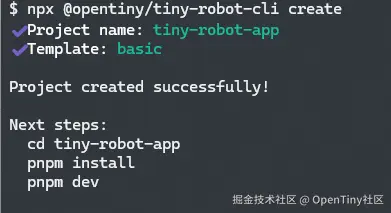
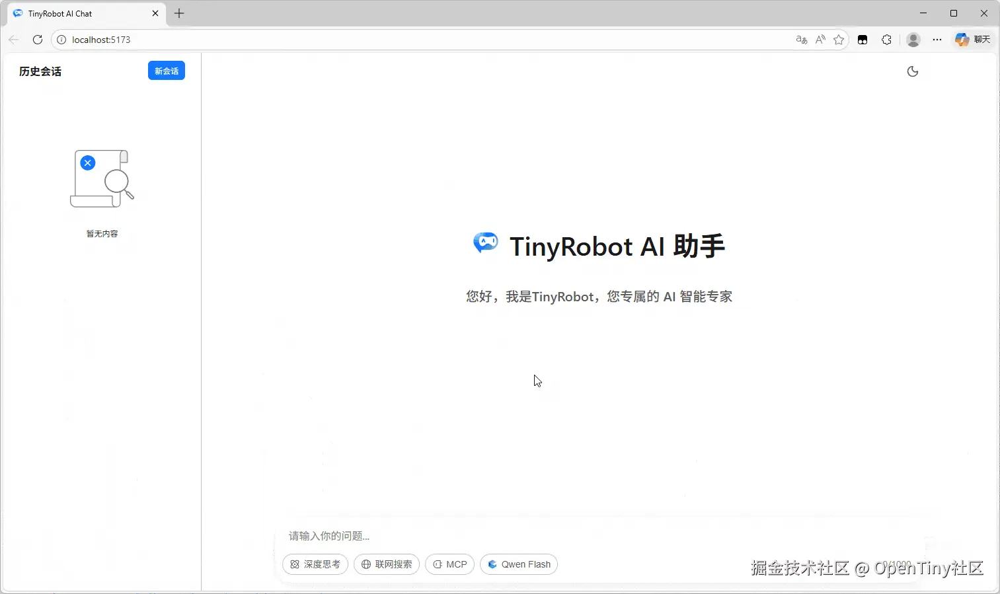
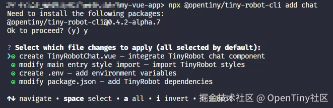
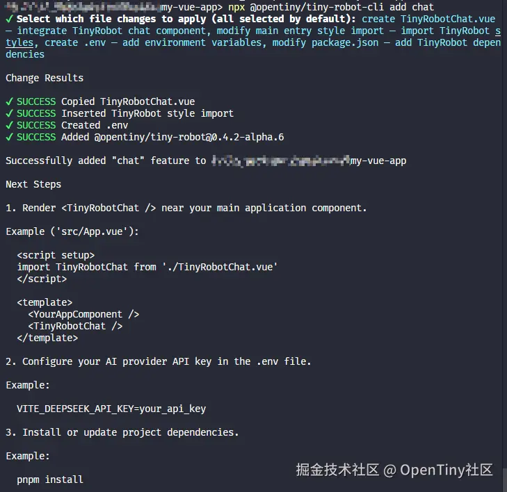
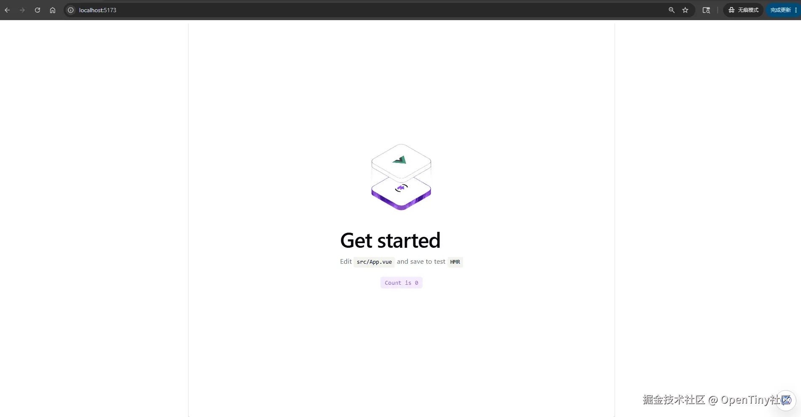
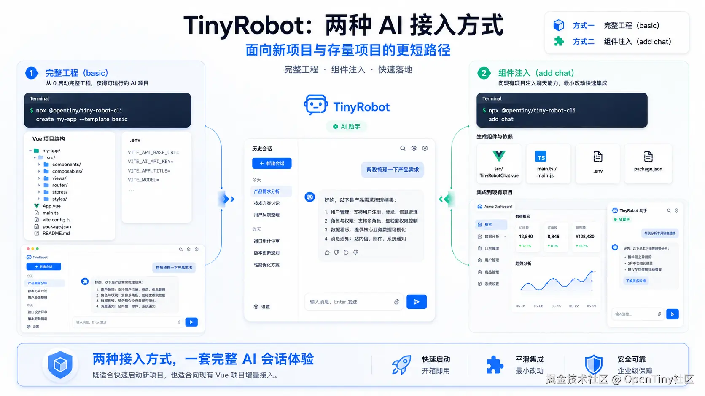

# 一行命令添加 AI 对话入口！TinyRobot 也太省事了~

当今AI时代，AI能力持续跃升，很多团队都有类似的诉求，想给项目里加一个 AI 聊天入口，看似简单，但真动手的时候，往往发现事情不少——聊天 UI、流式响应、会话状态管理、Markdown 渲染、响应式处理……这些功能拆开都不复杂，但放到一起就够折腾一阵。

所以有没有更简单无脑的的方式，能够快速搭建一个AI对话应用或者为已有的项目添加AI对话入口呢？

*有的！朋友！有的！*

**TinyRobot** 就是来解决这个问题的。TinyRobot 除了可以作为组件库提供基础的聊天气泡、聊天输入框等AI组件，现在也提供了**TinyRobot CLI** ，通过两条简单的命令可以实现：

- **创建完整项目**：通过 `create` 命令生成一套可以直接运行的 TinyRobot 示例工程；
- **接入已有项目**：通过 `add` 命令把 AI 聊天组件添加到现有 Vue 项目里。

简单来说：

> 如果还没有项目，或者只是想先看完整效果，可以用 `create` 命令。 对于现有的项目，只想加一个聊天入口，就用 `add` 命令。

首先我们来看下TinyRobot是什么~

## TinyRobot 是什么？

TinyRobot 是一套面向企业 AI 应用的 Vue 3 交互组件库与对话框架。

它基于 OpenTiny 设计体系，主要解决 AI 应用前端侧的一些常见问题，比如：

- 聊天消息、对话 UI 怎么组织
- 流式消息如何展示
- 会话状态怎么管理
- AI 助手、智能客服、多轮对话页面如何快速搭建
- 响应式的UI布局
- 组件样式如何保持一致，并方便后续扩展
- ...

如果你只是想做一个简单 Demo，当然可以自己写一个聊天框。但在真实项目里，问题通常会变多：消息状态、加载中状态、异常提示、多轮上下文、不同模型服务商配置、后续业务组件接入……这些都需要前端侧做不少封装。

使用 TinyRobot 可以帮你把 AI 会话应用里重复度较高的交互和工程基础准备好，让团队可以更快进入业务验证阶段。

## 为什么要提供CLI工具

我们在之前问答、问卷和直播反馈里，经常听到类似诉求：

> 我想搭一个AI对话问答的界面，有没有更快的方式，不用一个组件一个组件去写？

> 有没有将包含整个对话UI 的组件，直接引入就能用的？

> 我已经有现有业务项目了，TinyRobot可以直接快速集成到我的项目里面吗？

这些反馈背后体现了AI时代大家对开发效率的追求，通过CLI命令可以快速初始化项目或代码，提升效率，同时CLI对AI Agent也更加友好，比如可以直接将这篇文章扔给AI让AI执行CLI完成任务，进一步解放自己，CLI也可以为后续更多与AI结合的能力提供准备。

同时也可以看出其实是两个不同场景。

一种是**从零开始验证**：团队还没有接入方案，只想先看 TinyRobot 的完整效果，最好几条命令就能跑起来。

另一种是**已有项目中增量接入**：系统已经在线上或开发中，比如后台管理、工作台、门户站点。此时最重要的不是新建一个完整应用，而是尽量少改现有代码，先添加一个 AI 会话入口。

所以我们为 TinyRobot CLI 同时提供了两条基础命令：

| 场景 | 推荐方式 | 适合做什么 |
| --- | --- | --- |
| 还没有项目，或者想快速看完整效果 | 使用 `create` 命令创建完整项目 | Demo、原型、PoC、方案验证 |
| 已经有 Vue 项目 | 使用 `add` 命令添加聊天组件 | 后台系统、工作台、门户站点中的 AI 入口 |

总结一下：

- **想从零跑一个完整示例，用 `create` 命令；**
- **想在已有项目里加聊天能力，用 `add` 命令。**

## 路径一：用 create 命令创建完整项目

`create` 命令更适合“先跑起来”的场景。它会创建一个完整项目，适合第一次接触 TinyRobot 的开发者快速体验整体效果。

### 1. 执行创建命令

你可以使用 npm 或 pnpm 执行 CLI：

```bash
# npm
npx @opentiny/tiny-robot-cli create

# pnpm
pnpm dlx @opentiny/tiny-robot-cli create
```



创建完成后，进入项目目录：

```bash
cd <project-name>
```

### 2. 配置环境变量

创建出来的项目内置了 DeepSeek 和阿里百炼两个大模型服务商的示例配置。你可以复制 `.env.example`，再补充对应的 API Key。

```bash
cd <your-project-path>
cp .env.example .env
# 编辑 .env
```

示例配置如下：

```makefile
# 阿里百炼 API_KEY。部分 MCP 插件依赖此变量
VITE_ALIYUN_DASHSCOPE_KEY=

# DeepSeek API_KEY
VITE_DEEPSEEK_API_KEY=
```

模板中还内置了 3 个 MCP 插件示例：

- 阿里百炼提供的 12306 车票查询；
- 高德地图；
- Model Context Protocol 示例 MCP。

其中，阿里百炼相关 MCP 插件依赖 `VITE_ALIYUN_DASHSCOPE_KEY`。

这里需要注意：前端项目中的 `VITE_` 环境变量会被注入到构建产物中，更适合本地演示和快速验证。正式生产环境中，如果涉及模型 API Key，建议通过后端服务转发或网关托管，避免把敏感 Key 暴露在浏览器侧。

### 3. 安装依赖并启动项目

完成环境变量配置后，安装依赖并启动项目。

```arduino
pnpm install && pnpm dev
# 或
npm install && npm run dev
```

启动后，在浏览器打开：

```arduino
http://localhost:5173/
```

即可体验 TinyRobot 示例应用。



### 这种方式适合哪些场景？

用 `create` 命令创建完整项目，适合这些情况：

- 第一次接触 TinyRobot，想先看完整效果；
- 想快速做一个 Demo、原型或 PoC；
- 团队内部想先验证 AI 会话方案，再决定是否接入正式业务；
- 希望先有一个可运行项目，再基于它继续改造。

它的好处是路径清晰：不用先考虑怎么和旧系统融合，先把完整体验跑起来。等团队确认交互、模型服务商、MCP 插件和业务方向后，再决定后续怎么接入。

## 路径二：用 add 命令给已有项目添加聊天组件

如果你的项目已经存在，比如后台系统、企业工作台、内部门户，那么通常不希望为了 AI 聊天能力重建一套应用。

这时更适合使用 `add` 命令。

使用起来也很简单：

### 1. 在现有项目根目录执行命令

在你的 Vue 项目根目录执行 TinyRobot CLI 的 `add` 命令。

```sql
npx @opentiny/tiny-robot-cli add chat
```

如果当前项目是多包 workspace，CLI 会自动检测，并引导你选择目标 package。

如果是普通单项目，CLI 会直接在当前项目中完成注入。

### 2. CLI 会改哪些内容？

执行完成后，CLI 会根据你勾选的变更项，自动处理一些接入工作。

默认情况下，可能涉及这些文件：

| 变更项 | 作用 |
| --- | --- |
| `src/TinyRobotChat.vue` | 生成一个可直接使用的 TinyRobot 聊天组件 |
| `main.ts` / `main.js` | 自动插入 TinyRobot 样式导入 |
| `.env` | 添加所需环境变量 |
| `package.json` | 添加或升级 `@opentiny/tiny-robot` 依赖 |

也就是说，`add` 命令主要帮你处理几件容易漏但又比较机械的事情：组件生成、依赖补齐、样式引入、环境变量准备。

这样做的好处是，业务代码不用一开始就大改。你可以先把聊天组件挂到一个页面上，确认交互和调用链路没问题，再逐步和业务数据、权限、页面布局做更深的整合。



### 3. 在业务页面中使用组件

生成完成后，你可以把 `TinyRobotChat.vue` 放到需要展示聊天入口的位置。



例如在 `src/App.vue` 中使用：

```xml
<script>
import HelloWorld from './components/HelloWorld.vue'
import TinyRobotChat from './TinyRobotChat.vue'
</script>

<template>
  <HelloWorld />
  <TinyRobotChat />
</template>
```

CLI 会在 `src/main.ts` 或 `src/main.js` 中自动插入 TinyRobot 的基础样式：

```arduino
import '@opentiny/tiny-robot/dist/style.css'
```

如果你后续希望把聊天入口放进某个业务页面、抽屉、弹窗或侧边栏，也可以把生成的组件移动到对应目录，再按项目本身的组件组织方式引入。

### 4. 补充环境变量

如果只是查看组件样式，可能不需要马上配置模型 Key。 但如果要真正发起模型调用，需要在 `.env` 文件中补充对应的 API Key。

默认示例：

```makefile
VITE_DEEPSEEK_API_KEY=
```

如果项目中已经有 `.env`，CLI 会尽量合并需要的变量。 如果项目中没有 `.env`，CLI 会帮你创建。

同样需要注意，浏览器侧环境变量不适合直接放生产 API Key。正式接入时，建议结合后端服务进行代理、鉴权和限流。

### 5. 安装依赖并启动项目

如果 `package.json` 被更新了，需要重新安装依赖。

```arduino
pnpm install && pnpm dev
# 或
npm install && npm run dev
```

启动后，打开本地开发地址：

```arduino
http://localhost:5173/
```

即可在已有项目中看到注入后的 AI 会话能力。



### 这种方式适合哪些场景？

用 `add` 命令给已有项目添加聊天组件，更适合这些情况：

- 已经有后台系统、工作台、门户站点；
- 不想重建项目，只想快速补一个 AI 会话入口；
- 想先低成本试点，再决定是否做更深的业务整合；
- 希望接入过程尽量轻，不破坏现有项目结构；
- 团队想先验证交互和调用链路，再考虑权限、数据、知识库等业务能力。

相比创建完整项目，`add` 命令更像是在现有项目里开一个“小入口”。它不会替你设计完整业务闭环，但可以让你更快看到 AI 会话组件在真实项目中的样子。

## 小结

TinyRobot 现在提供了两条简单的CLI命令来帮助你接入AI对话能力。

如果你还没有项目，可以用 `create` 命令快速创建一套完整工程，先体验 TinyRobot 的整体交互、模型配置和 MCP 插件示例。

如果你已经有 Vue 项目，可以用 `add` 命令增量添加聊天组件，尽量减少对现有代码结构的影响，先把 AI 会话能力跑起来。

对于正在评估 AI 助手、智能客服、多轮对话系统的团队来说，这两种方式可以覆盖两个常见阶段：

第一步，先验证 TinyRobot 是否符合预期； 第二步，再把会话能力接入到真实业务项目里。



## 后续计划与共建

TinyRobot 后续会继续完善 AI 组件和交互能力，并提供更多适用于 AI 应用的组件与能力：包括布局组件、思维链组件、完整核心对话应用组件、Skill管理与加载等等。

如果你正在做 AI 助手、智能客服、企业工作台里的智能入口，或者对 Vue 3 场景下的 AI 交互组件感兴趣，欢迎关注和参与 TinyRobot，如果觉得项目不错，也欢迎给我们点个Star：

- TinyRobot 仓库：[github.com/opentiny/ti…](https://link.juejin.cn?target=https%3A%2F%2Fgithub.com%2Fopentiny%2Ftiny-robot)
- TinyRobot 文档：[docs.opentiny.design/tiny-robot/](https://link.juejin.cn?target=https%3A%2F%2Fdocs.opentiny.design%2Ftiny-robot%2F)
- OpenTiny 官网：[opentiny.design/](https://link.juejin.cn?target=https%3A%2F%2Fopentiny.design%2F)

也欢迎在使用过程中反馈你遇到的问题：比如使用时困惑的地方、使用中发现的问题、或者你希望 TinyRobot未来支持的能力，可以通过Github社区向我们反馈。您的反馈会直接影响后续功能设计。
