# 这次更新太良心！GenUI SDK v1.2.0 轻量化 + 稳流式 + 超强 Playground

## 前言

GenUI SDK 是 OpenTiny 团队基于生成式 UI 理念打造的解决方案，旨在增强大模型显示与交互效果，SDK提供完整的前后端一体化集成能力，遵循 OpenAI 规范；内置 Vue 与 Angular 双框架渲染器，支持自定义的组件库、交互行为与主题样式。既能快速从零搭建一个 AI 对话应用，也可以在现有业务系统中嵌入生成式 UI 能力。

最近我们推出了 GenUI SDK v1.2.0 新版本！本次更新聚焦 **SDK 轻量化与按需引入**、**流式渲染稳定性**、**Playground 能力升级**、**GenUI Template 体验完善**四大方向深度打磨，让 GenUI SDK 在生产场景中用得更轻、跑得更稳、调得更顺。

开源地址：[github.com/opentiny/ge…](https://link.juejin.cn?target=https%3A%2F%2Fgithub.com%2Fopentiny%2Fgenui-sdk)（欢迎 Star ⭐）

官方网站：[opentiny.design/genui-sdk](https://link.juejin.cn?target=https%3A%2F%2Fopentiny.design%2Fgenui-sdk)

## 版本特性总览

**SDK 构建优化**

- 按需引入：`@opentiny/genui-sdk-vue` 拆分为多入口构建，分别导出各个组件入口，支持按需引入

**流式渲染更稳**

- renderer组件新增 `isJsonComplete` 标记，传入对象类型内容也可进行缓冲优化
- SSE 兼容增强，支持更多的流式响应格式

**Playground：能力全面升级**

- Skills 技能包：支持导入 SKILL 文件夹，实现了渐进式披露
- A2A能力的加入，新增Agent协同能力
- 思考模式拆分：deepseek v4等模型支持思考与非思考模式
- 对话以及模板的历史记录支持导出导出
- 模板的JSON Patch 支持流式更新
- 模板的移动端进行界面的优化以及暗黑模式的适配

**其他修改**

- 严格 JSON 输出规范，从提示词层面减少解析失败
- 循环子节点作用域修复，渲染错误捕获恢复

## 新特性详解

### SDK 按需引入，包体积轻量化

此前 `@opentiny/genui-sdk-vue` 以单一整包发布。即便业务只使用渲染器，在摇树不友好的构建配置下，仍可能将 Chat、ConfigProvider 等模块一并打入 bundle，造成不必要的体积增长。

v1.2.0 支持**子路径分包导出**，可按场景选择入口：

| 子路径 | 适用场景 |
| --- | --- |
| `@opentiny/genui-sdk-vue` | 同时使用 Chat、Renderer、ConfigProvider（默认） |
| `@opentiny/genui-sdk-vue/chat` | 仅需对话组件 |
| `@opentiny/genui-sdk-vue/renderer` | 仅需渲染器（自建对话 UI） |
| `@opentiny/genui-sdk-vue/config-provider` | 主题/国际化配置 |
| `@opentiny/genui-sdk-vue/transform-jsx` | 需要 JSX 转换能力 |

只用 `GenuiRenderer` 自建对话 UI 时，现在只需引入 renderer 子包：

```javascript
import { GenuiRenderer } from '@opentiny/genui-sdk-vue/renderer'
```

除 SDK 本身分包外，内置 OpenTiny 物料也改为子包级引入，只打包 GenUI 实际用到的组件。

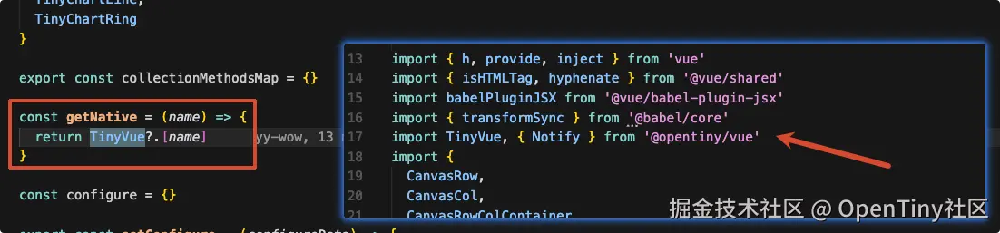

优化前：通过 `@opentiny/vue` 全量引入 TinyVue。

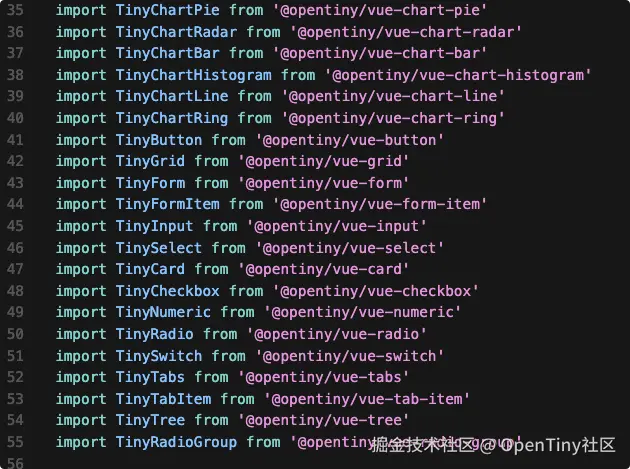

优化后：从 `@opentiny/vue-button`、`@opentiny/vue-grid`、`@opentiny/vue-chart-*` 等子包按需引入，排除与 GenUI 无关的依赖。

#### 构建体积对比

**测试条件**：仅引入 `GenuiRenderer`（`@opentiny/genui-sdk-vue/renderer`），生产环境 `vite build` + Rollup 可视化分析，同一分析方式对比 v1.2.0 前后。

| 指标 | 优化前 | 优化后 |
| --- | --- | --- |
| 整体 bundle | 14.67 MB | 8.02 MB |
| `@opentiny/genui-sdk-vue` 占比 | 约 3.04 MB（20.72%） | 约 506 KB（6.64%） |
| SDK 包体降幅（renderer 场景） | — | **约 83%** |

优化前（使用renderer 场景）：

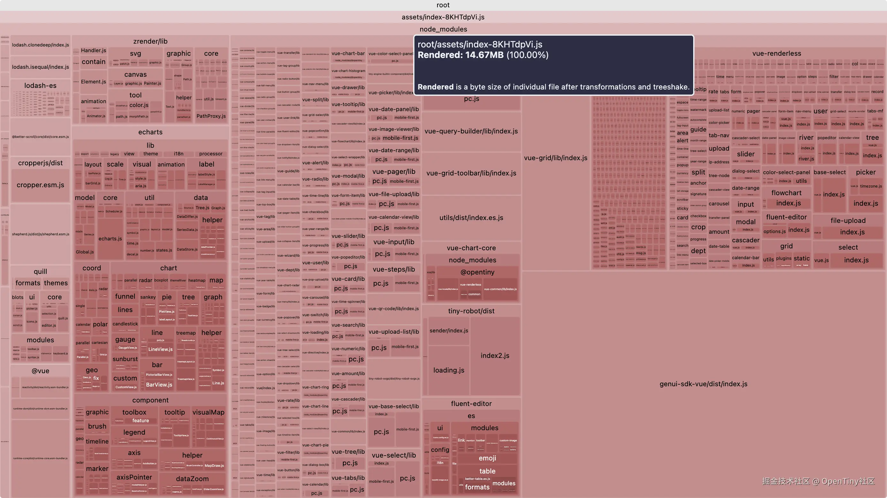

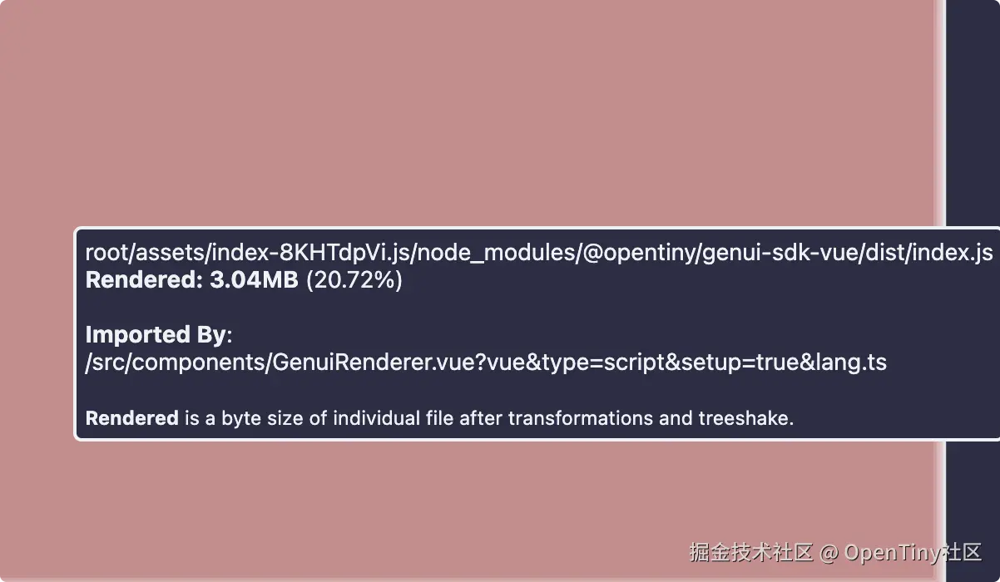

优化后（使用renderer 场景）：

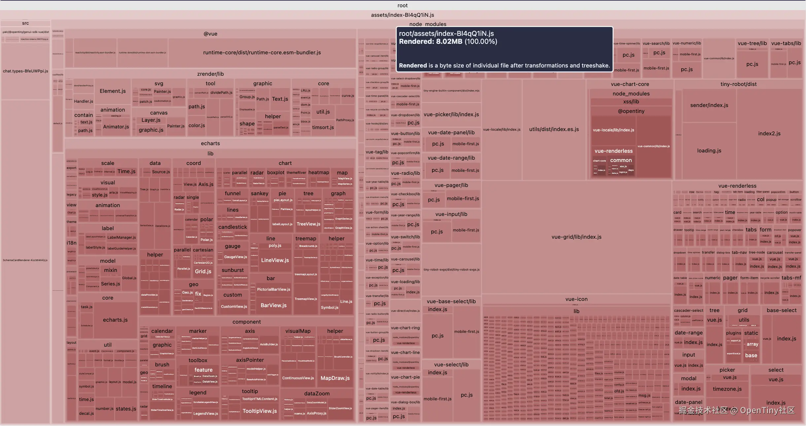

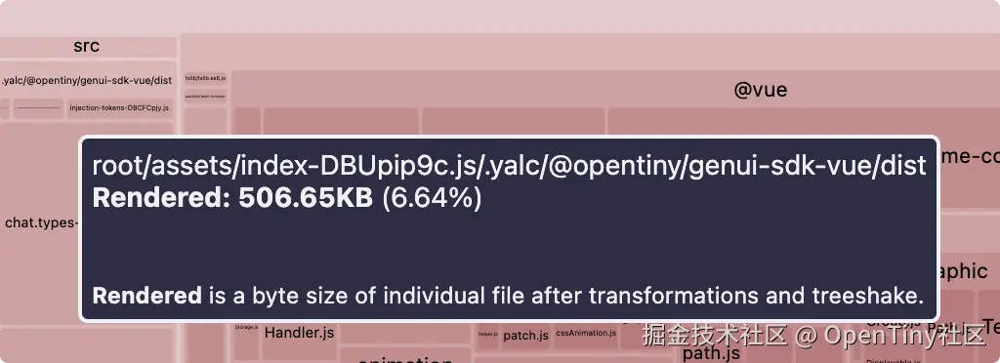

### 历史会话导入导出

Playground 的**对话历史**与**模板历史**均支持 JSON 格式的导入与导出，便于备份调试上下文、跨环境复现问题。历史面板支持多选，可批量导出或删除。

导出文件命名格式：`genui-history-YYYY-MM-DD-HH-mm-ss.json`（模板历史使用相同工具链，前缀可区分场景）。文件内容为**会话对象数组**，每条会话需包含 `id`、`messages` 等字段。

**导入校验与冲突处理**：

- 非合法 JSON 或缺少 `messages` 数组时会给出明确错误提示
- 导入会话 ID 与本地冲突时，通过 `reconcileImportedConversationIds` 自动分配新 ID，避免覆盖已有会话

模板列表（`GenuiTemplateList`）复用同一套历史工具栏，对话与模板的导入导出体验保持一致。

#### 会话导出

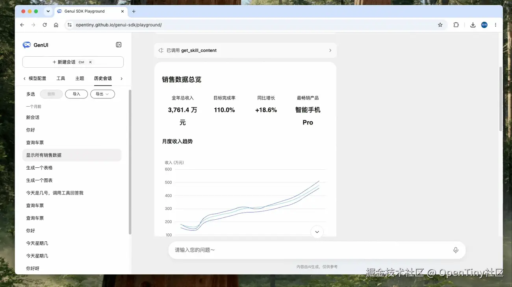

#### 会话导入

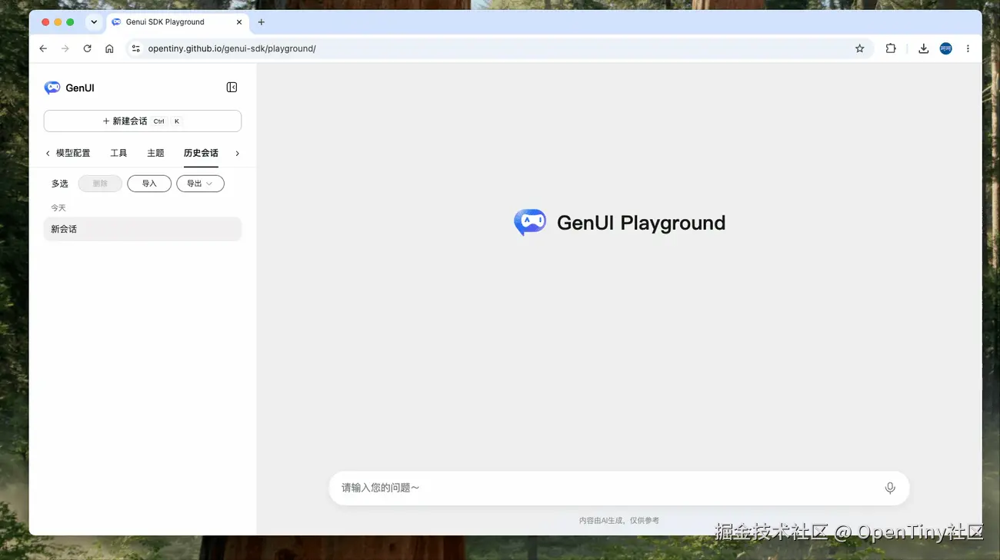

### 演练场Skill特性支持

本次更新为 Playground 带来 Agent 能力的重要升级之一：**Skill（技能包）** 支持。

- **单文件 Skill**：适合快速试验，直接编写 SKILL 内容
- **文件夹导入**：支持导入完整 SKILL 目录（含 `SKILL.md` 与附属模块），导入后可在树形面板中浏览、编辑各文件
- **渐进式披露**：系统提示词中仅注入技能名称与描述列表；当模型判断需要某技能时，通过工具 `get_skill_content` 按需拉取完整正文或子路径文档，避免一次性占满上下文窗口。

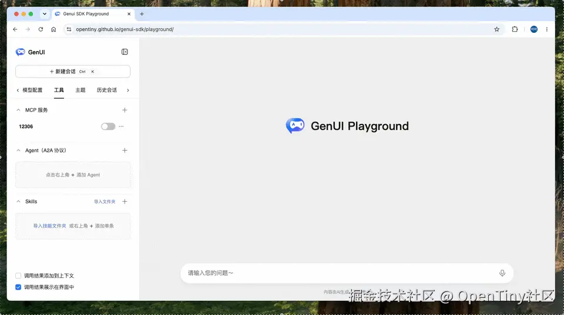

演示视频使用vue最佳实践的skill：[github.com/antfu/skill…](https://link.juejin.cn?target=https%3A%2F%2Fgithub.com%2Fantfu%2Fskills%2Ftree%2Fmain%2Fskills%2Fvue-best-practices)

### 演练场A2A 智能体协作

v1.2.0 在 Playground 服务端实现 **A2A（Agent-to-Agent）** 能力：将外部 AI 智能体注册为 **工具（Tool）** ，与 MCP Tools、Skill Tools 一并注入同一次对话。演练场由此从**单模型包办一切**升级为主 Agent 编排、领域 Agent 执行的多智能体模式。你可将已有垂直领域 Agent（客服、数据分析、代码审查等）接入，无需重复建设对话壳层。

当前实现基于 **A2A 协议 v0.3.0**，已支持在演练场中完成「主 Agent 编排 → 领域 Agent 执行 → 结果回写 Schema」的完整链路。A2A 官方已发布 **v1.0.0** 稳定版，我们正推进协议升级适配（Agent Card 解析、调用约定与错误处理等），**预计在下一版本中完成切换**——届时将更好对齐 v1.0.0 的互操作能力与生态工具，敬请关注后续 Release。

### 演练场模型支持思考以及非思考模式

系统自动检测支持 `enable_thinking` 的模型（如 DeepSeek-V4-Flash/Pro），将其拆分为两个条目：

- `{modelName}` —— No-Thinking 模式（`thinking: { type: 'disabled' }`），快速响应
- `{modelName}-thinking` —— Thinking 模式（`thinking: { type: 'enabled' }`），深度推理

用户可以在 Playground 中根据场景灵活选择：简单 UI 生成用 No-Thinking 追求速度，复杂交互逻辑用 Thinking 追求质量。

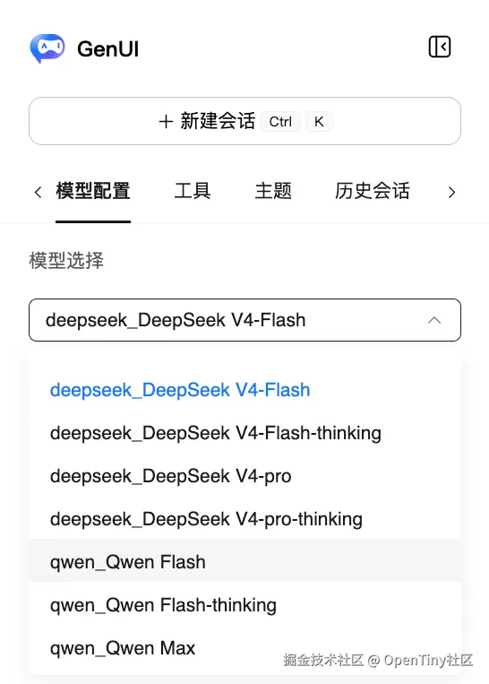

### 模板实验特性优化

#### 移动端及暗黑模式优化

v1.2.0专门针对了模板实验特性做了UI优化，重点优化了移动端样式和暗黑模式样式。

移动端： 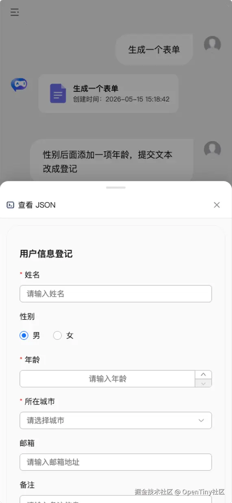

暗黑模式：

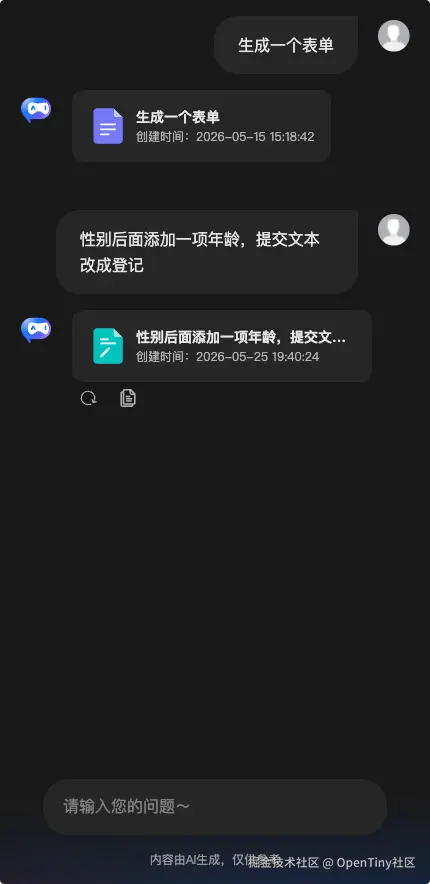

#### 提示词改进

v1.2.0 基于 RFC 6902 构建了完整的 JSON Patch Zod Schema。使得大模型返回的diff更加精确以及稳定

## 其他值得关注的修复

**新增** `isJsonComplete`**字段**

此前对象模式缺少一个「完整性标记」，函数体、样式属性还没写完就参与渲染，出现各种截断异常。

v1.2.0 为 `GenuiRenderer` 新增 `isJsonComplete` 字段，由调用方显式标记 schema 是否完整，配合 `requiredCompleteFieldSelectors`（缓冲字段），可以精确指定哪些关键字段必须写完才允许上屏

**严格 JSON 输出规范**

提示词强制要求 schemaJson 使用标准 JSON 格式——双引号、无尾逗号、无注释、无单引号。LLM 输出「伪 JSON」是解析失败的高频原因，约束输出格式，使得输出更稳定。

**循环子节点作用域修复**

修复了 `loop` 子节点读不到 `item`、`index` 等作用域变量的问题，循环渲染场景下变量引用现在可以正常工作。

**SSE 兼容增强**

部分 SSE 响应中 `data:` 后没有空格（如 `data:{"content":"..."}` 而非标准的 `data: {...}`），之前会解析失败。现在已兼容这种格式，对接更多流式接口更顺畅。

## 总结

GenUI SDK v1.2.0 以**更轻的 SDK 包体积、更稳的流式渲染控制、更强的演练场能力、更完善的模板体验**为核心升级方向。

欢迎各位开发者升级体验。使用过程中若遇到边界场景或有优化建议，欢迎通过 [GitHub Issues](https://link.juejin.cn?target=https%3A%2F%2Fgithub.com%2Fopentiny%2Fgenui-sdk%2Fissues) 反馈；也欢迎 Star 与参与贡献。我们将持续迭代打磨更优质的 GenUI 产品能力！

详细变更列表可参考 Release Note：[github.com/opentiny/ge…](https://link.juejin.cn?target=https%3A%2F%2Fgithub.com%2Fopentiny%2Fgenui-sdk%2Freleases)

## 关于 OpenTiny NEXT

OpenTiny NEXT 是一套企业智能前端开发解决方案，以生成式 UI 和 WebMCP 两大核心技术为基础，对现有传统的 TinyVue 组件库、TinyEngine 低代码引擎等产品进行智能化升级，构建出面向 Agent 应用的前端 NEXT-SDKs、AI Extension、TinyRobot智能助手、GenUI等新产品，实现AI理解用户意图自主完成任务，加速企业应用的智能化改造。

欢迎加入 OpenTiny 开源社区。添加微信小助手：opentiny-official 一起参与交流前端技术～  
 OpenTiny 官网：[opentiny.design](https://link.juejin.cn?target=https%3A%2F%2Fopentiny.design)  
 GenUI SDK 代码仓库：[github.com/opentiny/ge…](https://link.juejin.cn?target=https%3A%2F%2Fgithub.com%2Fopentiny%2Fgenui-sdk) （欢迎star ⭐）

如果你也想要共建，可以进入代码仓库，找到 good first issue标签，一起参与开源贡献~如果你有任何问题，欢迎在评论区留言交流！
