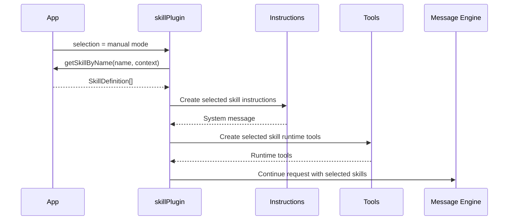
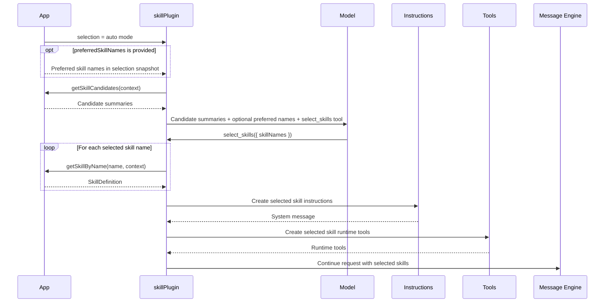

# Skill Toolchain Architecture

本文档面向维护者，用于说明 `packages/kit/src/skills` 中各模块的职责边界。面向使用者的 API 文档和交互示例放在 `docs/src/tools/skill.md`。

## 目标

skill 是一组可复用的能力模板。它可以从文件加载，被 storage 持久化或恢复，被业务侧选择，并在请求前转换为模型可消费的 instructions 和基础文件工具。

skill 核心能力不依赖 Vue，浏览器安全 API 从 `@opentiny/tiny-robot-kit` 和 `@opentiny/tiny-robot-kit/core` 导出；Node 文件系统能力从 `@opentiny/tiny-robot-kit/node` 导出。

## 核心数据

`SkillDefinition` 是 loader、storage、instructions、tools 之间流转的核心数据结构：

```ts
interface SkillDefinition {
  name: string
  description: string
  instructions: string
  resources?: SkillResourceDescriptor[]
  metadata?: Record<string, unknown>
}
```

- `name`：skill 唯一名称，由 storage 或业务侧集合负责覆盖和去重。
- `description`：用于展示、搜索或后续自动选择。
- `instructions`：注入模型请求的核心指令。
- `resources`：随 skill 携带的附加文件资源，可由基础文件工具读取。
- `metadata`：应用侧和 loader 保留的扩展信息。

## 模块职责

### `types/index.ts`

定义 skill 工具链的共享类型：

- `SkillDefinition`
- `SkillResourceDescriptor`
- `SkillFileKind`

该文件不包含运行逻辑。

### `utils.ts`

提供 skill 文件路径和文本文件判断工具：

- `normalizeSkillPath`
- `isTextSkillFilePath`
- `getExtension`

这些工具只处理文件路径和扩展名，不解析 skill 语义。

### `loader/browser.ts`

浏览器文件适配器。负责把浏览器文件来源转换为标准 `LoadableSkillFile[]`：

- `loadBrowserSkillFiles`

该模块只读取文件内容并标准化路径，不解析 `SKILL.md`。

### `loader/fs.ts`

Node 文件适配器。负责把本地目录转换为标准 `LoadableSkillFile[]`：

- `loadFsSkillFiles`

该模块依赖 Node `fs/path`，只能从 `@opentiny/tiny-robot-kit/node` 子入口导出，不能从浏览器根入口导出。

### `loader/definition.ts`

definition loader 层。负责把 `LoadableSkillFile[]` 解析为 `SkillDefinition`：

- 查找入口文件，默认 `SKILL.md`
- 解析 frontmatter
- 将正文转换为必填 `instructions`
- 将其他支持的文件转换为 `resources`
- 收集非致命 warnings

definition loader 不负责：

- 读取文件系统或浏览器文件
- 保存 skill 集合
- 选择 skill
- 编译 message 请求

### `capabilities/selection.ts`

selection capability 负责自动选择阶段的 instructions 和 runtime tool：

- `createSkillSelectionInstructionsMessage({ candidates, preferredSkillNames })`
- `createSkillSelectionRuntimeTools(candidates, options?)`

该 capability 提供：

- `select_skills`

### `capabilities/resources.ts`

resources capability 负责已启用 skill 的资源读取 instructions 和 runtime tools：

- `createSkillResourceInstructionsMessage(skills)`
- `createSkillResourceRuntimeTools(skills)`

该 capability 提供：

- `list_skill_files`
- `read_skill_file`

resources capability 的基础目标是让模型按需读取 skill 附加文件，而不是把所有 resources 一次性注入 prompt。模型应先通过 `list_skill_files` 查看文件列表和大小，再根据明确的 `skillName` 和相对路径调用 `read_skill_file`。

### `capabilities/commands.ts`

commands capability 目前只提供类型：

- `SkillCommandRequest`
- `SkillCommandResult`
- `SkillCommandExecutor`

`execute_skill_command` runtime tool 暂不实现。

capabilities 不负责：

- skill 去重
- 选择状态
- 持久化
- 集合管理

capability factory 是 `skillPlugin` 的内部组装能力，不从 `skills/index.ts` 对外导出。

### `index.ts`

skill core 的统一导出口。该入口会被 `@opentiny/tiny-robot-kit` 和 `@opentiny/tiny-robot-kit/core` 重新导出。

不要在这里导出 Node-only API，例如 `loadSkill({ source: 'fs', root })` 或 `createFsSkillStorage`。

## Message 接入

message 接入代码不放在 `src/skills` 下：

- core message adapter：`packages/kit/src/message/plugins/skillPlugin.ts`
- Vue message adapter：`packages/kit/src/vue/message/plugins/skillPlugin.ts`

`skillPlugin` 的职责是把调用方传入的当前 selection 快照接入 message 生命周期：

1. `onTurnStart` 读取 `selection`，或将 Vue 侧响应式 `skills` 映射为 `manual` selection。
2. 通过 `getSkillByName(name)` 将最终启用的 names 解析为 `SkillDefinition[]`。
3. 创建 `runtimeTools = createSkillResourceRuntimeTools(skills)`。
4. 将 `{ skills, skillNames, requestedSkillNames, unresolvedSkillNames, runtimeTools }` 写入 `customContext.__tiny_robot_skill`。
5. `provideTools` 暴露 `runtimeTools`。
6. `onBeforeRequest` 将 selected skill instructions 和 capability instructions prepend 到 system message。

`skillPlugin` 不加载、不缓存、不持久化、不管理 skill 集合。它只在 auto 模式下提供 `select_skills` runtime tool，让模型从候选摘要中选择 names。

## Skill 启用模式

### 手动指定

手动指定适合用户通过 `@skillName`、下拉选择或业务按钮明确启用某个 skill 的场景。通常一次只启用一个 skill，也可以由业务侧按需启用多个。

该模式不需要 selection 阶段。应用侧只传入最终 selected skill names；插件再通过顶层 `getSkillByName` 解析完整 `SkillDefinition`：

```ts
skillPlugin({
  selection: {
    mode: 'manual',
    skillNames: requestedSkillNames,
  },
  getSkillByName: (name) => storage.get(name),
})
```

`skillPlugin` 会把 selected skills 的 `instructions` 编译进 system prompt，并暴露基础文件工具。只有 `instructions` 直接进入 system prompt；`resources` 不默认展开，模型需要细节时通过 `list_skill_files` / `read_skill_file` 按需读取。

### Resource 读取策略

skill resources 可能包含较大的文档、代码或数据文件。大文件内容不应由模型盲目读取，避免单次 tool result 占用过多上下文。当前 resources capability 只提供列表和读取两个工具，因此 system instructions 应明确要求模型优先按以下顺序使用：

1. 先调用 `list_skill_files` 查看可用文件清单和基础元数据，包括 `skillName`、`path`、`kind`、`mimeType`、`size`、`lastModified`。
2. 根据文件名、类型和大小判断目标文件。
3. 只有已经明确需要某个文件内容时，才调用 `read_skill_file`。

`read_skill_file` 当前固定接收：

```ts
read_skill_file({
  skillName: string
  path: string
})
```

后续如果需要支持更大的文件，可以在 `read_skill_file` 上增加大小限制、截断诊断和范围读取能力。binary resource 不通过 `read_skill_file` 返回原始二进制。

### Resource 大文件定位规划

未来如果 resource 文件较大、目标内容不明确，单靠 `list_skill_files` 和 `read_skill_file` 仍然不够精确。可以增加 `search_skill_files` 作为大文件定位工具，但在实现前不要把它写入 runtime tools 或当前 system instructions。

规划中的使用流程：

1. 模型先调用 `list_skill_files` 查看文件列表和 size。
2. 如果文件较大或不知道目标内容在哪个位置，调用 `search_skill_files` 搜索关键词。
3. `search_skill_files` 返回多个匹配结果，每个结果包含文件路径、文本索引和部分片段。
4. 模型根据匹配结果选择目标位置，再调用支持 `offset` / `length` 的 `read_skill_file` 读取上下文。

规划中的 `search_skill_files` 参数形态：

```ts
search_skill_files({
  query: string
  skillName?: string
  maxResults?: number
})
```

推荐返回结构：

```ts
type SearchSkillFilesResult = {
  matches: Array<{
    skillName: string
    path: string
    line?: number
    offset: number
    length: number
    snippet: string
  }>
}
```

- `offset` 使用后续 `read_skill_file` 可复用的文本索引。第一阶段可按 JavaScript string offset 处理。
- `length` 表示命中关键词长度。
- `snippet` 是命中附近的一小段文本，应优先让关键词处于片段中间；如果命中靠近文件开头或结尾，可以自然偏移。
- `line` 只作为辅助展示和模型判断，不作为后续读取的主索引。

配套的 `read_skill_file` 范围读取参数形态：

```ts
read_skill_file({
  skillName: string
  path: string
  offset?: number
  length?: number
})
```

推荐返回结构：

```ts
type ReadSkillFileResult = {
  file: {
    skillName: string
    path: string
    kind?: string
    mimeType?: string
    size?: number
  }
  content: string
  offset: number
  returnedLength: number
  originalLength: number
  truncated: boolean
  nextOffset?: number
}
```



### 自动选择

自动选择适合应用有多个候选 skills，但用户没有明确指定 skill 的场景。该模式应拆成 selecting 和 ready 两个请求级阶段。

selecting 阶段只给模型候选摘要：

```txt
Available skills:
- weather: Get current weather information.
- vue-best-practices: Vue.js best practices workflow.
```

该阶段不提供完整 `instructions`，也不提供 skill resource tools。模型只负责调用 `select_skills` 产出 selected skill names。

`select_skills` 完成后进入 ready 阶段。插件根据 selected skill names 读取完整 `SkillDefinition[]`，再编译 selected skill instructions 和 resource tools：

```ts
skillPlugin({
  selection: {
    mode: 'auto',
    preferredSkillNames: currentPreferredSkillNames,
  },
  getSkillCandidates: () => storage.list(),
  getSkillByName: (name) => storage.get(name),
})
```

这样可以避免把所有 candidate skill instructions 一次性塞进 system prompt，减少 token 成本，也避免多个 skill 指令互相干扰。若 `getSkillByName` 找不到或解析某个 requested skill 失败，该 skill 会被跳过，并在 `select_skills` 的 tool result 中返回 `unresolvedSkillNames`。

`select_skills` 工具固定接收：

```ts
select_skills({
  skillNames: string[]
})
```

工具 JSON schema 应使用候选 skill names 限制可选范围：

```json
{
  "type": "object",
  "properties": {
    "skillNames": {
      "type": "array",
      "items": {
        "type": "string",
        "enum": ["weather", "vue-best-practices"]
      }
    }
  },
  "required": ["skillNames"],
  "additionalProperties": false
}
```

selection 工具返回结构化结果，便于模型了解选择和实际启用情况：

```json
{
  "requestedSkillNames": ["weather", "vue-best-practices"],
  "enabledSkillNames": ["weather"],
  "unresolvedSkillNames": ["vue-best-practices"]
}
```



如果 UI 支持随时在手动和自动之间切换，推荐让 `selection` 成为一个返回当前快照的函数。同一份 UI selected names 在 manual 模式下是最终启用项，在 auto 模式下是 preferred skill names：

```ts
skillPlugin({
  selection: () => {
    if (mode === 'manual') {
      return {
        mode: 'manual',
        skillNames: requestedSkillNames,
      }
    }

    if (mode === 'auto') {
      return {
        mode: 'auto',
        preferredSkillNames: requestedSkillNames,
      }
    }

    return { mode: 'none' }
  },
  getSkillCandidates: () => storage.list(),
  getSkillByName: (name) => storage.get(name),
})
```

## Sandbox Command Execution

部分 skill 需要专门的后端运行环境才能执行命令，例如 PPT、PDF、浏览器自动化或文档处理。`kit` 暂不实现 `execute_skill_command` runtime tool，目前只保留命令请求和结果类型，后续再接入应用侧 executor 和后端沙箱。

预留工具形态：

```ts
execute_skill_command({
  skillName: string
  command: string
  args: string[]
})
```

该阶段不要求从 `SKILL.md` 提取命令 allowlist，也不要求 tools 层生成命令枚举。`SKILL.md` 仍然是自然语言说明，模型可以根据说明决定 `command` 和 `args`。

当前职责边界：

- `capabilities/commands.ts` 只定义命令请求/结果类型。
- `skillPlugin` 暂不暴露 `execute_skill_command`。
- 应用侧 executor 负责选择后端运行环境、鉴权、沙箱、超时、日志、产物管理和错误返回。
- 后端必须把模型返回的 `command` / `args` 视为不可信输入。

后端执行约束：

- 在隔离环境中执行，例如容器、临时 workspace、受限用户或专用任务服务。
- 使用 argv 方式执行命令，例如 `spawn(command, args, { shell: false })`。
- 不把 `command` 和 `args` 拼接成 shell 字符串执行。
- 设置超时、输出大小限制和并发限制。
- 限制可访问的文件目录和网络能力。
- 对危险命令、高成本命令或写入性操作保留业务侧确认能力。

推荐返回结构：

```ts
type SkillArtifact = {
  id: string
  name: string
  mimeType?: string
  size?: number
  url?: string
  textAvailable?: boolean
  previewAvailable?: boolean
  metadata?: Record<string, unknown>
}

type SkillCommandResult = {
  ok: boolean
  exitCode?: number
  stdout?: string
  stderr?: string
  artifacts?: SkillArtifact[]
  error?: {
    code: string
    message: string
  }
}
```

### Artifact 产物模型

命令执行可能生成 PDF、PPTX、图片、压缩包等二进制文件。这些内容不应通过 tool message 直接传给模型，也不应以 base64 放进 `stdout`。后端沙箱应把文件写入受控的 artifact store，再在 `SkillCommandResult.artifacts` 中返回引用信息。

artifact store 可以是：

- 应用后端的临时目录和下载接口。
- 对象存储，例如 S3、OSS、MinIO。
- 专用任务服务提供的产物访问接口。

artifact 必须绑定用户、会话、请求或 sandbox run，不能只依赖裸 `artifactId` 做访问控制。`url` 应由应用侧决定是内部代理地址、短期 signed URL，还是仅供前端预览使用的下载地址。

推荐链路是：模型调用 `execute_skill_command`，应用侧 executor 在后端沙箱中按 argv 执行命令，沙箱把二进制产物写入 artifact store，再把 stdout、stderr 和 artifacts 引用返回给模型。后续如果模型需要理解产物内容，应用侧可以再提供读取 artifact 文本、摘要或预览信息的工具。

后续如果模型需要继续理解产物内容，可以在 command/artifact capability 中扩展 artifact 读取能力，例如：

- `list_skill_artifacts`
- `get_skill_artifact_info`
- `read_skill_artifact_text`

这些工具应返回文本、摘要或元数据，不返回原始二进制内容。后续可以只让 `execute_skill_command` 返回 `artifacts` 引用，由前端或应用侧负责展示、下载和预览。

后续如果 skill 命令逐渐稳定，可以再引入机器可读 manifest，把自由命令收敛为 command allowlist 和参数 schema。这个 manifest 属于后续增强，不影响当前基于沙箱的第一阶段设计。

## 后续事项

### 中期补

- 为 resource tools 增加大文件读取保护和定位能力。`list_skill_files` 提供 size 等元数据；未来可增加 `search_skill_files`，返回多个命中结果、文本 offset 和关键词居中的 snippet；`read_skill_file` 支持大小限制、`offset` / `length` 范围读取，并返回 `truncated`、`originalLength`、`nextOffset` 等诊断字段。
- 优化 storage/list candidate 体验。`SkillCandidate` 当前只包含 `name`、`description`、`metadata`；后续可按需要增加搜索、分页、标签或来源信息。
- 为重复 skill name 增加更明确的 diagnostics。优先放在 storage 或 selection 逻辑中，不放在 instructions 或 capabilities 中。

### 暂不急

- 暂不实现 `execute_skill_command` runtime tool。命令执行涉及 sandbox、安全、artifact store、权限和运行环境，应保持为应用侧能力。
- 暂不恢复 manager/selection set。业务侧可通过 storage `list/get` 和自己的 selected names 管理长期选择状态。

### 已完成

- [x] 评估 auto skill selection 是否需要独立 selector 层。
- [x] auto 模式在类型层要求提供 `getSkillCandidates`，运行时也保留错误兜底。
- [x] 在 `SkillRequestContext` 中记录 `requestedSkillNames` 和 `unresolvedSkillNames`，方便业务侧展示哪些 requested skills 未成功启用。
- [x] capability factory 不再从 public `skills/index.ts` 对外导出。
- [x] 文件存储。
- [x] 文档描述优化。
