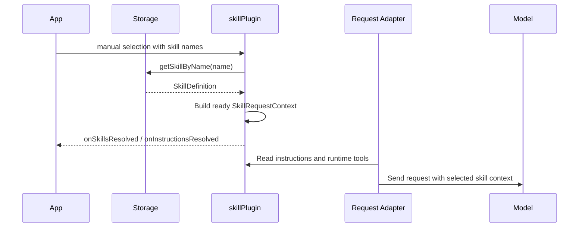
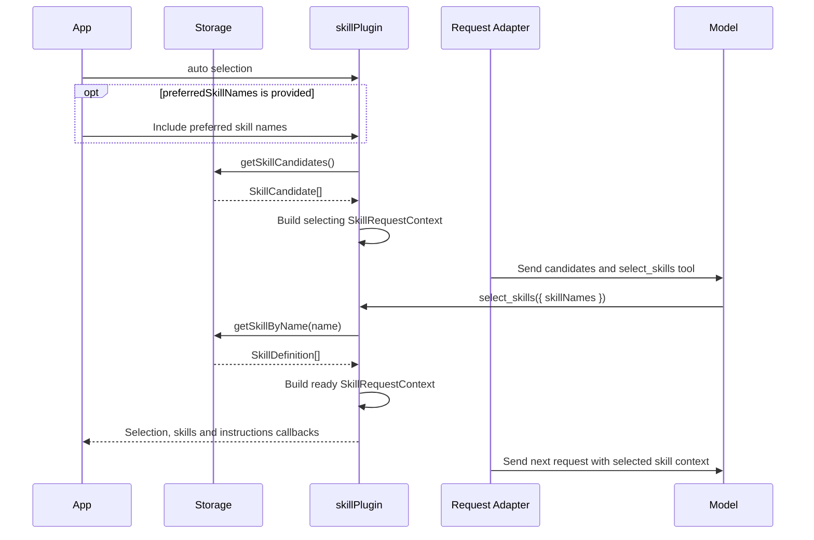

# Skill Toolchain Architecture

本文档面向维护者，说明 skill 工具链的整体架构、数据流和职责边界，不展开逐文件实现或完整 API 用法。

## 目标

skill 是一组可加载、可持久化、可选择的模型能力定义。kit 将其生命周期拆成两条相互衔接的数据流：

```text
加载与持久化：文件来源 -> Loader -> SkillDefinition -> Storage
请求组装：    SkillDefinition + Selection -> skillPlugin -> Instructions + Runtime Tools
```

这套架构遵循以下边界：

- Loader 只负责从外部来源构建 `SkillDefinition`。
- Storage 只负责保存、恢复和枚举 skills。
- `skillPlugin` 只负责单轮会话中的选择状态、instructions 和 tools。
- 业务侧负责长期选择状态，以及把 instructions 写入具体模型供应商的请求。

## 核心数据模型

`SkillDefinition` 是三个架构组件之间传递的核心数据：

```ts
interface SkillDefinition {
  name: string
  description: string
  instructions: string
  resources?: SkillResourceDescriptor[]
  metadata?: Record<string, unknown>
}
```

- `name` 是 storage 和 selection 使用的标识。
- `description` 是展示和自动选择使用的摘要。
- `instructions` 是 skill 的主要模型指令。
- `resources` 是模型可按需读取的附加文件。
- `metadata` 保留 loader 或业务侧的扩展数据。

resource 分为 text 和 binary。内容既可以直接保存在 definition 中，也可以由 storage 恢复为延迟读取函数，因此消费方不能假设资源内容始终已经加载。

## 架构组件

### Loader

Loader 把不同文件来源统一转换为 `SkillDefinition`。当前支持：

- 浏览器文件或目录。
- GitHub 仓库中的指定目录。
- Node 本地文件系统目录。

skill 入口默认是 `SKILL.md`。入口正文成为 `instructions`，其他支持的文件成为 resources。加载结果可以包含非致命 warnings；加载任务支持取消。

Loader 不负责：

- 保存或覆盖 skill。
- 管理已选择的 skill。
- 生成 message 请求。

### Storage

Storage 为业务侧提供 skill 集合，统一支持新增、读取、判断存在、删除、列举摘要和导入。当前实现包括：

- Memory storage：进程内临时集合。
- IndexedDB storage：浏览器持久化。
- File-system storage：Node 本地目录持久化。

`import()` 串联 Loader 与 Storage：先加载外部来源，再把得到的 `SkillDefinition` 保存到当前 storage。`list()` 返回候选摘要，`get()` 返回完整 definition。

Storage 不负责：

- 决定某轮请求启用哪些 skills。
- 生成 instructions 或 runtime tools。
- 管理 UI 的选择状态。

### Message Plugin

`skillPlugin` 把业务侧提供的 selection 快照转换为本轮请求的 skill 上下文：

```ts
interface SkillRequestContext {
  skills: SkillDefinition[]
  skillNames: string[]
  requestedSkillNames: string[]
  unresolvedSkillNames: string[]
  instructions: string[]
  runtimeTools: RuntimeTool[]
  selection: SkillSelectionStatus
}
```

该上下文写入 message engine 的 `customContext`，可通过 `getSkillRequestContext()` 读取。插件通过 `provideTools` 暴露当前阶段可用的 runtime tools，但不会自行修改 `requestBody`。

`requestedSkillNames` 表示请求启用的名称，`skillNames` 只包含成功解析的 skills，无法解析的名称记录在 `unresolvedSkillNames`。

`skillPlugin` 不负责：

- 加载或持久化 skill。
- 维护跨会话的选择集合。
- 决定 instructions 应写入哪个供应商字段。

## 运行流程

### Manual Selection

manual 模式用于用户或业务逻辑已经明确选中 skills 的场景。调用方可以直接传入完整 definitions，也可以传入 names 并通过 storage 解析：

```ts
skillPlugin({
  selection: {
    mode: 'manual',
    skillNames: selectedNames,
  },
  getSkillByName: (name) => storage.get(name),
})
```

插件在 turn 开始时解析 definitions，生成 selected skill instructions，并提供这些 skills 的 resource tools。单个名称解析失败不会中断其他 skills。



### Auto Selection

auto 模式用于存在多个候选 skills、但最终选择交给模型的场景：

```ts
skillPlugin({
  selection: {
    mode: 'auto',
    preferredSkillNames,
    maxSelectedSkills: 2,
  },
  getSkillCandidates: () => storage.list(),
  getSkillByName: (name) => storage.get(name),
})
```

自动选择分为两个阶段：

1. `selecting`：向模型提供候选摘要和 `select_skills` tool，不暴露完整 skill instructions 或 resource tools。
2. `ready`：模型选择 names 后，插件解析完整 definitions，并为下一次请求提供 selected skill instructions 和 resource tools。

`preferredSkillNames` 是选择偏好，不是最终启用结果。



### None

`selection: { mode: 'none' }` 表示本轮不启用 skill。插件仍写入空的 ready context，但不生成 instructions 或 runtime tools。

## Instructions 接入

`skillPlugin` 只生成 `SkillRequestContext.instructions`，不假设供应商使用 system message、独立 system 字段或其他协议。

当 instructions 更新时，插件触发 `onInstructionsResolved`。该回调发生在 turn 或 tool 生命周期中，收到的是基础上下文，不包含 `requestBody`。请求适配器可以在后续 `onBeforeRequest` 中读取当前 instructions：

```ts
const plugins = [
  skillPlugin({
    selection: { mode: 'manual', skillNames: selectedNames },
    getSkillByName: (name) => storage.get(name),
  }),
  {
    name: 'provider-skill-instructions',
    onBeforeRequest(context) {
      const instructions = getSkillRequestContext(context)?.instructions ?? []
      context.requestBody.system = instructions.join('\n\n')
    },
  },
]
```

具体注入方式属于 provider adapter，而不是 skill 工具链。

## Resource Tools

当已启用 skills 包含 resources 时，插件提供两个基础工具：

- `list_skill_files`：列出当前 skills 的资源摘要。
- `read_skill_file`：按 skill name 和相对路径读取 text resource。

binary resource 不通过 `read_skill_file` 返回。资源应优先按需读取，避免把全部文件内容预先放入上下文。

## Vue 接入

Vue `skillPlugin` 复用相同的 core 生命周期，并为 `mode`、`skills`、`skillNames`、`preferredSkillNames` 和 `maxSelectedSkills` 提供 `ref` / `computed` 支持。

调用方也可以直接提供 core-compatible `selection`。函数形式的 selection 会在每轮读取最新状态。Vue wrapper 只负责响应式适配，不改变 Loader、Storage 或 core plugin 的职责。

## 环境与导出边界

浏览器安全的 skill 类型、Loader、Memory/IndexedDB Storage 和 message plugin 从 `@opentiny/tiny-robot-kit` 或 `@opentiny/tiny-robot-kit/core` 导出。

依赖 Node 文件系统的 Loader 与 File-system Storage 只从 `@opentiny/tiny-robot-kit/node` 导出。Node-only API 不应进入 root/core 导出，避免浏览器 bundle 引入 `fs`、`path` 等依赖。

## 当前限制与 Roadmap

- resource tools 尚不支持范围读取、截断或全文搜索。
- GitHub Loader 尚不支持认证配置和进度回调。
- kit 尚不提供 skill command execution、执行沙箱或 artifact 管理。
- Storage 不负责业务搜索、分页、选择集合和冲突诊断。
- 新能力应保持 Loader、Storage、Message Plugin 与 provider adapter 的现有边界。
