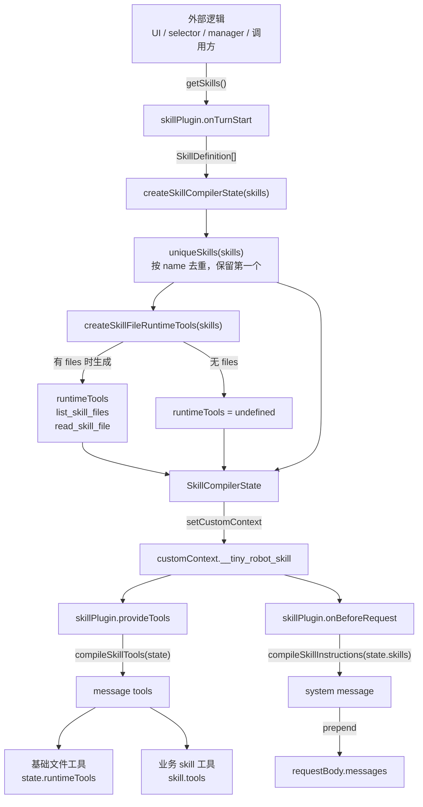

# Skill Message Plugin Flow

本文档说明 skill 如何通过 `skillPlugin` 接入 message 插件体系，以及关键数据在 loader、compiler、plugin hook 之间的流转方式。

## 核心边界

- `SkillDefinition` 是 skill 的能力模板，包含 `name`、`description`、`instructions`、`tools`、`files` 和 `metadata`。
- `fsSkillFiles` 和 `browserSkillFiles` 是文件适配器，只负责把平台文件源转换为 `SkillFile[]`。
- `SkillLoader` 负责把 `SkillFile[]` 解析为 `SkillDefinition`。
- `skillPlugin` 不加载、不选择、不缓存、不管理 skills，只通过 `getSkills()` 接收本次请求要使用的 skills。
- `compiler` 只负责把 `SkillDefinition[]` 转换为 message engine 可消费的 instructions、tools 和 compiler state。
- `SkillManager` 只负责 skill 集合和选择状态，不编译 instructions 或 tools。
- `message` 侧只通过插件 hook 消费 compiler 输出。

## 流程图



## 关键数据处理

### `getSkills()`

`getSkills()` 由调用方提供，返回本次请求要使用的 `SkillDefinition[]`。返回值已经代表被选中的 skills，插件内部不保留 `activeSkills` 语义。

```ts
skillPlugin({
  getSkills: () => [skill],
})
```

### `SkillCompilerState`

`onTurnStart` 会把 `getSkills()` 的结果转换为 compiler state，并写入 `customContext.__tiny_robot_skill`。

```ts
type SkillCompilerState = {
  skills: SkillDefinition[]
  skillNames: string[]
  runtimeTools?: RuntimeTool[]
}
```

- `skills`：去重后的 skill 列表。
- `skillNames`：从 `skills` 提取的名称列表，便于展示、日志或调试。
- `runtimeTools`：由 skill 文件资源生成的基础文件工具。

### Instructions

`onBeforeRequest` 从 compiler state 中读取 `state.skills`，调用 `compileSkillInstructions(state.skills)`。

处理规则：

- 只读取 `skill.instructions` 字符串。
- 空字符串或只包含空白的 instructions 会被忽略。
- 每个 skill 的 instructions 会按 `## skill.name` 分段。
- 编译结果作为 system message 插入到 `requestBody.messages` 最前面。

### Tools

`provideTools` 从 compiler state 中读取 state，调用 `compileSkillTools(state)`。

工具来源分为两类：

- 基础文件工具：由 `createSkillFileRuntimeTools(skills)` 根据 `skill.files` 创建。
- 业务 skill 工具：由 `skill.tools` 提供，是静态工具数组。

`compileSkillTools(state)` 会先返回基础文件工具，再返回业务 skill 工具。

### 基础文件工具

当任意 skill 带有 `files` 时，compiler 会创建两个基础 runtime tools：

- `list_skill_files`：列出当前 skills 携带的文件资源。
- `read_skill_file`：按 `skillName` 和相对路径读取文本文件内容。

二进制文件只返回文件摘要，不返回内容。

## Hook 对应关系

| Hook | 输入 | 处理 | 输出 |
| --- | --- | --- | --- |
| `onTurnStart` | `getSkills()` | 创建 `SkillCompilerState` 并写入 `customContext` | `customContext.__tiny_robot_skill` |
| `provideTools` | `SkillCompilerState` | 编译基础文件工具和业务工具 | `ToolProviderItem[]` |
| `onBeforeRequest` | `SkillCompilerState.skills` | 编译 skill instructions | prepend system message |

## SkillManager

`SkillManager` 是框架无关的 skill 集合管理工具。它可以被业务层、组件层 adapter 或测试代码复用，但不依赖 message engine。

基础能力：

- `set(skill)`：写入 skill，同名时覆盖，不存在时新增。
- `remove(name)`：删除 skill，并从选择状态中移除。
- `get(name)` / `has(name)` / `list()`：查询 skill。
- `select(names)` / `unselect(names)`：维护选择状态。
- `getSelectedSkillNames()` / `getSelectedSkills()`：读取已选 skills。
- `import(files, options)`：通过 `SkillLoader` 从 `SkillFile[]` 导入 skill。

`skillPlugin` 可以直接读取 manager 选择结果：

```ts
const manager = new SkillManager()

skillPlugin({
  getSkills: () => manager.getSelectedSkills(),
})
```

## Auto Skill Selection

auto skill selection 是一个独立的 selector 层能力，用于让模型根据用户问题从候选 skills 中选择本次请求要启用的 skills。它不属于 `skillPlugin` 的职责。

推荐链路：

```txt
用户问题
  -> selector turn: 模型读取候选 skill descriptions，并调用 selectSkills
  -> request-local selected skill names
  -> execution turn: skillPlugin 读取已选 skills，编译 instructions/tools
  -> 模型使用已启用 skills 回答
```

职责边界：

- `SkillManager` 管理全部可用 skills。
- `SkillSelector` 根据用户问题和候选 skill descriptions 产出本次请求的 selected skill names。
- `skillPlugin` 只读取 selected `SkillDefinition[]`，并编译 instructions 和 tools。
- auto selection 的结果应写入请求级状态，例如 `customContext.__tiny_robot_selected_skills`，不能直接写入 manager 的长期选择状态。

selector 阶段只提供候选摘要，不提供完整 instructions：

```txt
Available skills:
- weather: Get current weather information.
- vue-best-practices: Vue.js best practices workflow.
```

selector 工具可以设计为：

```ts
selectSkills({
  skillNames: string[]
})
```

工具 JSON schema 应使用候选 skill names 限制可选范围：

```json
{
  "type": "object",
  "properties": {
    "skillNames": {
      "type": "array",
      "items": {
        "type": "string",
        "enum": ["weather", "vue-best-practices"]
      }
    }
  },
  "required": ["skillNames"],
  "additionalProperties": false
}
```

selector 工具返回值建议是结构化结果，便于调试和日志记录：

```json
{
  "selectedSkillNames": ["vue-best-practices"]
}
```

execution 阶段再把 selected skill definitions 交给 `skillPlugin`：

```ts
skillPlugin({
  getSkills: (context) => context.customContext.__tiny_robot_selected_skills ?? [],
})
```

为了避免循环调用，selector 层应维护请求级状态，例如：

```ts
selectionStatus: 'pending' | 'done'
```

- `pending` 阶段提供 `selectSkills` 工具。
- `done` 阶段不再提供 selector 工具。
- `selectSkills` 每个请求最多调用一次。

## Manager TODO

- P1: 实现 auto skill selection。按本文档的独立 selector 层设计，让模型通过 `selectSkills` 工具选择请求级 skills，再交给 `skillPlugin` 编译。
- P1: 增加重复 skill 名称的诊断结果，用于 UI 提示或导入报告。
- P1: 设计持久化 adapter 协议，例如 localStorage、IndexedDB 或远程接口。
- P2: 增加批量导入结果，支持部分成功、部分失败和 warnings 汇总。
- P2: 增加 skill 启用状态、标签、来源、版本等管理字段的推荐 schema。
- P3: 增加 manager 事件或订阅机制，供 UI adapter 做响应式同步。
