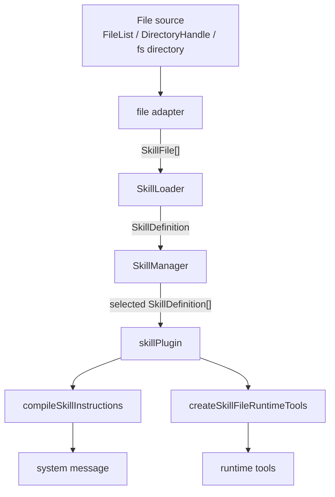
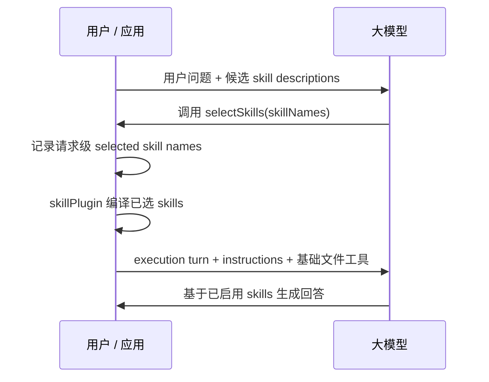

# Skill Toolchain Architecture

本文档面向维护者，用于说明 `packages/kit/src/skills` 中各模块的职责边界。面向使用者的 API 文档和交互示例放在 `docs/src/tools/skill.md`。

## 目标

skill 是一组可复用的能力模板。它可以从文件加载，被业务侧管理和选择，并在请求前转换为模型可消费的 instructions 和基础文件工具。

skill 核心能力不依赖 Vue，浏览器安全 API 从 `@opentiny/tiny-robot-kit/core` 导出；Node 文件系统能力从 `@opentiny/tiny-robot-kit/node` 导出。

## 核心数据

`SkillDefinition` 是 loader、manager、compiler 之间流转的核心数据结构：

```ts
interface SkillDefinition {
  name: string
  description: string
  instructions: string
  files?: SkillFileResource[]
  metadata?: Record<string, unknown>
}
```

- `name`：skill 唯一名称，由 manager 负责集合层面的覆盖和选择。
- `description`：用于展示、搜索或后续自动选择。
- `instructions`：注入模型请求的核心指令。
- `files`：随 skill 携带的附加文件资源，可由基础文件工具读取。
- `metadata`：应用侧和 loader 保留的扩展信息。

## 模块职责

### `types.ts`

定义 skill 工具链的共享类型：

- `SkillDefinition`
- `SkillFile`
- `SkillFileResource`
- 文本和二进制 skill 文件类型

该文件不包含运行逻辑。

### `utils.ts`

提供 skill 文件路径和文本文件判断工具：

- `normalizeSkillPath`
- `isTextSkillFilePath`
- `getExtension`

这些工具只处理文件路径和扩展名，不解析 skill 语义。

### `browserSkillFiles.ts`

浏览器文件适配器。负责把浏览器文件来源转换为标准 `SkillFile[]`：

- `loadSkillFilesFromFileList`
- `loadSkillFilesFromDirectoryHandle`

该模块只读取文件内容并标准化路径，不解析 `SKILL.md`。

### `fsSkillFiles.ts`

Node 文件适配器。负责把本地目录转换为标准 `SkillFile[]`：

- `loadSkillFilesFromFs`

该模块依赖 Node `fs/path`，只能从 `@opentiny/tiny-robot-kit/node` 子入口导出，不能从浏览器根入口导出。

### `skillLoader.ts`

loader 层。负责把 `SkillFile[]` 解析为 `SkillDefinition`：

- 查找入口文件，默认 `SKILL.md`
- 解析 frontmatter
- 将正文转换为必填 `instructions`
- 将其他支持的文件转换为 `files`
- 收集非致命 warnings

loader 不负责：

- 读取文件系统或浏览器文件
- 保存 skill 集合
- 选择 skill
- 编译 message 请求

### `manager.ts`

manager 层。负责 skill 集合和选择状态：

- `set(skill)`：新增或覆盖同名 skill
- `remove(name)` / `clear()`
- `get(name)` / `has(name)` / `list()`
- `select(names)` / `unselect(names)`
- `getSelectedSkillNames()` / `getSelectedSkills()`
- `import(files, options)`：通过 `SkillLoader` 导入 skill

manager 不负责编译 instructions 或 runtime tools。

### `compiler.ts`

compiler 层只保留两个纯转换函数：

- `compileSkillInstructions(skills)`
- `createSkillFileRuntimeTools(skills)`

`compileSkillInstructions` 将已选择的 skills 转换为 system message。

`createSkillFileRuntimeTools` 根据 `skill.files` 创建基础文件工具：

- `list_skill_files`
- `read_skill_file`

compiler 不负责：

- skill 去重
- 选择状态
- 持久化
- 集合管理

### `index.ts`

skill core 的统一导出口。该入口会被 `@opentiny/tiny-robot-kit/core` 重新导出。

不要在这里导出 Node-only API，例如 `loadSkillFilesFromFs`。

## Message 接入

message 接入代码不放在 `src/skills` 下：

- core message adapter：`packages/kit/src/message/plugins/skillPlugin.ts`
- Vue message adapter：`packages/kit/src/vue/message/plugins/skillPlugin.ts`

`skillPlugin` 的职责是把调用方传入的当前 skills 接入 message 生命周期：

1. `onTurnStart` 读取 `getSkills()` 或 Vue 侧响应式 `skills`。
2. 创建 `runtimeTools = createSkillFileRuntimeTools(skills)`。
3. 将 `{ skills, skillNames, runtimeTools }` 写入 `customContext.__tiny_robot_skill`。
4. `provideTools` 暴露 `runtimeTools`。
5. `onBeforeRequest` 调用 `compileSkillInstructions(skills)` 并 prepend system message。

`skillPlugin` 不加载、不缓存、不选择、不管理 skill 集合。

## 数据流



## Auto Skill Selection

auto skill selection 是一个未来的 selector 层能力，用于让模型根据用户问题从候选 skills 中选择本次请求要启用的 skills。它不属于 `skillPlugin`、compiler 或 manager 的当前职责。

推荐链路：



职责边界：

- `SkillManager` 管理全部可用 skills。
- `SkillSelector` 根据用户问题和候选 skill descriptions 产出本次请求的 selected skill names。
- `skillPlugin` 只读取 selected `SkillDefinition[]`，并编译 instructions 和基础文件工具。
- auto selection 的结果应写入请求级状态，例如 `customContext.__tiny_robot_selected_skills`，不能直接写入 manager 的长期选择状态。

selector 阶段只提供候选摘要，不提供完整 instructions：

```txt
Available skills:
- weather: Get current weather information.
- vue-best-practices: Vue.js best practices workflow.
```

selector 工具可以设计为：

```ts
selectSkills({
  skillNames: string[]
})
```

工具 JSON schema 应使用候选 skill names 限制可选范围：

```json
{
  "type": "object",
  "properties": {
    "skillNames": {
      "type": "array",
      "items": {
        "type": "string",
        "enum": ["weather", "vue-best-practices"]
      }
    }
  },
  "required": ["skillNames"],
  "additionalProperties": false
}
```

selector 工具返回值建议是结构化结果，便于调试和日志记录：

```json
{
  "selectedSkillNames": ["vue-best-practices"]
}
```

execution 阶段再把 selected skill definitions 交给 `skillPlugin`：

```ts
skillPlugin({
  getSkills: (context) => context.customContext.__tiny_robot_selected_skills ?? [],
})
```

为了避免循环调用，selector 层应维护请求级状态，例如：

```ts
selectionStatus: 'pending' | 'done'
```

- `pending` 阶段提供 `selectSkills` 工具。
- `done` 阶段不再提供 selector 工具。
- `selectSkills` 每个请求最多调用一次。

## 后续事项

- 为 `read_skill_file` 增加大小限制和截断策略。
- 为重复 skill 名称增加诊断能力，优先放在 manager 或选择逻辑中。
- 评估 auto skill selection 是否需要独立 selector 层。
