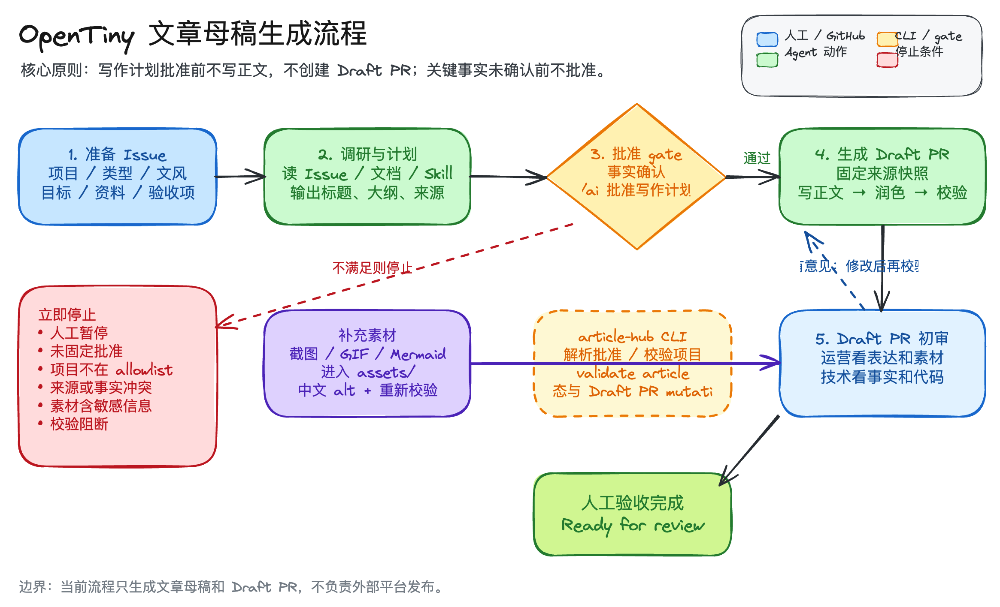

# 本地 Agent 生成 OpenTiny 文章使用说明

本文面向运营人员，说明如何使用 Codex 或 Claude Code 在本地生成 OpenTiny 技术文章母稿。你不需要理解 `article-hub` CLI 的内部实现，只需要知道在哪个页面操作、什么时候让 Agent 继续、什么时候请核心技术维护者确认事实。

当前流程只生成文章母稿和 Draft PR，不自动发布到公众号、掘金、CSDN 或官网。

## 适用场景

适合使用本文：

- 已经有一个 OpenTiny 文章选题，需要让本地 Agent 辅助生成文章母稿。
- 需要把文章产物提交成 Draft PR，交给运营和核心技术维护者 Review。
- 需要根据 PR 评论、`Request changes` 或 `/ai` 指令继续让 Agent 修改文章。

不适合使用本文：

- 自动发现热点、自动创建选题、自动发布到外部平台。
- 不经过写作计划批准，直接让 Agent 写完整文章。
- 让 Agent 使用无法追溯的私有资料生成正式对外内容。
- 把本文当成 CLI 参考手册。命令详情见 [docs/cli-reference.md](./docs/cli-reference.md)。

## 一句话流程

```text
GitHub 上创建或确认文章 Issue
→ 在 Codex / Claude Code 中让 Agent 调研并输出写作计划
→ 运营初审写作计划
→ 核心技术维护者确认技术事实
→ 在 GitHub Issue 中发送固定批准命令
→ 在 Agent 对话中生成文章和 Draft PR
→ 运营或技术补充截图、GIF 等图片素材
→ 运营和核心技术维护者初审 Draft PR
→ 在 Agent 对话中按初审或 Review 意见修改
→ 人工确认后在 GitHub 点击 Ready for review
```



关键点：写作计划没有批准前，不生成正文、不创建 Draft PR。关键技术事实没有确认前，不发送批准命令。

## 参与角色

| 角色 | 负责什么 | 主要操作位置 |
| --- | --- | --- |
| 运营人员 | 提出选题，确认读者、标题、大纲、表达、图片效果和发布可读性，推动流程继续。 | GitHub Issue、GitHub PR、Codex / Claude Code 对话 |
| 核心技术维护者 | 检查事实、术语、版本、Tag、Commit、API、代码片段、兼容性、性能和安全表述。 | GitHub Issue、GitHub PR |
| Agent | 调研、生成写作计划、写文章、在初稿和修改时调用润色 Skill、接入素材、按初审或 Review 意见修改。 | Codex / Claude Code 对话 |
| `article-hub` CLI | 校验项目、解析固定命令、过滤权限和 bot、生成批准快照、校验文章、更新状态和创建 Draft PR。 | Agent 自动调用 |

固定批准命令可以由运营人员或核心技术维护者发送，不额外限制角色；当前规则只要求发送者有仓库权限，且命令完全匹配。

## 操作位置速查

| 要做的事 | 在哪里操作 | 谁来做 |
| --- | --- | --- |
| 创建文章选题 | GitHub Issue 页面 | 运营人员 |
| 补充技术边界、版本、代码注意事项 | GitHub Issue 评论 | 核心技术维护者 |
| 让 Agent 做环境检查 | Codex / Claude Code 对话 | 运营人员发起，Agent 执行 |
| 让 Agent 调研和生成写作计划 | Codex / Claude Code 对话 | 运营人员发起，Agent 执行 |
| 审核写作计划传播方向 | GitHub Issue 或 Agent 对话 | 运营人员 |
| 审核写作计划技术事实 | GitHub Issue 评论 | 核心技术维护者 |
| 发送固定批准命令 | GitHub Issue 评论 | 有权限的运营人员或核心技术维护者 |
| 生成文章和 Draft PR | Codex / Claude Code 对话 | 运营人员发起，Agent 执行 |
| 补充截图、GIF、图片 | GitHub PR、Issue 附件或 Agent 对话 | 运营人员或核心技术维护者提供，Agent 接入 |
| 初审 Draft PR | GitHub PR 页面 | 运营人员和核心技术维护者 |
| 按初审或 Review 意见修改 | Codex / Claude Code 对话 | 运营人员发起，Agent 执行 |
| 点击 Ready for review | GitHub PR 页面 | 人工确认后操作 |

默认不需要手动编辑本地文件，不需要手动创建 `articles/.../article.md`、`assets/`、分支或 Draft PR。需要补充本地图片时，把图片路径或附件链接交给 Agent，让 Agent 复制到文章素材目录并更新正文引用。

## 开始前检查：让 Agent 代查

不需要自己运行技术命令。打开本仓库目录，把下面提示词复制给 Agent，让它检查环境并给出结论。

可复制提示词：

```text
请帮我做 ai-article-hub 本地文章生成前的环境检查。请你自己执行必要命令并给出结论，不要要求我理解技术细节。

请检查：
- 当前目录是否是 ai-article-hub 仓库根目录。
- GitHub CLI 是否已登录，并能访问目标仓库。
- Node.js 和 pnpm 是否满足仓库要求。
- 仓库依赖、测试和构建是否正常。
- article-hub CLI 是否可用，并且项目配置校验通过。
- generate-opentiny-article 和 polish-opentiny-article 是否能被当前 Agent 识别。

你可以使用但不限于这些命令：
- gh auth status
- pnpm test
- pnpm run build
- node dist/cli.js projects validate --config config/projects.yml

请用以下格式回复：
结论：可以开始 / 需要处理
已通过：
需要我处理：
你可以代办：
风险：
下一步建议：
```

你只需要看 Agent 的结论：

- `可以开始`：继续准备文章 Issue。
- `需要处理`：先看“需要我处理”和“你可以代办”。权限、账号、仓库访问问题通常需要人工处理；依赖安装、构建和校验通常可以让 Agent 代办。
- 如果 Agent 说 Skill 无法识别，确认 Codex 或 Claude Code 从本仓库目录启动；仍无法识别时重启工具，或交给技术同学处理。

## 当前支持范围

### 支持项目

| 项目 ID | 展示名称 |
| --- | --- |
| `webmcp-sdk` | WebMCP SDK |
| `genui-sdk` | OpenTiny MCP/GenUI |
| `tiny-robot` | TinyRobot |

如果文章主题不属于这些项目，Agent 应停止并提示需要先更新 [config/projects.yml](./config/projects.yml)。

### 支持文章类型

| 类型 | 适合什么文章 |
| --- | --- |
| `release` | 版本发布解读 |
| `practical-guide` | 教程、特性使用、性能优化、问题排查 |
| `source-analysis` | 源码、架构、关键链路解析 |
| `case-study` | 项目案例、实践复盘 |

### 支持文风

| 文风 | 说明 |
| --- | --- |
| `official-balanced` | 正式克制，技术与传播均衡 |
| `developer-friendly` | 面向开发者，解释更充分 |
| `release-promotional` | 突出版本价值，但不夸张 |
| `technical-deep-dive` | 强调机制、边界和技术细节 |

## 第一步：准备文章 Issue

操作位置：GitHub Issue 页面。

优先使用仓库的文章选题模板：[.github/ISSUE_TEMPLATE/article.yml](./.github/ISSUE_TEMPLATE/article.yml)。

Issue 至少写清楚：

- 项目：只能从当前支持项目里选。
- 文章类型：从当前支持文章类型里选。
- 文风：无需在 Issue 指定；由 AI 在写作计划中推荐，人工批准前确认或改选。
- 文章目标：这篇文章要解决谁的什么问题。
- 候选资料：Release、文档、Commit、PR、Demo、Issue 附件或其他公开链接。
- 人工验收说明：哪些事实、截图、GIF、代码片段必须由人确认。

建议运营人员在 Issue 中写清楚传播目标，核心技术维护者补充技术边界：

- 目标版本、Tag、Commit 或 Release。
- 关键 API、配置项、代码片段。
- 不能写成正式能力的实验特性。
- 必须人工验证的截图、GIF、Demo 或代码运行结果。
- 兼容性、性能、安全相关表述的限制条件。

最小示例：

```md
项目：genui-sdk
文章类型：practical-guide

文章目标：
面向前端开发者，说明如何用 GenUI SDK 在已有应用里接入生成式 UI。

候选资料：
- https://github.com/opentiny/genui-sdk
- 目标版本：v1.2.0
- 官方文档：请 Agent 调研 opentiny docs 中的 GenUI SDK 页面

人工验收说明：
- 代码片段需要核心技术维护者核对。
- 如果需要截图或 GIF，先生成素材需求，不要自动使用未确认素材。
- 兼容性表述需要维护者确认。
```

好资料的特点：

- 能打开。
- 能复现。
- 有版本、Commit、Tag 或发布时间。
- 来自源码、官方文档、Release、PR、Commit、测试或维护者明确确认。

不适合作为正式来源：

- 只有本机文件路径，别人无法访问。
- 只有一句聊天记录，没有维护者确认。
- 与官方源码或文档冲突。
- 只来自搜索摘要，无法回到一级来源。

## 第二步：让 Agent 做调研和写作计划

操作位置：Codex / Claude Code 对话。

把 Issue 链接或编号发给 Agent，明确要求只做调研和计划，不生成正文。

可复制提示词：

```text
请在本地 ai-article-hub 仓库中处理这个 OpenTiny 文章 Issue：<Issue 链接或编号>。

请先读取仓库 README、usage、docs、skills 和 config/projects.yml，按当前文章生成流程做调研并生成写作计划。

要求：
- 只做调研和写作计划，不生成正文，不创建 PR。
- 使用 gh 读取 Issue 原始事实，并用 article-hub 做确定性解析和项目校验。
- 检查相似 Issue、已有文章和 materials/article-archive。
- 先在对话中输出 5-8 行计划摘要，完整写作计划必须发布或更新为 GitHub Issue 评论。
- 发布评论时使用 gh issue comment；发布成功后在对话中给出 Issue 评论链接。
- 如果没有权限、网络失败或无法确认评论已发布，立即停止并说明失败原因；不要只把完整计划留在对话中。
- 完整计划没有进入 Issue 评论时，本任务视为未完成。
- 写清楚计划版本、推荐标题、目标读者、资料快照、建议大纲、截图/GIF 素材需求、素材缺口、人工验收项。
- 给出可复制的批准命令：/ai 批准写作计划。
```

写作计划需要包含：

- 计划版本（人类可读标签）和生成时间。
- 文章目标、目标读者和不覆盖内容。
- 推荐标题和候选标题。
- 目标 Release、Tag、分支和 Commit。
- 来源清单和可信度。
- 建议大纲。
- 截图、GIF、Mermaid 或其他图片素材计划。
- 素材缺口、风险和人工验收项。
- 可复制的批准命令。

Agent 会先在对话展示计划摘要，再把完整写作计划作为 Issue 评论发布或更新。评论发布成功并返回链接后，本步骤才算完成；如果发布失败，Agent 必须停止并说明原因。

如果写作计划被提出修改意见，可以让 Agent 按最新意见重新整理计划。计划里的文章目标、来源、目标版本、大纲或素材缺口发生实质变化时，需要重新发布写作计划评论并重新批准。

可复制提示词：

```text
请根据这个 Issue 中最新的写作计划 review 意见，修改并重新发布写作计划：<Issue 链接或编号>。

要求：
- 先读取 Issue 正文、现有写作计划评论和最新 review 意见。
- 逐条归纳本轮意见，区分传播方向、标题大纲、素材需求、技术事实和需要澄清的问题。
- 只修改写作计划，不生成正文，不创建 PR。
- 如果意见触及版本、API、兼容性、性能、安全或代码，请回到固定来源核验；无法确认时列为需要技术维护者确认的问题。
- 修改后把完整写作计划重新评论到 Issue，并给出可复制的批准命令：/ai 批准写作计划。
```

## 第三步：运营初审和技术事实确认

操作位置：GitHub Issue 评论，必要时也可以在 Agent 对话中请 Agent 修改计划。

### 运营初审

运营人员重点检查：

- 文章目标是否准确。
- 目标读者是否明确。
- 推荐标题是否适合发布。
- 大纲是否符合传播目标。
- 文风是否符合文章类型。
- 截图、GIF 或封面需求是否清楚。
- 人工验收项是否完整。

如果计划不合适，直接让 Agent 修改计划，不要批准。

### 技术事实确认

核心技术维护者重点检查：

- 目标版本、Tag、Commit 是否准确。
- API、配置项和代码片段是否真实可用。
- 兼容性、性能、安全、稳定性表述是否有来源。
- 是否遗漏重要限制条件。
- 是否把实验能力写成正式能力。
- 是否引用了过期文档、旧分支或未发布代码。
- 截图或 GIF 展示的功能状态是否真实。

运营人员可以在 Issue 中邀请技术维护者确认：

```text
请帮忙做技术事实确认：

- 目标版本 / Commit：
- 关键 API 或代码片段：
- 性能 / 兼容性 / 安全表述：
- 截图 / GIF 展示内容：
- 需要补充或删除的内容：

确认后我再发送固定批准命令。
```

技术维护者可以这样回复：

```text
技术事实确认通过。

可保留：
- ...

需要作为人工验收项保留：
- ...

不得写入正文：
- ...
```

如果计划里的文章目标、来源、目标版本、大纲或素材缺口发生实质变化，让 Agent 重新发布写作计划评论并重新批准。旧批准快照按最新批准为准自动失效。

## 第四步：批准写作计划

操作位置：GitHub Issue 评论。

运营初审和技术事实确认都通过后，由有权限的运营人员或核心技术维护者复制 Agent 给出的固定命令。

格式如下：

```text
/ai 批准写作计划
```

示例：

```text
/ai 批准写作计划
```

请逐字复制，不要改动空格或大小写。

这些都不算批准：

```text
我觉得可以，开始写吧
批准写作计划
/AI 批准写作计划
 /ai 批准写作计划
/ai 批准写作计划 2 a1b2c3d4
我批准 /ai 批准写作计划
```

系统只认固定命令，避免 Agent 猜测人的意图。

## 第五步：生成文章和 Draft PR

操作位置：Codex / Claude Code 对话。

写作计划批准后，再让 Agent 执行生成。

可复制提示词：

```text
写作计划已经在 Issue 中用固定命令批准。请使用 generate-opentiny-article 继续处理这个 Issue：<Issue 链接或编号>。

要求：
- 重新读取 Issue 和评论，确认批准命令 actionable: true。
- 如果 Issue 含 AI执行：人工暂停，立即停止。
- 校验项目属于 config/projects.yml。
- 固定来源快照后再生成文章。
- Issue fixture、计划正文临时文件、批准快照输入文件只放系统临时目录或 .cache/article-hub/<issue-number>/。
- 源码 checkout 缓存放 .cache/article-hub/source-cache/，不要写入 materials/source-cache/。
- materials/issue-sources/<issue-number>/ 只放需要随仓库保存的人工来源快照；不要放运行缓存、Issue fixture 或计划临时文件。
- 生成 articles/<project-id>/<YYYY-MM-DD>-<slug>/article.md 和必要素材。
- 初稿正文成型后自动调用 polish-opentiny-article 做正文优化；这是创建 Draft PR 前的固定步骤，不是 Review 通过后的收尾步骤。
- 运行 article-hub validate article，直到校验通过或明确说明阻断原因。
- 创建或更新 Draft PR 前运行 git status --short；发现 source-cache、临时计划文件、Issue fixture 等中间文件时先清理。无法确认清理安全时停止并说明。
- 校验通过后创建或更新 Draft PR，并回写 Issue 状态。
```

成功后你应该看到：

- 文章文件：`articles/<project-id>/<YYYY-MM-DD>-<slug>/article.md`
- 素材目录：`articles/<project-id>/<YYYY-MM-DD>-<slug>/assets/`
- 文章分支：`article/<issue-number>-<project-id>-<slug>`
- Draft PR 链接
- Issue 状态更新到等待人工处理

运营人员默认不手动编辑本地文件，不手动创建分支，不手动运行校验。如果 Agent 停止，只需要让它说明：

```text
停在哪一步：
缺什么信息：
需要人工决定什么：
```

## 第六步：补充截图、GIF 和其他图片素材

操作位置：GitHub Issue、GitHub PR、Codex / Claude Code 对话。

图片素材可以在写作计划阶段提出，也可以在 Draft PR 创建后补充。补充后必须进入文章目录下的 `assets/`，正文引用本地相对路径。

| 场景 | 推荐做法 |
| --- | --- |
| 写作计划阶段已明确需要截图或 GIF | 在 Issue 的人工验收说明中写清页面、状态、尺寸、是否需要 GIF。 |
| Draft PR 已创建但缺图 | 在 PR 评论中说明缺什么图，并把文件、附件链接或本机路径发给 Agent。 |
| 技术维护者需要演示动态图 | 技术维护者提供 GIF、录屏要求或可复现 Demo，Agent 只负责接入和校验。 |

分工：

- 运营人员确认图片是否适合发布：清晰、可读、无敏感信息、节奏合适。
- 核心技术维护者确认图片展示的功能状态真实：版本正确、交互路径正确、效果不误导。
- Agent 负责把图片放进文章素材目录、更新 Markdown 引用、补中文 alt、运行文章校验。
- `article-hub` 只校验本地图片路径和 alt，不判断截图内容是否真实。

推荐素材目录：

```text
articles/<project-id>/<YYYY-MM-DD>-<slug>/assets/images/
articles/<project-id>/<YYYY-MM-DD>-<slug>/assets/gifs/
articles/<project-id>/<YYYY-MM-DD>-<slug>/assets/diagrams/
```

正文引用示例：

```md


```

让 Agent 接入图片时可以这样说：

```text
请把下面截图 / GIF 接入这篇 Draft PR：<PR 链接>。

素材：
- <图片或 GIF 的附件链接、本机路径或说明>

要求：
- 放入文章目录下的 assets/。
- 正文使用中文 alt。
- 如果素材包含 Token、内部地址、账号信息、未公开客户数据或无法确认来源，请停止并说明问题。
- 接入后运行 article-hub validate article。
```

以下情况不要继续接入图片：

- 截图或 GIF 包含 Token、内部地址、账号信息、未公开客户数据。
- GIF 展示的功能效果无法由核心技术维护者确认。
- 只有聊天截图、未授权图片或来源不明的素材。
- 图片文件过大、模糊或看不清关键 UI。

这些问题可以作为 Draft PR 未完成项保留，正式发布前再补。

## 第七步：Draft PR 初审

操作位置：GitHub Draft PR 页面。

Draft PR 创建后，运营人员和核心技术维护者先做初审。整体表达、素材、事实、代码和图片问题都应在这个阶段提出；如果需要全文润色，也应作为本阶段的一轮修改处理。

### 运营初审

运营人员重点检查：

- 标题、摘要、大纲和正文节奏是否适合发布。
- 文章是否能让目标读者读懂。
- 开头是否说明读者问题。
- 结尾是否自然，不拔高。
- 截图、GIF、封面或图片缺口是否已经明确。
- PR 描述里的人工验收项是否完整。

### 技术初审

核心技术维护者重点检查：

- 事实、术语、版本和来源快照是否正确。
- 代码片段是否可用。
- API、配置项、命令和日志是否准确。
- 性能、兼容性、安全表述是否有来源。
- 截图和 GIF 展示的功能状态是否真实。
- 是否遗漏限制条件或已知风险。

如果文章里包含代码片段，PR 描述的 `## 人工验收` 区必须包含该项（属于 PR 协作元数据，不写进文章正文）：

```md
- [ ] 人工核对代码片段
```

Draft PR 初审阶段可以只评论，不要求核心技术维护者必须 Approve。正式 Review 是否需要 Approve、需要几名 Reviewer、何时允许合并，遵循仓库已有规则。

## 第八步：让 Agent 按意见修改

操作位置：Codex / Claude Code 对话。

如果初审或 Review 中有明确意见，把 PR 链接发给 Agent。文章正文修改都通过 `polish-opentiny-article` 执行：整体表达问题作为一轮全文修改处理，局部意见只改指定范围。每轮修改都会产生新改动，修改后需要相关人员重新确认；意见冲突、目标不清或缺少事实来源时，Agent 应停止并说明问题。

### 全文表达修改

如果文章事实没问题，但读起来有模板感、空话、营销腔或不够自然，可以在 Draft PR 初审阶段使用全文表达修改。运营和技术都已确认通过后，不应再将全文润色作为默认收尾步骤；如果人工仍要求全文润色，应视为新一轮修改，润色后至少由运营重新检查，涉及事实表述时还需要核心技术维护者重新确认。

可复制提示词：

```text
请使用 polish-opentiny-article 对这篇 Draft PR 做 /ai 全文润色：<PR 链接>。

要求：
- 只优化正文自然语言。
- 不改 Front Matter、标题、代码块、命令、日志、API、版本号、Commit、图片路径、链接目标、Mermaid 或 SVG 源内容。
- 不新增来源外事实、数据、用户反馈、产品能力或因果关系。
- 润色后运行 article-hub validate article，并提交本轮修改。
```

### 按本轮修改意见处理

如果 PR 中同时有运营评论、技术 Review、行级评论或 `Request changes`，不要按评论者身份拆成多轮处理。让 Agent 读取本轮全部意见，先逐条归类，再按范围修改。处理边界由意见内容决定：运营也可能提出事实问题，技术也可能提出表达问题。

| 情况 | 用哪个提示词 |
| --- | --- |
| 只想整体去模板感、空话、营销腔 | 使用“全文表达修改”提示词 |
| PR 里已有多条评论、Review 或 `Request changes` | 使用“按本轮修改意见处理”提示词 |
| 意见互相冲突、说法模糊或缺少事实来源 | 仍使用“按本轮修改意见处理”提示词，让 Agent 停止并列出待确认项 |

可复制提示词：

```text
请使用 polish-opentiny-article 处理这篇 Draft PR 的本轮修改意见：<PR 链接>。

要求：
- 读取本轮全部 PR 评论（包括行级评论/Review 线程、PR 级别评论、Request changes，以及评论中以 /ai 开头的修改指令）。
- 先逐条列出意见并归类：表达/结构类、素材类、事实类、需澄清、无法采纳。
- 对表达、结构、图片说明和发布可读性问题，只修改评论指向的段落、行或受影响章节。
- 对版本、API、兼容性、性能、安全、代码等事实类问题，回到固定来源核验；缺少来源或意见冲突时停止并说明需要谁确认。
- 不按评论者身份决定处理边界。
- 修改后运行 article-hub validate article，并提交本轮修改。
- 完成后逐条说明处理结果、对应 Commit、无法采纳的意见及理由、以及仍需人工确认的问题，不自动 Resolve conversation。
```

适合写在 PR 评论里的修改要求：

```text
/ai 请把“核心亮点解析”这一节改得更像开发者教程，减少宣传语，但不要改代码块。
```

不适合的修改要求：

```text
/ai 把数据写得更好看一点
/ai 加几个真实用户案例
/ai 顺手优化全文所有地方
```

如果缺少来源，Agent 不应该编造数据或案例。

## 可选：定时巡检

如果 Codex、Claude Code 或其他本地 Agent 支持定时任务，可以让它定期检查文章 Issue 和 Draft PR，自动处理已经明确授权的写作计划、固定批准命令、PR Review 和 `/ai` 修改指令。

定时巡检只负责本地唤醒和消费已授权事件，不跳过写作计划批准、事实确认、人工 Review、Ready for review 或发布流程。建议先完整跑通一次人工流程，再参考 [本地 Agent 定时巡检配置说明](./docs/local-agent-scheduled-checks.md) 配置 Issue 巡检和 PR 巡检。

## 第九步：验收与 Ready for review

操作位置：GitHub PR 页面。

Draft PR 完成初审修改和必选验收项后，再由人工点击 GitHub 的 **Ready for review**。

点击前建议确认：

- 运营初审的标题、摘要、结构、表达和图片问题已处理。
- 核心技术维护者提出的事实、代码、版本、API、兼容性、性能和安全问题已处理。
- 不再有待处理的全文润色、运营修改或技术修改请求。
- 截图、GIF 或图片素材没有敏感信息，且功能状态真实。
- 必选人工验收项已经完成，或仍作为明确未完成项保留在 Draft PR 中。
- Agent 最近一次修改后已经运行 `article-hub validate article`。
- 注意校验边界：`article-hub validate article` 只保证 Front Matter、来源版本、路径与图片 alt 等确定性规则合规，不判断文章是否单主线推进、读起来是否机械。结构与读感由初稿自审表、独立结构裁判和人工 Review 把关；`valid: true` 不代表可发布。

PR 合并和外部发布不属于当前本地生成流程。

创建 Draft PR 时，`article-hub create-pr` 会在 `articles/publications.json` 中写入文章条目和空 `publications`。母稿合入后，若后续已发布到外部平台，再补充平台 URL 和 UTC+8 发布日期；缺少平台记录表示尚未确认发布。

## 什么时候应该停止

出现以下情况时，不要继续让 Agent 写正文、提交 PR 或处理图片素材：

- Issue 有 `AI执行：人工暂停` 标签。
- 写作计划没有固定批准命令。
- 运营初审或技术事实确认未通过。
- 批准命令不是逐字固定命令。
- 批准来自未授权用户或 bot。
- 项目不在 [config/projects.yml](./config/projects.yml)。
- 关键资料无法追溯。
- 人工资料与官方源码或文档冲突。
- 缺少目标版本、Tag 或 Commit，且文章核心结论依赖它。
- 技术维护者未确认关键事实、代码片段、截图或 GIF 展示效果。
- 图片或 GIF 含敏感信息、未公开客户数据或来源不明素材。
- 文章校验失败，且不能在不改受保护内容的前提下修复。
- PR Head 已被人工更新，Agent 需要重新读取最新内容。

此时让 Agent 输出三件事即可：

```text
停在哪一步：
缺什么信息：
需要人工决定什么：
```

## 常见问题

| 问题 | 怎么处理 |
| --- | --- |
| Agent 没有触发 Skill | 生成初稿时直接写 `generate-opentiny-article`；修改正文时直接写 `polish-opentiny-article`。环境检查、状态查询和资料确认不需要触发润色 Skill。 |
| Codex 或 Claude Code 找不到 Skill | 确认从本仓库目录启动工具；Claude Code 需要接受 workspace trust。仍找不到时重启工具。 |
| `gh auth status` 失败 | 先完成 GitHub CLI 登录，再继续。 |
| 项目不支持 | 先由维护者评估是否要更新 [config/projects.yml](./config/projects.yml)。 |
| 技术维护者还没确认事实 | 不要批准计划。先让技术维护者确认，或让 Agent 标出缺失来源。 |
| 运营可以自己发批准命令吗 | 可以，只要有仓库权限，并且运营初审和技术事实确认都已完成。 |
| 核心技术维护者必须 Approve PR 吗 | 当前流程不新增这个要求，按仓库已有 Review 规则执行。 |
| 写作计划没有批准命令 | 让 Agent 重新发布写作计划评论，并把固定批准命令贴到 Issue。 |
| 自然语言已经说“同意”但 Agent 仍停止 | 这是预期行为。必须使用固定 `/ai 批准写作计划` 命令。 |
| 计划改过后还能用旧批准命令吗 | 旧批准快照以最新批准为准自动失效；让 Agent 重新发布计划评论，再重新发送 /ai 批准写作计划。 |
| 文章校验失败 | 让 Agent 根据 `blocking_issues[].code` 修复；不要让它靠修改 Front Matter、代码或图片路径凑过校验。 |
| 缺截图或封面 | 可以先保留为 Draft PR 验收项；正式发布前由人工补齐。 |
| GIF 或截图怎么交给 Agent | 给 Agent 附件链接、本机路径或 PR 评论说明，让它复制到 `assets/` 并更新正文引用。 |
| 图片里有 Token 或内部地址 | 停止使用，重新提供不含敏感信息的素材。 |
| 能不能直接在 GitHub PR 里改文章 | 可以，但改完再让 Agent 继续时，要提醒它重新读取最新 PR，避免覆盖人工修改。 |
| PR 一直是 Draft | 检查人工验收项、代码片段、截图缺口和必需检查是否完成。 |
| 想发布到外部平台 | 当前流程只生成文章母稿和 Draft PR，不负责发布平台适配。 |

## 产物目录说明

文章母稿：

```text
articles/<project-id>/<YYYY-MM-DD>-<slug>/article.md
```

文章素材：

```text
articles/<project-id>/<YYYY-MM-DD>-<slug>/assets/
```

常见图片素材：

```text
articles/<project-id>/<YYYY-MM-DD>-<slug>/assets/images/
articles/<project-id>/<YYYY-MM-DD>-<slug>/assets/gifs/
```

Mermaid 图表素材：

```text
articles/<project-id>/<YYYY-MM-DD>-<slug>/assets/diagrams/<name>.mmd
articles/<project-id>/<YYYY-MM-DD>-<slug>/assets/diagrams/<name>.svg
articles/<project-id>/<YYYY-MM-DD>-<slug>/assets/diagrams/<name>.png
```

正文统一引用 PNG。`.mmd` 和 `.svg` 用于后续 Review 和修改。

## 相关文档

- [README.md](./README.md)：仓库能力、结构和核心工作流。
- [docs/article-generation-requirements.md](./docs/article-generation-requirements.md)：完整需求和边界。
- [docs/cli-reference.md](./docs/cli-reference.md)：`article-hub` CLI 参数参考。
- [docs/local-agent-scheduled-checks.md](./docs/local-agent-scheduled-checks.md)：本地 Agent 定时巡检配置说明。
- [.agents/skills/generate-opentiny-article/SKILL.md](./.agents/skills/generate-opentiny-article/SKILL.md)：生成文章的 Codex 流程。
- [.agents/skills/polish-opentiny-article/SKILL.md](./.agents/skills/polish-opentiny-article/SKILL.md)：初稿优化和修改处理的 Codex 流程。
- [.claude/skills/generate-opentiny-article/SKILL.md](./.claude/skills/generate-opentiny-article/SKILL.md)：生成文章的 Claude Code 流程。
- [.claude/skills/polish-opentiny-article/SKILL.md](./.claude/skills/polish-opentiny-article/SKILL.md)：初稿优化和修改处理的 Claude Code 流程。
